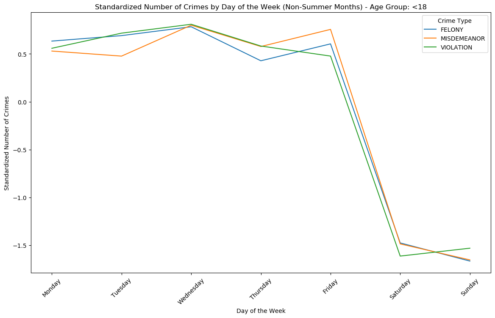

# NYC Crime Rate Analysis

In this analysis we synthesize NYC crime data with census data, and zillow housing data to understand the effect of crime rates on housing prices at a zip code level. We show that there is a significant negative relationship ( p < 0.0003, R^2 = 0.311) between the trend in crime rate per 100,000 and the percent change in housing prices. On average, if the linear crime rate trend increases by 1 per 100,000 people, this causes the average NYC home to lose $5,312 in value.  Along the way we build a model to predict the profile of a criminal suspect given the profile of a victim. 

## Data Visualization - Idle hands are the Devil's workshop

### Data

We start by getting NYC crime report data from NYC Open Data : CSV data https://data.cityofnewyork.us/Public-Safety/NYPD-Complaint-Data-Historic/qgea-i56i/about_data

We also get home values by zip code from Zillow Home Value Index (ZHVI All home SFT, Condo/Coop) Time Series Smoothed seasonally adjusted : CSV data https://www.zillow.com/research/data/

Finally we need population data by zip code : For this we look at the Census data.

https://data.census.gov/table/ACSDT5Y2011.B01003?t=Counts,%20Estimates,%20and%20Projections:Population%20Total&g=040XX00US36$8600000&y=2011

For the raw CSV files see: https://drive.google.com/drive/folders/19QnftB8seO4_HQYX9Umu3FkkGjwCW9PI?usp=drive_link

<table border="1" class="dataframe">
  <thead>
    <tr style="text-align: right;">
      <th></th>
      <th>CMPLNT_FR_DT</th>
      <th>LAW_CAT_CD</th>
      <th>SUSP_AGE_GROUP</th>
      <th>SUSP_RACE</th>
      <th>SUSP_SEX</th>
      <th>Latitude</th>
      <th>Longitude</th>
      <th>VIC_AGE_GROUP</th>
      <th>VIC_RACE</th>
      <th>VIC_SEX</th>
    </tr>
  </thead>
  <tbody>
    <tr>
      <th>4</th>
      <td>03/10/2008</td>
      <td>FELONY</td>
      <td>&lt;18</td>
      <td>BLACK</td>
      <td>M</td>
      <td>40.650142</td>
      <td>-73.944674</td>
      <td>25-44</td>
      <td>BLACK</td>
      <td>M</td>
    </tr>
    <tr>
      <th>6</th>
      <td>12/21/2008</td>
      <td>MISDEMEANOR</td>
      <td>25-44</td>
      <td>BLACK</td>
      <td>M</td>
      <td>40.669126</td>
      <td>-73.973071</td>
      <td>25-44</td>
      <td>WHITE</td>
      <td>M</td>
    </tr>
    <tr>
      <th>9</th>
      <td>04/19/2008</td>
      <td>VIOLATION</td>
      <td>18-24</td>
      <td>WHITE HISPANIC</td>
      <td>M</td>
      <td>40.689954</td>
      <td>-73.916924</td>
      <td>25-44</td>
      <td>WHITE HISPANIC</td>
      <td>F</td>
    </tr>
    <tr>
      <th>20</th>
      <td>07/14/2008</td>
      <td>FELONY</td>
      <td>25-44</td>
      <td>BLACK</td>
      <td>F</td>
      <td>40.628285</td>
      <td>-73.944245</td>
      <td>45-64</td>
      <td>WHITE</td>
      <td>M</td>
    </tr>
    <tr>
      <th>26</th>
      <td>11/11/2008</td>
      <td>MISDEMEANOR</td>
      <td>25-44</td>
      <td>BLACK HISPANIC</td>
      <td>M</td>
      <td>40.655604</td>
      <td>-73.926420</td>
      <td>45-64</td>
      <td>BLACK</td>
      <td>F</td>
    </tr>
    <tr>
      <th>...</th>
      <td>...</td>
      <td>...</td>
      <td>...</td>
      <td>...</td>
      <td>...</td>
      <td>...</td>
      <td>...</td>
      <td>...</td>
      <td>...</td>
      <td>...</td>
    </tr>
    <tr>
      <th>8914821</th>
      <td>08/06/2008</td>
      <td>VIOLATION</td>
      <td>65+</td>
      <td>BLACK</td>
      <td>F</td>
      <td>40.834776</td>
      <td>-73.916017</td>
      <td>45-64</td>
      <td>BLACK</td>
      <td>F</td>
    </tr>
    <tr>
      <th>8914824</th>
      <td>10/27/2008</td>
      <td>MISDEMEANOR</td>
      <td>25-44</td>
      <td>BLACK</td>
      <td>M</td>
      <td>40.831575</td>
      <td>-73.927705</td>
      <td>25-44</td>
      <td>BLACK</td>
      <td>F</td>
    </tr>
    <tr>
      <th>8914831</th>
      <td>05/25/2008</td>
      <td>MISDEMEANOR</td>
      <td>&lt;18</td>
      <td>BLACK</td>
      <td>M</td>
      <td>40.841935</td>
      <td>-73.914246</td>
      <td>45-64</td>
      <td>BLACK</td>
      <td>M</td>
    </tr>
    <tr>
      <th>8914834</th>
      <td>04/16/2008</td>
      <td>FELONY</td>
      <td>25-44</td>
      <td>BLACK</td>
      <td>M</td>
      <td>40.826765</td>
      <td>-73.950203</td>
      <td>45-64</td>
      <td>WHITE</td>
      <td>F</td>
    </tr>
    <tr>
      <th>8914836</th>
      <td>06/25/2008</td>
      <td>MISDEMEANOR</td>
      <td>25-44</td>
      <td>BLACK</td>
      <td>M</td>
      <td>40.578255</td>
      <td>-73.972324</td>
      <td>25-44</td>
      <td>BLACK</td>
      <td>F</td>
    </tr>
  </tbody>
</table>

2071516 rows × 10 columns

### Analysis

Generally crime increases during the summer months; however, the reverse is true for minors age < 18. 

During the summer, adults are engaging in less structured social activities - vacations, parties, nightlife, and other outdoof activities. This creates more opportunitiy for crime, whereas work provides a structured activity that decreases crime. 

For minors, however, we see that the structure and supervision they receive at home (or at a summer job) is much better than what they receive at schools. 

  
  
    

This is confirmed further if we examine the data by day of the week. We see higher Felonies and Misdemeanors on the weekends, whether it's summer or not.

  
  

But we see the opposite trend for minors. 

  
  

