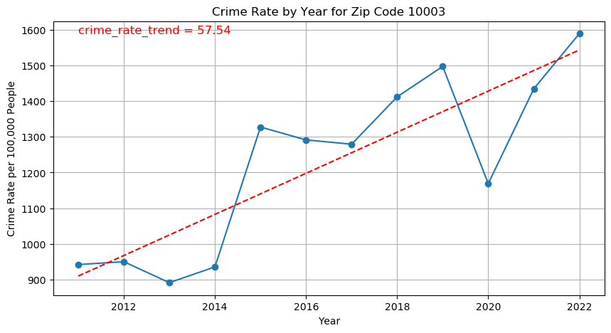

# NYC Crime Rate Analysis

In this analysis we synthesize NYC crime data with census data, and zillow housing data to understand the effect of crime rates on housing prices at a zip code level. We show that there is a significant negative relationship ( p < 0.0003, R^2 = 0.311) between the trend in crime rate per 100,000 and the percent change in housing prices. On average, if the linear crime rate trend increases by 1 per 100,000 people, this causes the average NYC home to lose $5,312 in value.  Along the way we build a model to predict the profile of a criminal suspect given the profile of a victim. 

[Example Section](README.md#Analysis)

## Data Visualization

### Data

We start by getting NYC crime report data from NYC Open Data : CSV data https://data.cityofnewyork.us/Public-Safety/NYPD-Complaint-Data-Historic/qgea-i56i/about_data

We also get home values by zip code from Zillow Home Value Index (ZHVI All home SFT, Condo/Coop) Time Series Smoothed seasonally adjusted : CSV data https://www.zillow.com/research/data/

Finally we need population data by zip code : For this we look at the Census data.

https://data.census.gov/table/ACSDT5Y2011.B01003?t=Counts,%20Estimates,%20and%20Projections:Population%20Total&g=040XX00US36$8600000&y=2011

For the raw CSV files see: https://drive.google.com/drive/folders/19QnftB8seO4_HQYX9Umu3FkkGjwCW9PI?usp=drive_link

<div>

<table border="1" class="dataframe">
  <thead>
    <tr style="text-align: right;">
      <th></th>
      <th>CMPLNT_FR_DT</th>
      <th>LAW_CAT_CD</th>
      <th>SUSP_AGE_GROUP</th>
      <th>SUSP_RACE</th>
      <th>SUSP_SEX</th>
      <th>Latitude</th>
      <th>Longitude</th>
      <th>VIC_AGE_GROUP</th>
      <th>VIC_RACE</th>
      <th>VIC_SEX</th>
    </tr>
  </thead>
  <tbody>
    <tr>
      <th>4</th>
      <td>03/10/2008</td>
      <td>FELONY</td>
      <td>&lt;18</td>
      <td>BLACK</td>
      <td>M</td>
      <td>40.650142</td>
      <td>-73.944674</td>
      <td>25-44</td>
      <td>BLACK</td>
      <td>M</td>
    </tr>
    <tr>
      <th>6</th>
      <td>12/21/2008</td>
      <td>MISDEMEANOR</td>
      <td>25-44</td>
      <td>BLACK</td>
      <td>M</td>
      <td>40.669126</td>
      <td>-73.973071</td>
      <td>25-44</td>
      <td>WHITE</td>
      <td>M</td>
    </tr>
    <tr>
      <th>9</th>
      <td>04/19/2008</td>
      <td>VIOLATION</td>
      <td>18-24</td>
      <td>WHITE HISPANIC</td>
      <td>M</td>
      <td>40.689954</td>
      <td>-73.916924</td>
      <td>25-44</td>
      <td>WHITE HISPANIC</td>
      <td>F</td>
    </tr>
    <tr>
      <th>20</th>
      <td>07/14/2008</td>
      <td>FELONY</td>
      <td>25-44</td>
      <td>BLACK</td>
      <td>F</td>
      <td>40.628285</td>
      <td>-73.944245</td>
      <td>45-64</td>
      <td>WHITE</td>
      <td>M</td>
    </tr>
    <tr>
      <th>26</th>
      <td>11/11/2008</td>
      <td>MISDEMEANOR</td>
      <td>25-44</td>
      <td>BLACK HISPANIC</td>
      <td>M</td>
      <td>40.655604</td>
      <td>-73.926420</td>
      <td>45-64</td>
      <td>BLACK</td>
      <td>F</td>
    </tr>
    <tr>
      <th>...</th>
      <td>...</td>
      <td>...</td>
      <td>...</td>
      <td>...</td>
      <td>...</td>
      <td>...</td>
      <td>...</td>
      <td>...</td>
      <td>...</td>
      <td>...</td>
    </tr>
    <tr>
      <th>8914821</th>
      <td>08/06/2008</td>
      <td>VIOLATION</td>
      <td>65+</td>
      <td>BLACK</td>
      <td>F</td>
      <td>40.834776</td>
      <td>-73.916017</td>
      <td>45-64</td>
      <td>BLACK</td>
      <td>F</td>
    </tr>
    <tr>
      <th>8914824</th>
      <td>10/27/2008</td>
      <td>MISDEMEANOR</td>
      <td>25-44</td>
      <td>BLACK</td>
      <td>M</td>
      <td>40.831575</td>
      <td>-73.927705</td>
      <td>25-44</td>
      <td>BLACK</td>
      <td>F</td>
    </tr>
    <tr>
      <th>8914831</th>
      <td>05/25/2008</td>
      <td>MISDEMEANOR</td>
      <td>&lt;18</td>
      <td>BLACK</td>
      <td>M</td>
      <td>40.841935</td>
      <td>-73.914246</td>
      <td>45-64</td>
      <td>BLACK</td>
      <td>M</td>
    </tr>
    <tr>
      <th>8914834</th>
      <td>04/16/2008</td>
      <td>FELONY</td>
      <td>25-44</td>
      <td>BLACK</td>
      <td>M</td>
      <td>40.826765</td>
      <td>-73.950203</td>
      <td>45-64</td>
      <td>WHITE</td>
      <td>F</td>
    </tr>
    <tr>
      <th>8914836</th>
      <td>06/25/2008</td>
      <td>MISDEMEANOR</td>
      <td>25-44</td>
      <td>BLACK</td>
      <td>M</td>
      <td>40.578255</td>
      <td>-73.972324</td>
      <td>25-44</td>
      <td>BLACK</td>
      <td>F</td>
    </tr>
  </tbody>
</table>
<p>2071516 rows × 10 columns</p>
</div>


### Idle hands are the Devil's workshop


For Adults we see crime increases during the summer months, however we see that crime declines for minors during summer. During the summer, adults are engaging in less structured social activities - vacations, parties, nightlife, and other outdoof activities. This creates more opportunitiy for crime, whereas work provides a structured activity that decreases crime. For minors, however, we see that the structure and supervision they receive at home (or at a summer job) is much better than what they receive at schools. 


We can verify this by looking at crime by day of the week during summer and non-summer months. Here we see that crime increases on the weekends for adults and decrease for minors. This rules out the possibility that the summer heat is causing aggrivation. 


_**Insight**_: Structured and supervised environments generally lead to less crime. Families tend to do a better job of creating these environments for kids than schools do. This may be particularly relevant for someone considering the benefits of homeschooling their kids, or weighing the costs and benefits of community activities.


## Analysis
## Analysis: the relationship between crime rates and housing prices

First we use ```Geopandas``` API to attach a zip code to our crime data. Our zillow housing price data and our census data is divided by zip code, so this is essential for connecting our datasets. 

```
def get_zip_code(longitude, latitude, zip_codes):
    
    try: 
        # Create a GeoDataFrame for the input point
        point = gpd.GeoDataFrame(geometry=[Point(longitude, latitude)], crs='EPSG:4326')

        # Perform spatial join to find the corresponding ZIP Code
        joined = gpd.sjoin(point, zip_codes, how='left', predicate='within')

        # Extract the ZIP Code from the resulting GeoDataFrame
        if not joined.empty:
            return joined.iloc[0]['modzcta']  # Use 'modzcta' as the ZIP Code column
        else:
            return None
    except:
        return None

crime_data['zip_code'] = crime_data.apply(lambda row: get_zip_code(row['Longitude'], row['Latitude'], zip_codes), axis=1)
crime_data.to_csv('big_data_w_zipcodes.csv')
```

we thenk look at crime per 100,000 by zip code and capture the trend in crime rate ```Beta``` 
<p>
  
  
  
  
    
</p>


Once we merge our data together, we get a dataset that looks like this 
<div>
<table border="1" class="dataframe">
  <thead>
    <tr style="text-align: right;">
      <th></th>
      <th>Year</th>
      <th>zipCode</th>
      <th>CrimeCount</th>
      <th>Population</th>
      <th>CrimeRate</th>
      <th>Beta</th>
      <th>HousingPrice</th>
      <th>AvgHousingPrice2011</th>
      <th>AvgHousingPrice2022</th>
      <th>chng_housing_price</th>
      <th>chng_housing_price_pct</th>
    </tr>
  </thead>
  <tbody>
    <tr>
      <th>0</th>
      <td>2011</td>
      <td>10001</td>
      <td>509</td>
      <td>21097.0</td>
      <td>2412.665308</td>
      <td>176.536217</td>
      <td>1612133.893494</td>
      <td>1.614173e+06</td>
      <td>1.891585e+06</td>
      <td>277411.531212</td>
      <td>0.171860</td>
    </tr>
    <tr>
      <th>1</th>
      <td>2011</td>
      <td>10001</td>
      <td>509</td>
      <td>21097.0</td>
      <td>2412.665308</td>
      <td>176.536217</td>
      <td>1627445.944321</td>
      <td>1.614173e+06</td>
      <td>1.891585e+06</td>
      <td>277411.531212</td>
      <td>0.171860</td>
    </tr>
    <tr>
      <th>2</th>
      <td>2011</td>
      <td>10001</td>
      <td>509</td>
      <td>21097.0</td>
      <td>2412.665308</td>
      <td>176.536217</td>
      <td>1612133.893494</td>
      <td>1.614173e+06</td>
      <td>1.891585e+06</td>
      <td>277411.531212</td>
      <td>0.171860</td>
    </tr>
    <tr>
      <th>3</th>
      <td>2011</td>
      <td>10001</td>
      <td>509</td>
      <td>21097.0</td>
      <td>2412.665308</td>
      <td>176.536217</td>
      <td>1567627.09884</td>
      <td>1.614173e+06</td>
      <td>1.891585e+06</td>
      <td>277411.531212</td>
      <td>0.171860</td>
    </tr>
    <tr>
      <th>4</th>
      <td>2011</td>
      <td>10001</td>
      <td>509</td>
      <td>21097.0</td>
      <td>2412.665308</td>
      <td>176.536217</td>
      <td>1606498.615164</td>
      <td>1.614173e+06</td>
      <td>1.891585e+06</td>
      <td>277411.531212</td>
      <td>0.171860</td>
    </tr>
    <tr>
      <th>...</th>
      <td>...</td>
      <td>...</td>
      <td>...</td>
      <td>...</td>
      <td>...</td>
      <td>...</td>
      <td>...</td>
      <td>...</td>
      <td>...</td>
      <td>...</td>
      <td>...</td>
    </tr>
    <tr>
      <th>1406047</th>
      <td>2022</td>
      <td>11694</td>
      <td>267</td>
      <td>24584</td>
      <td>1086.072242</td>
      <td>29.717461</td>
      <td>878751.028993</td>
      <td>5.729438e+05</td>
      <td>8.845665e+05</td>
      <td>311622.688883</td>
      <td>0.543897</td>
    </tr>
    <tr>
      <th>1406048</th>
      <td>2022</td>
      <td>11694</td>
      <td>267</td>
      <td>24584</td>
      <td>1086.072242</td>
      <td>29.717461</td>
      <td>878773.461607</td>
      <td>5.729438e+05</td>
      <td>8.845665e+05</td>
      <td>311622.688883</td>
      <td>0.543897</td>
    </tr>
    <tr>
      <th>1406049</th>
      <td>2022</td>
      <td>11694</td>
      <td>267</td>
      <td>24584</td>
      <td>1086.072242</td>
      <td>29.717461</td>
      <td>883008.653716</td>
      <td>5.729438e+05</td>
      <td>8.845665e+05</td>
      <td>311622.688883</td>
      <td>0.543897</td>
    </tr>
    <tr>
      <th>1406050</th>
      <td>2022</td>
      <td>11694</td>
      <td>267</td>
      <td>24584</td>
      <td>1086.072242</td>
      <td>29.717461</td>
      <td>878773.461607</td>
      <td>5.729438e+05</td>
      <td>8.845665e+05</td>
      <td>311622.688883</td>
      <td>0.543897</td>
    </tr>
    <tr>
      <th>1406051</th>
      <td>2022</td>
      <td>11697</td>
      <td>8</td>
      <td>13558</td>
      <td>59.005753</td>
      <td>NaN</td>
      <td>NaN</td>
      <td>NaN</td>
      <td>NaN</td>
      <td>NaN</td>
      <td>NaN</td>
    </tr>
  </tbody>
</table>
<p>1406052 rows × 11 columns</p>
</div>

And we are ready to run our regression
```
df = df.dropna(subset=['Beta', 'chng_housing_price_pct'])

# Define the independent (X) and dependent (y) variables
X = df[['Beta']]
y = df['chng_housing_price_pct']

# Add a constant to the independent variables matrix
X = sm.add_constant(X)

# Perform OLS regression
model = sm.OLS(y, X).fit()

# Print the regression results
print(model.summary())
```


```
                              OLS Regression Results                              
==================================================================================
Dep. Variable:     chng_housing_price_pct   R-squared:                       0.311
Model:                                OLS   Adj. R-squared:                  0.311
Method:                     Least Squares   F-statistic:                 2.811e+05
Date:                    Tue, 04 Jun 2024   Prob (F-statistic):               0.00
Time:                            21:04:39   Log-Likelihood:            -2.0037e+05
No. Observations:                  622595   AIC:                         4.007e+05
Df Residuals:                      622593   BIC:                         4.008e+05
Df Model:                               1                                         
Covariance Type:                nonrobust                                         
==============================================================================
                 coef    std err          t      P>|t|      [0.025      0.975]
------------------------------------------------------------------------------
const          0.9153      0.000   2003.055      0.000       0.914       0.916
Beta          -0.0081   1.53e-05   -530.159      0.000      -0.008      -0.008
==============================================================================
Omnibus:                     6499.228   Durbin-Watson:                   0.003
Prob(Omnibus):                  0.000   Jarque-Bera (JB):             7626.804
Skew:                           0.195   Prob(JB):                         0.00
Kurtosis:                       3.377   Cond. No.                         32.2
==============================================================================
```
```
print(final_merged_data['HousingPrice'].mean())
print(final_merged_data['HousingPrice'].mean()*0.0081)

655,808.04
5,312.04
```

There is a very significant negative relationship between the linear trend in crime rate per 100,000 people in a zip code, and the percent change in housing prices in that zip code. 

This linear trend in crime rate per 100,000 people explains 31% of the variance in housing prices. And for each unit increase in that crime trend, the average home loses $5,312 in value. This is a substantial enough amount that it should encourage homeowners to invest in neighborhood safety initiatives. 


