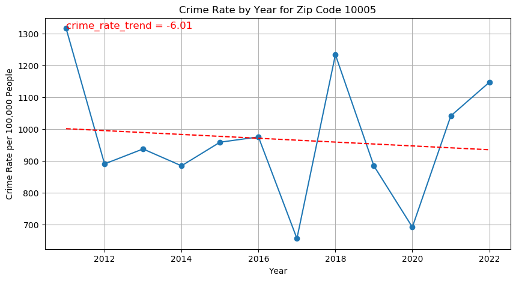

<a id="top"></a>
# The relationship between crime rates and housing prices

_In this analysis we synthesize NYC crime data, with zillow housing data, and US Census data to show the relationship between Crime rates and housing prices._

_We take a unique approach and use the linear crime rate trend per capita in a zip code as a predictor of percent change in housing prices in that zip code. The theory is that the trend in crime rates affects the reputation of the neighborhood and therefore housing prces._

<u>Results</u>: _We find a significant negative relationship (p < 0.0003, R^2 = 0.31) between linear crime rate trends per capita and percent change in housing prices in NYC from 2011 to 2022._


## Table of Contents
- [Data wrangling](#section1)
- [Data visualization](#section2)
- [Regression analysis](#section3)

<a id="section1"></a>
# 1) Import and clean the data

We start by getting NYC crime report data from NYC Open Data : CSV data https://data.cityofnewyork.us/Public-Safety/NYPD-Complaint-Data-Historic/qgea-i56i/about_data

We also get home values by zip code from Zillow Home Value Index (ZHVI All home SFT, Condo/Coop) Time Series Smoothed seasonally adjusted : CSV data https://www.zillow.com/research/data/

Finally we need population data by zip code : For this we look at the Census data.

https://data.census.gov/table/ACSDT5Y2011.B01003?t=Counts,%20Estimates,%20and%20Projections:Population%20Total&g=040XX00US36$8600000&y=2011

we download the census data by year and aggregate them into 1 spread sheet. the years we could get are from 2011 - 2022


```python
import os
import pandas as pd
import numpy as np
import requests
import matplotlib.pyplot as plt
import seaborn as sns


## we use geopandas to add zip codes to our crime data
## we need zip codes because our housing data is referenced by zip code.
## so we convert longitude and latitude to zip code for each row in our crime data
import geopandas as gpd
from shapely.geometry import Point
import os
import pygeos
import rtree


import statsmodels.api as sm
from scipy.stats import pearsonr
from statsmodels.tsa.stattools import adfuller
from statsmodels.tsa.arima.model import ARIMA
from sklearn.preprocessing import StandardScaler


```

    c:\users\alex\appdata\local\programs\python\python37\lib\site-packages\geopandas\_compat.py:115: UserWarning: The Shapely GEOS version (3.11.3-CAPI-1.17.3) is incompatible with the GEOS version PyGEOS was compiled with (3.10.4-CAPI-1.16.2). Conversions between both will be slow.
      shapely_geos_version, geos_capi_version_string
    

## Let's load our Crime data


```python
columns_to_keep = ['CMPLNT_FR_DT', 'LAW_CAT_CD', 'SUSP_AGE_GROUP', 'SUSP_RACE', 'SUSP_SEX', 'VIC_AGE_GROUP', 'VIC_RACE', 'VIC_SEX',
   'Latitude', 'Longitude' ]


crime_data = pd.read_csv('crime_data.csv', usecols=columns_to_keep)
```


```python
crime_data.head()
```


<div>
<style scoped>
    .dataframe tbody tr th:only-of-type {
        vertical-align: middle;
    }

    .dataframe tbody tr th {
        vertical-align: top;
    }

    .dataframe thead th {
        text-align: right;
    }
</style>
<table border="1" class="dataframe">
  <thead>
    <tr style="text-align: right;">
      <th></th>
      <th>CMPLNT_FR_DT</th>
      <th>LAW_CAT_CD</th>
      <th>SUSP_AGE_GROUP</th>
      <th>SUSP_RACE</th>
      <th>SUSP_SEX</th>
      <th>Latitude</th>
      <th>Longitude</th>
      <th>VIC_AGE_GROUP</th>
      <th>VIC_RACE</th>
      <th>VIC_SEX</th>
    </tr>
  </thead>
  <tbody>
    <tr>
      <th>0</th>
      <td>02/20/2008</td>
      <td>FELONY</td>
      <td>(null)</td>
      <td>UNKNOWN</td>
      <td>(null)</td>
      <td>40.692464</td>
      <td>-73.972708</td>
      <td>25-44</td>
      <td>WHITE</td>
      <td>F</td>
    </tr>
    <tr>
      <th>1</th>
      <td>08/21/2008</td>
      <td>FELONY</td>
      <td>(null)</td>
      <td>(null)</td>
      <td>(null)</td>
      <td>40.771341</td>
      <td>-73.953418</td>
      <td>45-64</td>
      <td>WHITE HISPANIC</td>
      <td>F</td>
    </tr>
    <tr>
      <th>2</th>
      <td>04/03/2008</td>
      <td>FELONY</td>
      <td>(null)</td>
      <td>(null)</td>
      <td>(null)</td>
      <td>40.671245</td>
      <td>-73.926713</td>
      <td>25-44</td>
      <td>BLACK</td>
      <td>F</td>
    </tr>
    <tr>
      <th>3</th>
      <td>08/19/2008</td>
      <td>MISDEMEANOR</td>
      <td>(null)</td>
      <td>UNKNOWN</td>
      <td>(null)</td>
      <td>40.813412</td>
      <td>-73.943226</td>
      <td>(null)</td>
      <td>UNKNOWN</td>
      <td>M</td>
    </tr>
    <tr>
      <th>4</th>
      <td>03/10/2008</td>
      <td>FELONY</td>
      <td>&lt;18</td>
      <td>BLACK</td>
      <td>M</td>
      <td>40.650142</td>
      <td>-73.944674</td>
      <td>25-44</td>
      <td>BLACK</td>
      <td>M</td>
    </tr>
  </tbody>
</table>
</div>


```python
df = crime_data.copy()
df['CMPLNT_FR_DT'].mean()
```


    Timestamp('2015-11-18 00:03:59.196844032')


## Let's load our Housing data


```python
zillow_data = pd.read_csv('zillow_data.csv')
zillow_data.head()
```


<div>
<style scoped>
    .dataframe tbody tr th:only-of-type {
        vertical-align: middle;
    }

    .dataframe tbody tr th {
        vertical-align: top;
    }

    .dataframe thead th {
        text-align: right;
    }
</style>
<table border="1" class="dataframe">
  <thead>
    <tr style="text-align: right;">
      <th></th>
      <th>RegionID</th>
      <th>SizeRank</th>
      <th>RegionName</th>
      <th>RegionType</th>
      <th>StateName</th>
      <th>State</th>
      <th>City</th>
      <th>Metro</th>
      <th>CountyName</th>
      <th>2000-01-31</th>
      <th>...</th>
      <th>2023-07-31</th>
      <th>2023-08-31</th>
      <th>2023-09-30</th>
      <th>2023-10-31</th>
      <th>2023-11-30</th>
      <th>2023-12-31</th>
      <th>2024-01-31</th>
      <th>2024-02-29</th>
      <th>2024-03-31</th>
      <th>2024-04-30</th>
    </tr>
  </thead>
  <tbody>
    <tr>
      <th>0</th>
      <td>91982</td>
      <td>1</td>
      <td>77494</td>
      <td>zip</td>
      <td>TX</td>
      <td>TX</td>
      <td>Katy</td>
      <td>Houston-The Woodlands-Sugar Land, TX</td>
      <td>Fort Bend County</td>
      <td>213463.221766</td>
      <td>...</td>
      <td>488235.174762</td>
      <td>490749.946441</td>
      <td>492598.348830</td>
      <td>493857.713761</td>
      <td>494559.104796</td>
      <td>495182.966394</td>
      <td>496580.196689</td>
      <td>498775.863988</td>
      <td>501631.311127</td>
      <td>504191.521560</td>
    </tr>
    <tr>
      <th>1</th>
      <td>61148</td>
      <td>2</td>
      <td>8701</td>
      <td>zip</td>
      <td>NJ</td>
      <td>NJ</td>
      <td>Lakewood</td>
      <td>New York-Newark-Jersey City, NY-NJ-PA</td>
      <td>Ocean County</td>
      <td>137293.774710</td>
      <td>...</td>
      <td>552105.838958</td>
      <td>557998.314944</td>
      <td>564321.215281</td>
      <td>571660.009863</td>
      <td>578460.106425</td>
      <td>583227.579651</td>
      <td>584811.159583</td>
      <td>587368.424745</td>
      <td>592465.126119</td>
      <td>600765.893612</td>
    </tr>
    <tr>
      <th>2</th>
      <td>91940</td>
      <td>3</td>
      <td>77449</td>
      <td>zip</td>
      <td>TX</td>
      <td>TX</td>
      <td>Katy</td>
      <td>Houston-The Woodlands-Sugar Land, TX</td>
      <td>Harris County</td>
      <td>104657.662381</td>
      <td>...</td>
      <td>280286.283611</td>
      <td>281194.368840</td>
      <td>281734.942252</td>
      <td>281724.603121</td>
      <td>281486.774213</td>
      <td>281192.083503</td>
      <td>281550.767554</td>
      <td>282258.587207</td>
      <td>283366.392394</td>
      <td>284335.695860</td>
    </tr>
    <tr>
      <th>3</th>
      <td>62080</td>
      <td>4</td>
      <td>11368</td>
      <td>zip</td>
      <td>NY</td>
      <td>NY</td>
      <td>New York</td>
      <td>New York-Newark-Jersey City, NY-NJ-PA</td>
      <td>Queens County</td>
      <td>151159.744038</td>
      <td>...</td>
      <td>470293.119764</td>
      <td>470287.047021</td>
      <td>469717.985426</td>
      <td>467648.873528</td>
      <td>464224.467531</td>
      <td>459848.455550</td>
      <td>456960.515649</td>
      <td>455322.918370</td>
      <td>458447.265050</td>
      <td>463052.465021</td>
    </tr>
    <tr>
      <th>4</th>
      <td>91733</td>
      <td>5</td>
      <td>77084</td>
      <td>zip</td>
      <td>TX</td>
      <td>TX</td>
      <td>Houston</td>
      <td>Houston-The Woodlands-Sugar Land, TX</td>
      <td>Harris County</td>
      <td>103553.438861</td>
      <td>...</td>
      <td>274946.698136</td>
      <td>275833.130611</td>
      <td>276267.718851</td>
      <td>276257.923524</td>
      <td>275831.123272</td>
      <td>275402.735803</td>
      <td>275449.324127</td>
      <td>275980.979306</td>
      <td>276993.281910</td>
      <td>277995.947760</td>
    </tr>
  </tbody>
</table>
<p>5 rows × 301 columns</p>
</div>


## Let's load our Census data 


```python
census_data = pd.read_csv('Aggregate census data.csv')

census_data = census_data.dropna()

census_data.head()
```


<div>
<style scoped>
    .dataframe tbody tr th:only-of-type {
        vertical-align: middle;
    }

    .dataframe tbody tr th {
        vertical-align: top;
    }

    .dataframe thead th {
        text-align: right;
    }
</style>
<table border="1" class="dataframe">
  <thead>
    <tr style="text-align: right;">
      <th></th>
      <th>GEO_ID</th>
      <th>NAME</th>
      <th>zipCode</th>
      <th>2011</th>
      <th>2011 margin of error</th>
      <th>2012</th>
      <th>2012 margin of error</th>
      <th>2013</th>
      <th>2013 margin of error</th>
      <th>2014</th>
      <th>...</th>
      <th>2018</th>
      <th>2018 margin of error</th>
      <th>2019</th>
      <th>2019 margin of error</th>
      <th>2020</th>
      <th>2020 margin of error</th>
      <th>2021</th>
      <th>2021 margin of error</th>
      <th>2022</th>
      <th>2022 margin of error</th>
    </tr>
  </thead>
  <tbody>
    <tr>
      <th>0</th>
      <td>8600000US06390</td>
      <td>ZCTA5 06390</td>
      <td>6390.0</td>
      <td>280.0</td>
      <td>121.0</td>
      <td>307.0</td>
      <td>121.0</td>
      <td>291.0</td>
      <td>113.0</td>
      <td>296.0</td>
      <td>...</td>
      <td>183.0</td>
      <td>117.0</td>
      <td>125.0</td>
      <td>106.0</td>
      <td>61.0</td>
      <td>36.0</td>
      <td>58</td>
      <td>36</td>
      <td>53</td>
      <td>39</td>
    </tr>
    <tr>
      <th>1</th>
      <td>8600000US10001</td>
      <td>ZCTA5 10001</td>
      <td>10001.0</td>
      <td>21097.0</td>
      <td>1160.0</td>
      <td>20579.0</td>
      <td>1027.0</td>
      <td>21966.0</td>
      <td>1552.0</td>
      <td>22767.0</td>
      <td>...</td>
      <td>22924.0</td>
      <td>1190.0</td>
      <td>24117.0</td>
      <td>1274.0</td>
      <td>25026.0</td>
      <td>1759.0</td>
      <td>26966</td>
      <td>1911</td>
      <td>27004</td>
      <td>1827</td>
    </tr>
    <tr>
      <th>2</th>
      <td>8600000US10002</td>
      <td>ZCTA5 10002</td>
      <td>10002.0</td>
      <td>81335.0</td>
      <td>2469.0</td>
      <td>80323.0</td>
      <td>2259.0</td>
      <td>82191.0</td>
      <td>2595.0</td>
      <td>79894.0</td>
      <td>...</td>
      <td>74993.0</td>
      <td>1909.0</td>
      <td>74479.0</td>
      <td>1959.0</td>
      <td>74363.0</td>
      <td>3183.0</td>
      <td>76807</td>
      <td>3172</td>
      <td>76518</td>
      <td>2894</td>
    </tr>
    <tr>
      <th>3</th>
      <td>8600000US10003</td>
      <td>ZCTA5 10003</td>
      <td>10003.0</td>
      <td>55190.0</td>
      <td>1766.0</td>
      <td>56614.0</td>
      <td>2161.0</td>
      <td>57310.0</td>
      <td>1844.0</td>
      <td>57068.0</td>
      <td>...</td>
      <td>54682.0</td>
      <td>1754.0</td>
      <td>53977.0</td>
      <td>1593.0</td>
      <td>54671.0</td>
      <td>2568.0</td>
      <td>54447</td>
      <td>2660</td>
      <td>53877</td>
      <td>2579</td>
    </tr>
    <tr>
      <th>4</th>
      <td>8600000US10004</td>
      <td>ZCTA5 10004</td>
      <td>10004.0</td>
      <td>2604.0</td>
      <td>362.0</td>
      <td>2780.0</td>
      <td>511.0</td>
      <td>2807.0</td>
      <td>450.0</td>
      <td>3024.0</td>
      <td>...</td>
      <td>3028.0</td>
      <td>442.0</td>
      <td>3335.0</td>
      <td>581.0</td>
      <td>3310.0</td>
      <td>658.0</td>
      <td>4795</td>
      <td>966</td>
      <td>4579</td>
      <td>926</td>
    </tr>
  </tbody>
</table>
<p>5 rows × 27 columns</p>
</div>


### Group the Crime data into categories, and drop N/A datapoints


```python
crime_data['SUSP_RACE'].unique()
crime_data['VIC_RACE'].unique()


crime_data_cleaned = crime_data.dropna(subset=['CMPLNT_FR_DT', 'Latitude', 'Longitude'])
crime_data_cleaned['SUSP_AGE_GROUP'].unique()


filtered_values = ['25-44', '18-24', '45-64', '<18', '65+']

crime_data_cleaned = crime_data_cleaned[crime_data_cleaned['SUSP_AGE_GROUP'].isin(filtered_values)]
crime_data_cleaned = crime_data_cleaned[crime_data_cleaned['VIC_AGE_GROUP'].isin(filtered_values)]


filtered_values = ['BLACK', 'WHITE', 'WHITE HISPANIC', 'BLACK HISPANIC', 'ASIAN / PACIFIC ISLANDER', 'AMERICAN INDIAN/ALASKAN NATIVE'] 

crime_data_cleaned = crime_data_cleaned[crime_data_cleaned['SUSP_RACE'].isin(filtered_values)]
crime_data_cleaned = crime_data_cleaned[crime_data_cleaned['VIC_RACE'].isin(filtered_values)]

filtered_values = ['M', 'F']
crime_data_cleaned = crime_data_cleaned[crime_data_cleaned['SUSP_SEX'].isin(filtered_values)]
crime_data_cleaned = crime_data_cleaned[crime_data_cleaned['VIC_SEX'].isin(filtered_values)]


crime_data_cleaned.head()


```


<div>
<style scoped>
    .dataframe tbody tr th:only-of-type {
        vertical-align: middle;
    }

    .dataframe tbody tr th {
        vertical-align: top;
    }

    .dataframe thead th {
        text-align: right;
    }
</style>
<table border="1" class="dataframe">
  <thead>
    <tr style="text-align: right;">
      <th></th>
      <th>CMPLNT_FR_DT</th>
      <th>LAW_CAT_CD</th>
      <th>SUSP_AGE_GROUP</th>
      <th>SUSP_RACE</th>
      <th>SUSP_SEX</th>
      <th>Latitude</th>
      <th>Longitude</th>
      <th>VIC_AGE_GROUP</th>
      <th>VIC_RACE</th>
      <th>VIC_SEX</th>
    </tr>
  </thead>
  <tbody>
    <tr>
      <th>4</th>
      <td>03/10/2008</td>
      <td>FELONY</td>
      <td>&lt;18</td>
      <td>BLACK</td>
      <td>M</td>
      <td>40.650142</td>
      <td>-73.944674</td>
      <td>25-44</td>
      <td>BLACK</td>
      <td>M</td>
    </tr>
    <tr>
      <th>6</th>
      <td>12/21/2008</td>
      <td>MISDEMEANOR</td>
      <td>25-44</td>
      <td>BLACK</td>
      <td>M</td>
      <td>40.669126</td>
      <td>-73.973071</td>
      <td>25-44</td>
      <td>WHITE</td>
      <td>M</td>
    </tr>
    <tr>
      <th>9</th>
      <td>04/19/2008</td>
      <td>VIOLATION</td>
      <td>18-24</td>
      <td>WHITE HISPANIC</td>
      <td>M</td>
      <td>40.689954</td>
      <td>-73.916924</td>
      <td>25-44</td>
      <td>WHITE HISPANIC</td>
      <td>F</td>
    </tr>
    <tr>
      <th>20</th>
      <td>07/14/2008</td>
      <td>FELONY</td>
      <td>25-44</td>
      <td>BLACK</td>
      <td>F</td>
      <td>40.628285</td>
      <td>-73.944245</td>
      <td>45-64</td>
      <td>WHITE</td>
      <td>M</td>
    </tr>
    <tr>
      <th>26</th>
      <td>11/11/2008</td>
      <td>MISDEMEANOR</td>
      <td>25-44</td>
      <td>BLACK HISPANIC</td>
      <td>M</td>
      <td>40.655604</td>
      <td>-73.926420</td>
      <td>45-64</td>
      <td>BLACK</td>
      <td>F</td>
    </tr>
  </tbody>
</table>
</div>


### Add zip codes to our data so that we can merge our crime data with our housing data

### Geopandas is an API that allows us to look up a zip code given longitude and latitude data. 


```python
# Load the ZIP Code shapefile once
zip_code_shapefile = 'geo_export_5d779e3d-72be-4a75-b7b0-443826472d7f.shp'
zip_codes = gpd.read_file(zip_code_shapefile)

# Ensure the coordinate reference system (CRS) is WGS84 (EPSG:4326)
zip_codes = zip_codes.to_crs(epsg=4326)

# Define the function to get ZIP Code from latitude and longitude using the pre-loaded GeoDataFrame
def get_zip_code(longitude, latitude, zip_codes):
    
    try: 
        # Create a GeoDataFrame for the input point
        point = gpd.GeoDataFrame(geometry=[Point(longitude, latitude)], crs='EPSG:4326')

        # Perform spatial join to find the corresponding ZIP Code
        joined = gpd.sjoin(point, zip_codes, how='left', predicate='within')

        # Extract the ZIP Code from the resulting GeoDataFrame
        if not joined.empty:
            return joined.iloc[0]['modzcta']  # Use 'modzcta' as the ZIP Code column
        else:
            return None
    except:
        return None
    
## This took 8 hours of compute time! 

# crime_data['zip_code'] = crime_data.apply(lambda row: get_zip_code(row['Longitude'], row['Latitude'], zip_codes), axis=1)
# crime_data.to_csv('big_data_w_zipcodes.csv')

df = pd.read_csv('big_data_w_zipcodes.csv')
```


```python
df['zip_code'].unique()
df_clean = df.dropna(subset=['zip_code'])

df_clean = df_clean[df_clean['zip_code'] != 99999]

df_clean['zip_code'] = df_clean['zip_code'].astype(str)
df_clean['zip_code'] = df_clean['zip_code'].apply(lambda x: x[:-2])


```

### Use zip codes to combine the Housing data with the Crime data


```python
crime_data = df_clean.copy()
zillow_data = zillow_data.copy()

crime_data['CMPLNT_FR_DT'] = pd.to_datetime(crime_data['CMPLNT_FR_DT'], format='%m/%d/%Y', errors='coerce')

# Drop rows where CMPLNT_FR_DT could not be converted
crime_data = crime_data.dropna(subset=['CMPLNT_FR_DT']).copy()

# Extract year and month
crime_data.loc[:, 'Year'] = crime_data['CMPLNT_FR_DT'].dt.year
crime_data.loc[:, 'Month'] = crime_data['CMPLNT_FR_DT'].dt.month

zillow_long = pd.melt(zillow_data, 
                      id_vars=['RegionID', 'RegionName', 'State', 'City', 'Metro', 'CountyName'], 
                      var_name='Date', 
                      value_name='HousingPrice')

# Convert Date to datetime, coercing errors
zillow_long['Date'] = pd.to_datetime(zillow_long['Date'], errors='coerce')

# Drop rows where Date could not be converted
zillow_long = zillow_long.dropna(subset=['Date']).copy()

# Extract year and month from the Date column
zillow_long.loc[:, 'Year'] = zillow_long['Date'].dt.year
zillow_long.loc[:, 'Month'] = zillow_long['Date'].dt.month

# Rename RegionName to zip_code for merging
zillow_long = zillow_long.rename(columns={'RegionName': 'zip_code'})

# Convert zip_code to string for merging
zillow_long['zip_code'] = zillow_long['zip_code'].astype(str)
crime_data['zip_code'] = crime_data['zip_code'].astype(str)

# Step 3: Merge the dataframes on zip_code, Year, and Month
merged_data = pd.merge(crime_data, zillow_long, on=['zip_code', 'Year', 'Month'], how='left')

```


```python
merged_data.head()
```


<div>
<style scoped>
    .dataframe tbody tr th:only-of-type {
        vertical-align: middle;
    }

    .dataframe tbody tr th {
        vertical-align: top;
    }

    .dataframe thead th {
        text-align: right;
    }
</style>
<table border="1" class="dataframe">
  <thead>
    <tr style="text-align: right;">
      <th></th>
      <th>Unnamed: 0</th>
      <th>CMPLNT_FR_DT</th>
      <th>LAW_CAT_CD</th>
      <th>SUSP_AGE_GROUP</th>
      <th>SUSP_RACE</th>
      <th>SUSP_SEX</th>
      <th>Latitude</th>
      <th>Longitude</th>
      <th>VIC_AGE_GROUP</th>
      <th>VIC_RACE</th>
      <th>...</th>
      <th>zip_code</th>
      <th>Year</th>
      <th>Month</th>
      <th>RegionID</th>
      <th>State</th>
      <th>City</th>
      <th>Metro</th>
      <th>CountyName</th>
      <th>Date</th>
      <th>HousingPrice</th>
    </tr>
  </thead>
  <tbody>
    <tr>
      <th>0</th>
      <td>0</td>
      <td>2008-03-10</td>
      <td>FELONY</td>
      <td>&lt;18</td>
      <td>BLACK</td>
      <td>M</td>
      <td>40.650142</td>
      <td>-73.944674</td>
      <td>25-44</td>
      <td>BLACK</td>
      <td>...</td>
      <td>11203</td>
      <td>2008</td>
      <td>3</td>
      <td>62014.0</td>
      <td>NY</td>
      <td>New York</td>
      <td>New York-Newark-Jersey City, NY-NJ-PA</td>
      <td>Kings County</td>
      <td>2008-03-31</td>
      <td>428218.672402</td>
    </tr>
    <tr>
      <th>1</th>
      <td>2</td>
      <td>2008-04-19</td>
      <td>VIOLATION</td>
      <td>18-24</td>
      <td>WHITE HISPANIC</td>
      <td>M</td>
      <td>40.689954</td>
      <td>-73.916924</td>
      <td>25-44</td>
      <td>WHITE HISPANIC</td>
      <td>...</td>
      <td>11221</td>
      <td>2008</td>
      <td>4</td>
      <td>62032.0</td>
      <td>NY</td>
      <td>New York</td>
      <td>New York-Newark-Jersey City, NY-NJ-PA</td>
      <td>Kings County</td>
      <td>2008-04-30</td>
      <td>421535.515864</td>
    </tr>
    <tr>
      <th>2</th>
      <td>3</td>
      <td>2008-07-14</td>
      <td>FELONY</td>
      <td>25-44</td>
      <td>BLACK</td>
      <td>F</td>
      <td>40.628285</td>
      <td>-73.944245</td>
      <td>45-64</td>
      <td>WHITE</td>
      <td>...</td>
      <td>11210</td>
      <td>2008</td>
      <td>7</td>
      <td>62021.0</td>
      <td>NY</td>
      <td>New York</td>
      <td>New York-Newark-Jersey City, NY-NJ-PA</td>
      <td>Kings County</td>
      <td>2008-07-31</td>
      <td>496640.589895</td>
    </tr>
    <tr>
      <th>3</th>
      <td>4</td>
      <td>2008-11-11</td>
      <td>MISDEMEANOR</td>
      <td>25-44</td>
      <td>BLACK HISPANIC</td>
      <td>M</td>
      <td>40.655604</td>
      <td>-73.926420</td>
      <td>45-64</td>
      <td>BLACK</td>
      <td>...</td>
      <td>11203</td>
      <td>2008</td>
      <td>11</td>
      <td>62014.0</td>
      <td>NY</td>
      <td>New York</td>
      <td>New York-Newark-Jersey City, NY-NJ-PA</td>
      <td>Kings County</td>
      <td>2008-11-30</td>
      <td>403782.866617</td>
    </tr>
    <tr>
      <th>4</th>
      <td>5</td>
      <td>2008-02-15</td>
      <td>MISDEMEANOR</td>
      <td>18-24</td>
      <td>BLACK</td>
      <td>M</td>
      <td>40.810262</td>
      <td>-73.941560</td>
      <td>45-64</td>
      <td>BLACK</td>
      <td>...</td>
      <td>10037</td>
      <td>2008</td>
      <td>2</td>
      <td>61651.0</td>
      <td>NY</td>
      <td>New York</td>
      <td>New York-Newark-Jersey City, NY-NJ-PA</td>
      <td>New York County</td>
      <td>2008-02-29</td>
      <td>322347.586211</td>
    </tr>
  </tbody>
</table>
<p>5 rows × 21 columns</p>
</div>


### Finally we need to know how much crime relative to the local population, so we merge our Census data with our Crime data


```python
crime_data = merged_data.copy()
# Preprocess Census Data
# Ensure zipCode column is correctly named and convert to string type for merging
census_data['zipCode'] = census_data['zipCode'].astype(str).str.split('.').str[0]
#print("Census Data Columns:", census_data.columns)

# Aggregate Crime Data by year and zip code
crime_data['Year'] = pd.to_datetime(crime_data['CMPLNT_FR_DT']).dt.year
crime_counts = crime_data.groupby(['Year', 'zip_code']).size().reset_index(name='CrimeCount')

# Ensure the zip_code column in crime_counts is of type string for consistent merging
crime_counts['zip_code'] = crime_counts['zip_code'].astype(str)
#print("Crime Counts Columns:", crime_counts.columns)

# Merge the aggregated crime data with the census population data
crime_counts = crime_counts.rename(columns={'zip_code': 'zipCode'})
merged_data = crime_counts.copy()

# Add population data for each year without suffix conflicts
population_data = pd.melt(census_data, id_vars=['zipCode'], var_name='Year', value_name='Population')
population_data = population_data[population_data['Year'].str.isnumeric()]
population_data['Year'] = population_data['Year'].astype(int)

merged_data = pd.merge(merged_data, population_data, on=['zipCode', 'Year'], how='left')

# Filter for valid years (2011-2022)
valid_years = list(range(2011, 2023))
merged_data = merged_data[merged_data['Year'].isin(valid_years)]

# Filter out rows with zero or NaN population
merged_data = merged_data[merged_data['Population'].notna() & (merged_data['Population'] > 0)]

# Calculate the crime rate per 100,000 people
if 'Population' in merged_data.columns:
    merged_data['CrimeRate'] = (merged_data['CrimeCount'] / merged_data['Population']) * 100000

else:
    print("Error: 'Population' column not found in merged data.")
```


```python
merged_data.head()
```


<div>
<style scoped>
    .dataframe tbody tr th:only-of-type {
        vertical-align: middle;
    }

    .dataframe tbody tr th {
        vertical-align: top;
    }

    .dataframe thead th {
        text-align: right;
    }
</style>
<table border="1" class="dataframe">
  <thead>
    <tr style="text-align: right;">
      <th></th>
      <th>Year</th>
      <th>zipCode</th>
      <th>CrimeCount</th>
      <th>Population</th>
      <th>CrimeRate</th>
    </tr>
  </thead>
  <tbody>
    <tr>
      <th>2033</th>
      <td>2011</td>
      <td>10001</td>
      <td>509</td>
      <td>21097.0</td>
      <td>2412.665308</td>
    </tr>
    <tr>
      <th>2034</th>
      <td>2011</td>
      <td>10002</td>
      <td>887</td>
      <td>81335.0</td>
      <td>1090.551423</td>
    </tr>
    <tr>
      <th>2035</th>
      <td>2011</td>
      <td>10003</td>
      <td>520</td>
      <td>55190.0</td>
      <td>942.199674</td>
    </tr>
    <tr>
      <th>2036</th>
      <td>2011</td>
      <td>10004</td>
      <td>55</td>
      <td>2604.0</td>
      <td>2112.135177</td>
    </tr>
    <tr>
      <th>2037</th>
      <td>2011</td>
      <td>10005</td>
      <td>65</td>
      <td>4935.0</td>
      <td>1317.122594</td>
    </tr>
  </tbody>
</table>
</div>


### For each zip code, we want to record the linear crime trend (or "Beta") over the years. 


```python
merged_data['Year'] = merged_data['Year'].astype(int)
merged_data['zipCode'] = merged_data['zipCode'].astype(str)

# Ensure CrimeRate column is calculated and cast to float
merged_data['CrimeRate'] = (merged_data['CrimeCount'] / merged_data['Population']) * 100000
merged_data['CrimeRate'] = merged_data['CrimeRate'].astype(float)

# Prepare a DataFrame to store the results
results = pd.DataFrame(columns=['zipCode', 'Beta'])

# Get the unique zip codes
zip_codes = merged_data['zipCode'].unique()

# Perform OLS regression for each zip code
for zip_code in zip_codes:
    zip_data = merged_data[merged_data['zipCode'] == zip_code].copy()
    
    if len(zip_data) < 2:
        continue  # Skip zip codes with less than 2 data points to avoid regression errors
    
    # Drop NaN values
    zip_data = zip_data.dropna(subset=['Year', 'CrimeRate'])
    
    # Prepare the independent and dependent variables
    X = sm.add_constant(zip_data['Year'])  # Add a constant term for the intercept
    y = zip_data['CrimeRate']
    
    # Ensure X and y are numpy arrays with appropriate dtypes
    X = np.asarray(X, dtype=float)
    y = np.asarray(y, dtype=float)
    
    # Perform OLS regression
    model = sm.OLS(y, X).fit()
    
    
    # Extract the beta coefficient for the 'Year' variable
    beta = model.params[1]  # 'Year' should be at index 1 if the constant is at index 0
    
    # Append the result to the results DataFrame
    results = results.append({'zipCode': zip_code, 'Beta': beta}, ignore_index=True)

# Merge the results DataFrame with the original merged_data
merged_data = pd.merge(merged_data, results, on='zipCode', how='left')

# Display the merged data with the Beta coefficients
merged_data
```


<div>
<style scoped>
    .dataframe tbody tr th:only-of-type {
        vertical-align: middle;
    }

    .dataframe tbody tr th {
        vertical-align: top;
    }

    .dataframe thead th {
        text-align: right;
    }
</style>
<table border="1" class="dataframe">
  <thead>
    <tr style="text-align: right;">
      <th></th>
      <th>Year</th>
      <th>zipCode</th>
      <th>CrimeCount</th>
      <th>Population</th>
      <th>CrimeRate</th>
      <th>Beta</th>
    </tr>
  </thead>
  <tbody>
    <tr>
      <th>0</th>
      <td>2011</td>
      <td>10001</td>
      <td>509</td>
      <td>21097.0</td>
      <td>2412.665308</td>
      <td>176.536217</td>
    </tr>
    <tr>
      <th>1</th>
      <td>2011</td>
      <td>10002</td>
      <td>887</td>
      <td>81335.0</td>
      <td>1090.551423</td>
      <td>87.616352</td>
    </tr>
    <tr>
      <th>2</th>
      <td>2011</td>
      <td>10003</td>
      <td>520</td>
      <td>55190.0</td>
      <td>942.199674</td>
      <td>57.544412</td>
    </tr>
    <tr>
      <th>3</th>
      <td>2011</td>
      <td>10004</td>
      <td>55</td>
      <td>2604.0</td>
      <td>2112.135177</td>
      <td>-4.221215</td>
    </tr>
    <tr>
      <th>4</th>
      <td>2011</td>
      <td>10005</td>
      <td>65</td>
      <td>4935.0</td>
      <td>1317.122594</td>
      <td>-6.012379</td>
    </tr>
    <tr>
      <th>...</th>
      <td>...</td>
      <td>...</td>
      <td>...</td>
      <td>...</td>
      <td>...</td>
      <td>...</td>
    </tr>
    <tr>
      <th>2113</th>
      <td>2022</td>
      <td>11691</td>
      <td>1282</td>
      <td>10520</td>
      <td>12186.311787</td>
      <td>805.497945</td>
    </tr>
    <tr>
      <th>2114</th>
      <td>2022</td>
      <td>11692</td>
      <td>514</td>
      <td>14531</td>
      <td>3537.265157</td>
      <td>140.950822</td>
    </tr>
    <tr>
      <th>2115</th>
      <td>2022</td>
      <td>11693</td>
      <td>300</td>
      <td>70365</td>
      <td>426.348327</td>
      <td>-85.874470</td>
    </tr>
    <tr>
      <th>2116</th>
      <td>2022</td>
      <td>11694</td>
      <td>267</td>
      <td>24584</td>
      <td>1086.072242</td>
      <td>29.717461</td>
    </tr>
    <tr>
      <th>2117</th>
      <td>2022</td>
      <td>11697</td>
      <td>8</td>
      <td>13558</td>
      <td>59.005753</td>
      <td>-11.887864</td>
    </tr>
  </tbody>
</table>
<p>2118 rows × 6 columns</p>
</div>


<a id="section2"></a>
# 2) Visualize our data

### Let's look at different types of crime on a monthly basis


```python
data_copy = crime_data_cleaned.copy()

# Convert the date column to datetime
data_copy['CMPLNT_FR_DT'] = pd.to_datetime(data_copy['CMPLNT_FR_DT'], errors='coerce')

# Extract month from the date
data_copy['Month'] = data_copy['CMPLNT_FR_DT'].dt.month_name()

# Drop rows with NaT in CMPLNT_FR_DT
data_copy = data_copy.dropna(subset=['CMPLNT_FR_DT'])

# Aggregate the data by month and crime type
crime_by_month = data_copy.groupby(['Month', 'LAW_CAT_CD']).size().unstack(fill_value=0).reset_index()

# Reorder the months for better visualization
months_order = ['January', 'February', 'March', 'April', 'May', 'June', 'July', 'August', 'September', 'October', 'November', 'December']
crime_by_month['Month'] = pd.Categorical(crime_by_month['Month'], categories=months_order, ordered=True)
crime_by_month = crime_by_month.sort_values('Month')

# Standardize the values
scaler = StandardScaler()
crime_by_month_standardized = pd.DataFrame(scaler.fit_transform(crime_by_month.iloc[:, 1:]), columns=crime_by_month.columns[1:], index=crime_by_month['Month'])

# Melt the standardized data for plotting
crime_by_month_melted = crime_by_month_standardized.reset_index().melt(id_vars='Month', var_name='Crime Type', value_name='Standardized Number of Crimes')

# Plotting the standardized line chart
plt.figure(figsize=(14, 8))
sns.lineplot(data=crime_by_month_melted, x='Month', y='Standardized Number of Crimes', hue='Crime Type', markers=True, dashes=False)
plt.title('Standardized Number of Crimes by Month')
plt.xlabel('Month')
plt.ylabel('Standardized Number of Crimes')
plt.xticks(rotation=45)
plt.legend(title='Crime Type')
plt.show()
```


    

    


### Interesting.. crime peaks during the summer months.  Is this the same for all age groups? 


```python
data_copy = crime_data_cleaned.copy()

# Convert the date column to datetime
data_copy['CMPLNT_FR_DT'] = pd.to_datetime(data_copy['CMPLNT_FR_DT'], errors='coerce')

# Extract month from the date
data_copy['Month'] = data_copy['CMPLNT_FR_DT'].dt.month_name()

# Drop rows with NaT in CMPLNT_FR_DT
data_copy = data_copy.dropna(subset=['CMPLNT_FR_DT'])

# List of age groups
age_groups = data_copy['SUSP_AGE_GROUP'].unique()

# Reorder the months for better visualization
months_order = ['January', 'February', 'March', 'April', 'May', 'June', 'July', 'August', 'September', 'October', 'November', 'December']

# Create a 2x3 grid of plots
fig, axes = plt.subplots(3, 2, figsize=(15, 20))  # Adjust figsize as needed
axes = axes.flatten()

for i, age_group in enumerate(age_groups):
    if i >= 6:  # If there are more than 6 age groups, only plot the first 6
        break
        
    # Filter data for the current age group
    age_group_data = data_copy[data_copy['SUSP_AGE_GROUP'] == age_group]
    
    # Aggregate the data by month and crime type
    crime_by_month = age_group_data.groupby(['Month', 'LAW_CAT_CD']).size().unstack(fill_value=0).reset_index()
    
    # Reorder the months
    crime_by_month['Month'] = pd.Categorical(crime_by_month['Month'], categories=months_order, ordered=True)
    crime_by_month = crime_by_month.sort_values('Month')
    
    # Standardize the values
    scaler = StandardScaler()
    crime_by_month_standardized = pd.DataFrame(scaler.fit_transform(crime_by_month.iloc[:, 1:]), columns=crime_by_month.columns[1:], index=crime_by_month['Month'])
    
    # Melt the standardized data for plotting
    crime_by_month_melted = crime_by_month_standardized.reset_index().melt(id_vars='Month', var_name='Crime Type', value_name='Standardized Number of Crimes')
    
    # Plotting the standardized line chart
    sns.lineplot(data=crime_by_month_melted, x='Month', y='Standardized Number of Crimes', hue='Crime Type', markers=True, dashes=False, ax=axes[i])
    axes[i].set_title(f'Age Group: {age_group}', fontsize=16)
    axes[i].set_xlabel('Month', fontsize=14)
    axes[i].set_ylabel('Standardized Number of Crimes', fontsize=14)
    axes[i].tick_params(axis='x', rotation=45, labelsize=12)
    axes[i].tick_params(axis='y', labelsize=12)
    axes[i].legend(title='Crime Type', fontsize=12, title_fontsize=14)

# Remove any unused subplots
for j in range(i+1, 6):
    fig.delaxes(axes[j])

plt.tight_layout()
plt.show()
```


    

    


### Seems like minors have the opposite crime trend during summer months.  Let's just look at all crime by minors and adults on a monthly basis


```python
data_copy = crime_data_cleaned.copy()

# Convert the date column to datetime
data_copy['CMPLNT_FR_DT'] = pd.to_datetime(data_copy['CMPLNT_FR_DT'], errors='coerce')

# Extract month from the date
data_copy['Month'] = data_copy['CMPLNT_FR_DT'].dt.month_name()

# Drop rows with NaT in CMPLNT_FR_DT
data_copy = data_copy.dropna(subset=['CMPLNT_FR_DT'])

# Aggregate data by month and age group
data_copy['AgeGroup'] = data_copy['SUSP_AGE_GROUP'].apply(lambda x: '<18' if x == '<18' else '18+')
crime_by_month = data_copy.groupby(['Month', 'AgeGroup']).size().unstack(fill_value=0).reset_index()

# Reorder the months for better visualization
months_order = ['January', 'February', 'March', 'April', 'May', 'June', 'July', 'August', 'September', 'October', 'November', 'December']
crime_by_month['Month'] = pd.Categorical(crime_by_month['Month'], categories=months_order, ordered=True)
crime_by_month = crime_by_month.sort_values('Month')

# Standardize the values
scaler = StandardScaler()
crime_by_month[['<18', '18+']] = scaler.fit_transform(crime_by_month[['<18', '18+']])

# Plotting the standardized line chart
plt.figure(figsize=(10, 7))  # Adjust figsize to make the plots more square-like
sns.lineplot(data=crime_by_month, x='Month', y='<18', marker='o', label='Minors')
sns.lineplot(data=crime_by_month, x='Month', y='18+', marker='o', label='Adults')

# Add a red box from May to September
plt.axvspan(4.5, 8.5, color='red', alpha=0.3)

# Add annotation for summer months
plt.annotate('Summer Months', xy=(6.5, .6), xycoords=('data', 'axes fraction'), textcoords='offset points', xytext=(0, 10), ha='center', fontsize=12, color='red', bbox=dict(facecolor='white', edgecolor='red', boxstyle='round,pad=0.5'))

plt.title('Standardized Total Crimes by Month', fontsize=16)
plt.xlabel('Month', fontsize=14)
plt.ylabel('Standardized Total Crimes', fontsize=14)
plt.xticks(rotation=45, fontsize=12)
plt.yticks(fontsize=12)
plt.legend(title='Age Group', fontsize=12, title_fontsize=14)
plt.tight_layout()
plt.show()
```


    

    


### Deconvoluting the effect of stress through summer heat as a causal factor. 

### To test this we look at crime on a weekly basis during summer and non-summer months 


```python
data = crime_data_cleaned.copy()

# Combine Hispanic groups
data['SUSP_RACE'] = data['SUSP_RACE'].replace({'BLACK HISPANIC': 'HISPANIC', 'WHITE HISPANIC': 'HISPANIC'})
data['VIC_RACE'] = data['VIC_RACE'].replace({'BLACK HISPANIC': 'HISPANIC', 'WHITE HISPANIC': 'HISPANIC'})

# Convert the date column to datetime
data['CMPLNT_FR_DT'] = pd.to_datetime(data['CMPLNT_FR_DT'], errors='coerce')

# Drop rows with NaT in CMPLNT_FR_DT
data = data.dropna(subset=['CMPLNT_FR_DT'])

# Extract day of the week from the date
data['DayOfWeek'] = data['CMPLNT_FR_DT'].dt.day_name()

# Filter data for summer months (June, July, August)
summer_data = data[data['CMPLNT_FR_DT'].dt.month.isin([6, 7, 8])]

# Filter data for non-summer months
non_summer_data = data[~data['CMPLNT_FR_DT'].dt.month.isin([6, 7, 8])]

# Function to aggregate total crimes by day of the week and standardize
def aggregate_and_standardize_crimes_by_day(data):
    data['AgeGroup'] = data['SUSP_AGE_GROUP'].apply(lambda x: '<18' if x == '<18' else '18+')
    crime_by_day = data.groupby(['DayOfWeek', 'AgeGroup']).size().unstack(fill_value=0).reset_index()
    
    # Reorder the days of the week for better visualization
    days_order = ['Monday', 'Tuesday', 'Wednesday', 'Thursday', 'Friday', 'Saturday', 'Sunday']
    crime_by_day['DayOfWeek'] = pd.Categorical(crime_by_day['DayOfWeek'], categories=days_order, ordered=True)
    crime_by_day = crime_by_day.sort_values('DayOfWeek')
    
    # Standardize the values
    scaler = StandardScaler()
    crime_by_day[['<18', '18+']] = scaler.fit_transform(crime_by_day[['<18', '18+']])
    
    return crime_by_day

# Aggregate and standardize crimes by day for summer and non-summer data
summer_crime_by_day = aggregate_and_standardize_crimes_by_day(summer_data.copy())
non_summer_crime_by_day = aggregate_and_standardize_crimes_by_day(non_summer_data.copy())

# Create a 1x2 grid of plots
fig, axes = plt.subplots(1, 2, figsize=(18, 8))  # Adjust figsize to make the plots more balanced

# Plotting the standardized total crimes by day of the week for summer months
sns.lineplot(data=summer_crime_by_day, x='DayOfWeek', y='<18', marker='o', label='Under 18', ax=axes[0])
sns.lineplot(data=summer_crime_by_day, x='DayOfWeek', y='18+', marker='o', label='18 and Over', ax=axes[0])
axes[0].set_title('Total Crimes by Day of the Week (Summer Months)', fontsize=20)
axes[0].set_xlabel('Day of the Week', fontsize=18)
axes[0].set_ylabel('Standardized Total Crimes', fontsize=18)
axes[0].tick_params(axis='x', rotation=45, labelsize=16)
axes[0].tick_params(axis='y', labelsize=16)
axes[0].legend(title='Age Group', fontsize=16, title_fontsize=18)

# Plotting the standardized total crimes by day of the week for non-summer months
sns.lineplot(data=non_summer_crime_by_day, x='DayOfWeek', y='<18', marker='o', label='Under 18', ax=axes[1])
sns.lineplot(data=non_summer_crime_by_day, x='DayOfWeek', y='18+', marker='o', label='18 and Over', ax=axes[1])
axes[1].set_title('Total Crimes by Day of the Week (Non-Summer Months)', fontsize=20)
axes[1].set_xlabel('Day of the Week', fontsize=18)
axes[1].set_ylabel('Standardized Total Crimes', fontsize=18)
axes[1].tick_params(axis='x', rotation=45, labelsize=16)
axes[1].tick_params(axis='y', labelsize=16)
axes[1].legend(title='Age Group', fontsize=16, title_fontsize=18)

plt.tight_layout()
plt.show()
```


    

    


### Explanation:
- Heat does not explain the crime spike
   - The crime pattern is consistent during summer and non-summer months
   - Yet still see that crime spikes when adults have free time, and 
   - Crime drops when children are out of school. 


- Structured supervision is the most logical explanation. 
   - Minors are under the supervision of their parents during summer hours
   - Adults are under the supervision of their work during non-summer months but take vacations more during summer

### Most crime is among the same racial groups and the same age range


```python
data = crime_data_cleaned.copy()

age_order = ['<18', '18-24', '25-44', '45-64', '65+']

# Create crosstab
data['SUSP_AGE_GROUP'] = pd.Categorical(data['SUSP_AGE_GROUP'], categories=age_order, ordered=True)
data['VIC_AGE_GROUP'] = pd.Categorical(data['VIC_AGE_GROUP'], categories=age_order, ordered=True)

crosstab = pd.crosstab(data['SUSP_AGE_GROUP'], data['VIC_AGE_GROUP'])
crosstab_percentage = crosstab / crosstab.sum().sum() * 100

# Plot heatmap
plt.figure(figsize=(10, 8))
ax = sns.heatmap(crosstab_percentage, annot=True, cmap='Blues', fmt='.2f')

# Add red circles around the diagonal elements
for i in range(len(age_order)):
    plt.gca().add_patch(plt.Circle((i + 0.5, i + 0.5), 0.5, color='red', fill=False, linewidth=2))

plt.title('Crosstab of Suspect Age vs Victim Age (Percentages)')
plt.xlabel('Victim Age')
plt.ylabel('Suspect Age')
plt.show()


# Create crosstab
crosstab = pd.crosstab(data['SUSP_RACE'], data['VIC_RACE'])
crosstab_percentage = crosstab / crosstab.sum().sum() * 100

# Plot heatmap
plt.figure(figsize=(10, 8))
ax = sns.heatmap(crosstab_percentage, annot=True, cmap='Blues', fmt='.2f')

# Add red circles around the diagonal elements
race_order = crosstab.index.intersection(crosstab.columns).tolist()
for i, race in enumerate(race_order):
    plt.gca().add_patch(plt.Circle((i + 0.5, i + 0.5), 0.5, color='red', fill=False, linewidth=2))

plt.title('Crosstab of Suspect Race vs Victim Race (Percentages)')
plt.xlabel('Victim Race')
plt.ylabel('Suspect Race')
plt.show()

```


    

    


    

    


```python
data = zillow_data.copy()
data = data.dropna(subset=['Metro'])

# Filter data for New York City and its boroughs
nyc_boroughs = ['New York County', 'Kings County', 'Queens County', 'Bronx County', 'Richmond County']
nyc_data = data[data['CountyName'].isin(nyc_boroughs)]

# Select the latest date column for the box plot
latest_date = nyc_data.columns[-1]

plt.figure(figsize=(14, 8))
sns.boxplot(x='CountyName', y=latest_date, data=nyc_data)
plt.xlabel('Borough')
plt.ylabel('Housing Prices')
plt.title('Distribution of Housing Prices by Borough in New York City')
plt.show()
```


    

    


<a id="section3"></a>
# 3) Regression Analysis

Focusing on the years 2011 to 2022, we examine how the linear trend in crime rate per capita for each zip code effects the percent change in housing prices in that zip code. We show that the linear trend in crime rate per 100,000 people is highly significant and explains 31% of the variance in % change in housing price.

### For each zip code, show the rate at which crime rates are increasing (or decreasing) per capita per year


```python
zip_codes = merged_data['zipCode'].unique()

# Plot crime rate by year for each zip code
for zip_code in zip_codes[:5]:
    plt.figure(figsize=(10, 5))
    zip_data = merged_data[merged_data['zipCode'] == zip_code]
    plt.plot(zip_data['Year'], zip_data['CrimeRate'], marker='o')
    
     # Fit a linear trendline
    z = np.polyfit(zip_data['Year'], zip_data['CrimeRate'], 1)
    p = np.poly1d(z)
    
    # Plot the trendline
    plt.plot(zip_data['Year'], p(zip_data['Year']), "r--", label=f'Trendline (slope = {z[0]:.2f})')
    plt.text(zip_data['Year'].min(), zip_data['CrimeRate'].max(), f'crime_rate_trend = {z[0]:.2f}', color='red', fontsize=12)
    
    
    plt.title(f'Crime Rate by Year for Zip Code {zip_code}')
    plt.xlabel('Year')
    plt.ylabel('Crime Rate per 100,000 People')
    plt.grid(True)
    plt.show()
```


    

    


    

    


    

    


    

    


    

    


### We add the percent change in housing prices from 2011 to 2022 to our data table 


```python

crime_rate_data = merged_data.copy()
# Ensure zip_code columns are of the same type for merging
crime_rate_data['zipCode'] = crime_rate_data['zipCode'].astype(str)
crime_data['zip_code'] = crime_data['zip_code'].astype(str)

# Merge datasets to get HousingPrice
merged_data = pd.merge(crime_rate_data, crime_data[['Year', 'zip_code', 'HousingPrice']], 
                       left_on=['Year', 'zipCode'], right_on=['Year', 'zip_code'], how='left')

# Drop rows with NaN values in HousingPrice
merged_data = merged_data.dropna(subset=['HousingPrice'])

# Preprocess Census Data
census_data['zipCode'] = census_data['zipCode'].astype(str).str.split('.').str[0]

# Aggregate Crime Data by year and zip code
crime_data['Year'] = pd.to_datetime(crime_data['CMPLNT_FR_DT']).dt.year
crime_counts = crime_data.groupby(['Year', 'zip_code']).size().reset_index(name='CrimeCount')

# Ensure the zip_code column in crime_counts is of type string for consistent merging
crime_counts['zip_code'] = crime_counts['zip_code'].astype(str)

# Merge the aggregated crime data with the census population data
crime_counts = crime_counts.rename(columns={'zip_code': 'zipCode'})
population_data = pd.melt(census_data, id_vars=['zipCode'], var_name='Year', value_name='Population')
population_data = population_data[population_data['Year'].str.isnumeric()]
population_data['Year'] = population_data['Year'].astype(int)

# Merge crime counts with population data
crime_population_merged = pd.merge(crime_counts, population_data, on=['zipCode', 'Year'], how='left')

# Filter for valid years (2011-2022)
valid_years = list(range(2011, 2023))
crime_population_merged = crime_population_merged[crime_population_merged['Year'].isin(valid_years)]

# Filter out rows with zero or NaN population
crime_population_merged = crime_population_merged[crime_population_merged['Population'].notna() & (crime_population_merged['Population'] > 0)]

# Calculate the crime rate per 100,000 people
if 'Population' in crime_population_merged.columns:
    crime_population_merged['CrimeRate'] = (crime_population_merged['CrimeCount'] / crime_population_merged['Population']) * 100000
else:
    print("Error: 'Population' column not found in merged data.")

# Now merge this data with the initial merged_data to include HousingPrice
final_merged_data = pd.merge(crime_population_merged, merged_data[['Year', 'zipCode', 'Beta', 'HousingPrice']], 
                             on=['Year', 'zipCode'], how='left')

# Calculate the average housing price per zip code for 2011 and 2022
avg_housing_2011 = final_merged_data[final_merged_data['Year'] == 2011].groupby('zipCode')['HousingPrice'].mean().reset_index()
avg_housing_2022 = final_merged_data[final_merged_data['Year'] == 2022].groupby('zipCode')['HousingPrice'].mean().reset_index()

# Rename columns to avoid conflicts
avg_housing_2011 = avg_housing_2011.rename(columns={'HousingPrice': 'AvgHousingPrice2011'})
avg_housing_2022 = avg_housing_2022.rename(columns={'HousingPrice': 'AvgHousingPrice2022'})

# Merge the averages with the main dataframe
final_merged_data = pd.merge(final_merged_data, avg_housing_2011, on='zipCode', how='left')
final_merged_data = pd.merge(final_merged_data, avg_housing_2022, on='zipCode', how='left')

# Calculate the change in housing price
final_merged_data['chng_housing_price'] = final_merged_data['AvgHousingPrice2022'] - final_merged_data['AvgHousingPrice2011']
final_merged_data['chng_housing_price_pct'] = (final_merged_data['AvgHousingPrice2022'] - final_merged_data['AvgHousingPrice2011'])/final_merged_data['AvgHousingPrice2011']
# Display the final merged data with the new column
final_merged_data
```


<div>
<style scoped>
    .dataframe tbody tr th:only-of-type {
        vertical-align: middle;
    }

    .dataframe tbody tr th {
        vertical-align: top;
    }

    .dataframe thead th {
        text-align: right;
    }
</style>
<table border="1" class="dataframe">
  <thead>
    <tr style="text-align: right;">
      <th></th>
      <th>Year</th>
      <th>zipCode</th>
      <th>CrimeCount</th>
      <th>Population</th>
      <th>CrimeRate</th>
      <th>Beta</th>
      <th>HousingPrice</th>
      <th>AvgHousingPrice2011</th>
      <th>AvgHousingPrice2022</th>
      <th>chng_housing_price</th>
      <th>chng_housing_price_pct</th>
    </tr>
  </thead>
  <tbody>
    <tr>
      <th>0</th>
      <td>2011</td>
      <td>10001</td>
      <td>509</td>
      <td>21097.0</td>
      <td>2412.665308</td>
      <td>176.536217</td>
      <td>1612133.893494</td>
      <td>1.614173e+06</td>
      <td>1.891585e+06</td>
      <td>277411.531212</td>
      <td>0.171860</td>
    </tr>
    <tr>
      <th>1</th>
      <td>2011</td>
      <td>10001</td>
      <td>509</td>
      <td>21097.0</td>
      <td>2412.665308</td>
      <td>176.536217</td>
      <td>1627445.944321</td>
      <td>1.614173e+06</td>
      <td>1.891585e+06</td>
      <td>277411.531212</td>
      <td>0.171860</td>
    </tr>
    <tr>
      <th>2</th>
      <td>2011</td>
      <td>10001</td>
      <td>509</td>
      <td>21097.0</td>
      <td>2412.665308</td>
      <td>176.536217</td>
      <td>1612133.893494</td>
      <td>1.614173e+06</td>
      <td>1.891585e+06</td>
      <td>277411.531212</td>
      <td>0.171860</td>
    </tr>
    <tr>
      <th>3</th>
      <td>2011</td>
      <td>10001</td>
      <td>509</td>
      <td>21097.0</td>
      <td>2412.665308</td>
      <td>176.536217</td>
      <td>1567627.09884</td>
      <td>1.614173e+06</td>
      <td>1.891585e+06</td>
      <td>277411.531212</td>
      <td>0.171860</td>
    </tr>
    <tr>
      <th>4</th>
      <td>2011</td>
      <td>10001</td>
      <td>509</td>
      <td>21097.0</td>
      <td>2412.665308</td>
      <td>176.536217</td>
      <td>1606498.615164</td>
      <td>1.614173e+06</td>
      <td>1.891585e+06</td>
      <td>277411.531212</td>
      <td>0.171860</td>
    </tr>
    <tr>
      <th>...</th>
      <td>...</td>
      <td>...</td>
      <td>...</td>
      <td>...</td>
      <td>...</td>
      <td>...</td>
      <td>...</td>
      <td>...</td>
      <td>...</td>
      <td>...</td>
      <td>...</td>
    </tr>
    <tr>
      <th>1406047</th>
      <td>2022</td>
      <td>11694</td>
      <td>267</td>
      <td>24584</td>
      <td>1086.072242</td>
      <td>29.717461</td>
      <td>878751.028993</td>
      <td>5.729438e+05</td>
      <td>8.845665e+05</td>
      <td>311622.688883</td>
      <td>0.543897</td>
    </tr>
    <tr>
      <th>1406048</th>
      <td>2022</td>
      <td>11694</td>
      <td>267</td>
      <td>24584</td>
      <td>1086.072242</td>
      <td>29.717461</td>
      <td>878773.461607</td>
      <td>5.729438e+05</td>
      <td>8.845665e+05</td>
      <td>311622.688883</td>
      <td>0.543897</td>
    </tr>
    <tr>
      <th>1406049</th>
      <td>2022</td>
      <td>11694</td>
      <td>267</td>
      <td>24584</td>
      <td>1086.072242</td>
      <td>29.717461</td>
      <td>883008.653716</td>
      <td>5.729438e+05</td>
      <td>8.845665e+05</td>
      <td>311622.688883</td>
      <td>0.543897</td>
    </tr>
    <tr>
      <th>1406050</th>
      <td>2022</td>
      <td>11694</td>
      <td>267</td>
      <td>24584</td>
      <td>1086.072242</td>
      <td>29.717461</td>
      <td>878773.461607</td>
      <td>5.729438e+05</td>
      <td>8.845665e+05</td>
      <td>311622.688883</td>
      <td>0.543897</td>
    </tr>
    <tr>
      <th>1406051</th>
      <td>2022</td>
      <td>11697</td>
      <td>8</td>
      <td>13558</td>
      <td>59.005753</td>
      <td>NaN</td>
      <td>NaN</td>
      <td>NaN</td>
      <td>NaN</td>
      <td>NaN</td>
      <td>NaN</td>
    </tr>
  </tbody>
</table>
<p>1406052 rows × 11 columns</p>
</div>


### Let's view the negative relationship between linear crime rate per capita and percent change in housing prices 


```python
df = final_merged_data[final_merged_data['Beta']<50]

plt.figure(figsize=(10, 6))
sns.regplot(x='Beta', y='chng_housing_price_pct', data=df.sample(n=10000), line_kws={"color": "red"})
plt.title('Increasing crime rate trends negatively affect housing prices')
plt.xlabel('Linear trend in crime rate per 100,000 people')
plt.ylabel('Percent change in housing price')
plt.show()
```


    

    


### Let's fit a OLS regression model to our data to understand this relationship better 


```python
df = df.dropna(subset=['Beta', 'chng_housing_price_pct'])

# Define the independent (X) and dependent (y) variables
X = df[['Beta']]
y = df['chng_housing_price_pct']

# Add a constant to the independent variables matrix
X = sm.add_constant(X)

# Perform OLS regression
model = sm.OLS(y, X).fit()

# Print the regression results
print(model.summary())


```

                                  OLS Regression Results                              
    ==================================================================================
    Dep. Variable:     chng_housing_price_pct   R-squared:                       0.311
    Model:                                OLS   Adj. R-squared:                  0.311
    Method:                     Least Squares   F-statistic:                 2.811e+05
    Date:                    Sun, 09 Jun 2024   Prob (F-statistic):               0.00
    Time:                            14:31:05   Log-Likelihood:            -2.0037e+05
    No. Observations:                  622595   AIC:                         4.007e+05
    Df Residuals:                      622593   BIC:                         4.008e+05
    Df Model:                               1                                         
    Covariance Type:                nonrobust                                         
    ==============================================================================
                     coef    std err          t      P>|t|      [0.025      0.975]
    ------------------------------------------------------------------------------
    const          0.9153      0.000   2003.055      0.000       0.914       0.916
    Beta          -0.0081   1.53e-05   -530.159      0.000      -0.008      -0.008
    ==============================================================================
    Omnibus:                     6499.228   Durbin-Watson:                   0.003
    Prob(Omnibus):                  0.000   Jarque-Bera (JB):             7626.804
    Skew:                           0.195   Prob(JB):                         0.00
    Kurtosis:                       3.377   Cond. No.                         32.2
    ==============================================================================
    
    Notes:
    [1] Standard Errors assume that the covariance matrix of the errors is correctly specified.
    


```python
print(final_merged_data['HousingPrice'].mean())
print(final_merged_data['HousingPrice'].mean()*0.0081)
```

    655808.0416420082
    5312.045137300266
    

### Interpretation: If the linear crime rate trend per capita in a zip code increases by 1 per 100,000 people, then each home in that zip code loses 0.81% of it's value. The average home in New York is 655,808, so the average home would lose 5,312. Our results are highly significant, and the linear trend in crime rates per capita explains 31% of the variance in percent change in housing prices at the zip code level 


