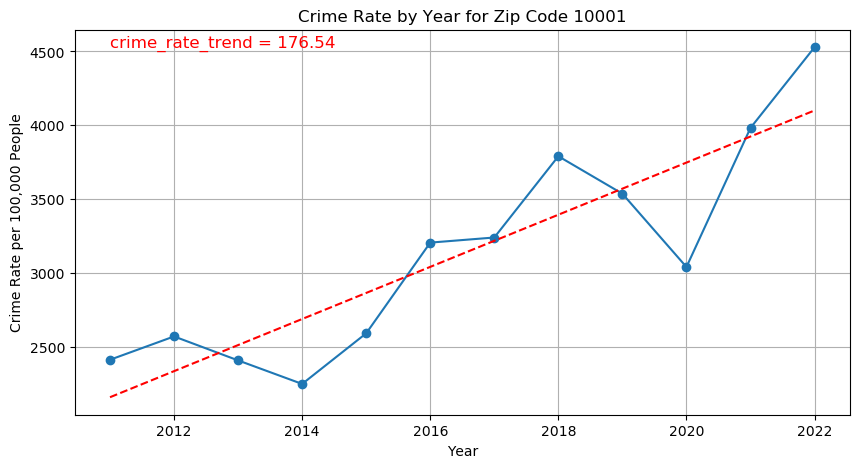
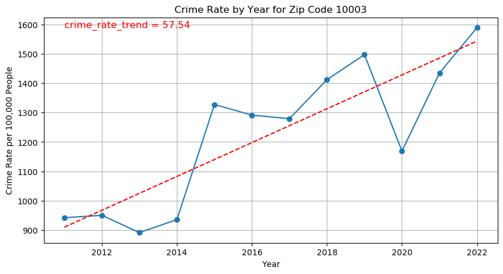
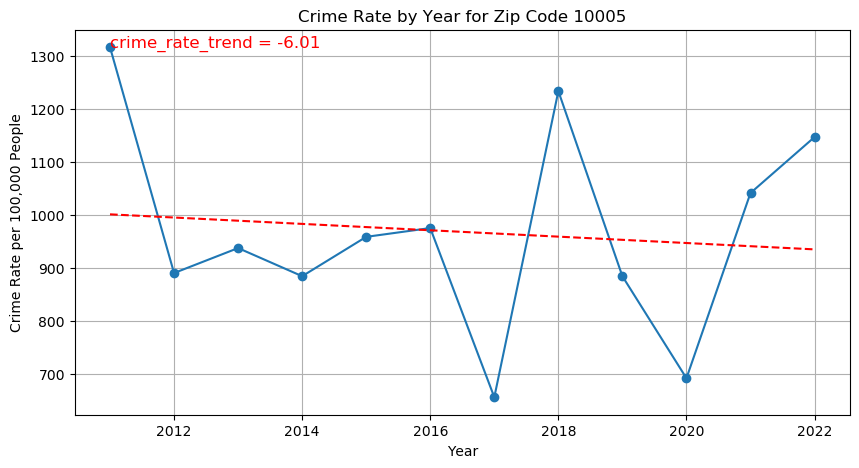
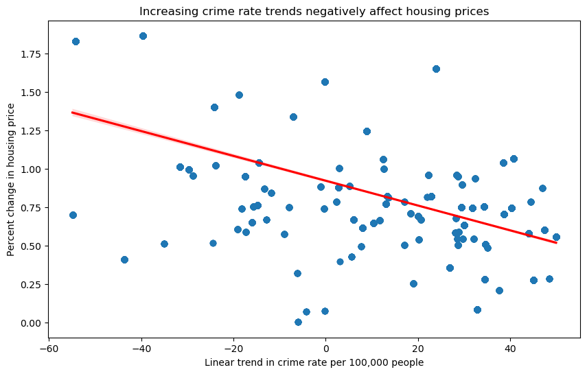
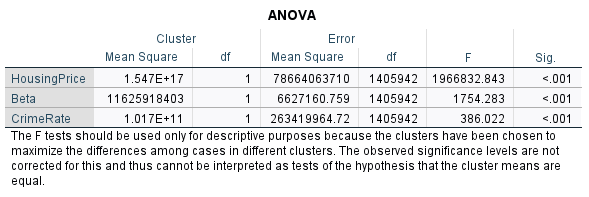
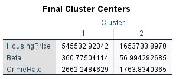

# Analysis of NYC Crime Data

### In this analysis we synthesize NYC crime data, with zillow housing data, and US Census data to show the relationship between Crime rates and housing prices. 

### We show that there is a significant negative relationship (p < 0.0003, R^2 = 0.31) between crime rate trends and change in housing prices in NYC from 2011 to 2022. 


# 1.) Import and clean the data

We start by getting NYC crime report data from NYC Open Data : CSV data https://data.cityofnewyork.us/Public-Safety/NYPD-Complaint-Data-Historic/qgea-i56i/about_data

We also get home values by zip code from Zillow Home Value Index (ZHVI All home SFT, Condo/Coop) Time Series Smoothed seasonally adjusted : CSV data https://www.zillow.com/research/data/

Finally we need population data by zip code : For this we look at the Census data.

https://data.census.gov/table/ACSDT5Y2011.B01003?t=Counts,%20Estimates,%20and%20Projections:Population%20Total&g=040XX00US36$8600000&y=2011

we download the census data by year and aggregate them into 1 spread sheet. the years we could get are from 2011 - 2022


```python
import os
import pandas as pd
import numpy as np
import requests
import matplotlib.pyplot as plt
import seaborn as sns


## we use geopandas to add zip codes to our crime data
## we need zip codes because our housing data is referenced by zip code.
## so we convert longitude and latitude to zip code for each row in our crime data
import geopandas as gpd
from shapely.geometry import Point
import os
import pygeos
import rtree


import statsmodels.api as sm
from scipy.stats import pearsonr
from statsmodels.tsa.stattools import adfuller
from statsmodels.tsa.arima.model import ARIMA


```

    c:\users\alex\appdata\local\programs\python\python37\lib\site-packages\geopandas\_compat.py:115: UserWarning: The Shapely GEOS version (3.11.3-CAPI-1.17.3) is incompatible with the GEOS version PyGEOS was compiled with (3.10.4-CAPI-1.16.2). Conversions between both will be slow.
      shapely_geos_version, geos_capi_version_string
    


```python
columns_to_keep = ['CMPLNT_FR_DT', 'LAW_CAT_CD', 'SUSP_AGE_GROUP', 'SUSP_RACE', 'SUSP_SEX', 'VIC_AGE_GROUP', 'VIC_RACE', 'VIC_SEX',
   'Latitude', 'Longitude' ]


crime_data = pd.read_csv('crime_data.csv', usecols=columns_to_keep)
```


```python
crime_data
```


<div>
<style scoped>
    .dataframe tbody tr th:only-of-type {
        vertical-align: middle;
    }

    .dataframe tbody tr th {
        vertical-align: top;
    }

    .dataframe thead th {
        text-align: right;
    }
</style>
<table border="1" class="dataframe">
  <thead>
    <tr style="text-align: right;">
      <th></th>
      <th>CMPLNT_FR_DT</th>
      <th>LAW_CAT_CD</th>
      <th>SUSP_AGE_GROUP</th>
      <th>SUSP_RACE</th>
      <th>SUSP_SEX</th>
      <th>Latitude</th>
      <th>Longitude</th>
      <th>VIC_AGE_GROUP</th>
      <th>VIC_RACE</th>
      <th>VIC_SEX</th>
    </tr>
  </thead>
  <tbody>
    <tr>
      <th>0</th>
      <td>02/20/2008</td>
      <td>FELONY</td>
      <td>(null)</td>
      <td>UNKNOWN</td>
      <td>(null)</td>
      <td>40.692464</td>
      <td>-73.972708</td>
      <td>25-44</td>
      <td>WHITE</td>
      <td>F</td>
    </tr>
    <tr>
      <th>1</th>
      <td>08/21/2008</td>
      <td>FELONY</td>
      <td>(null)</td>
      <td>(null)</td>
      <td>(null)</td>
      <td>40.771341</td>
      <td>-73.953418</td>
      <td>45-64</td>
      <td>WHITE HISPANIC</td>
      <td>F</td>
    </tr>
    <tr>
      <th>2</th>
      <td>04/03/2008</td>
      <td>FELONY</td>
      <td>(null)</td>
      <td>(null)</td>
      <td>(null)</td>
      <td>40.671245</td>
      <td>-73.926713</td>
      <td>25-44</td>
      <td>BLACK</td>
      <td>F</td>
    </tr>
    <tr>
      <th>3</th>
      <td>08/19/2008</td>
      <td>MISDEMEANOR</td>
      <td>(null)</td>
      <td>UNKNOWN</td>
      <td>(null)</td>
      <td>40.813412</td>
      <td>-73.943226</td>
      <td>(null)</td>
      <td>UNKNOWN</td>
      <td>M</td>
    </tr>
    <tr>
      <th>4</th>
      <td>03/10/2008</td>
      <td>FELONY</td>
      <td>&lt;18</td>
      <td>BLACK</td>
      <td>M</td>
      <td>40.650142</td>
      <td>-73.944674</td>
      <td>25-44</td>
      <td>BLACK</td>
      <td>M</td>
    </tr>
    <tr>
      <th>...</th>
      <td>...</td>
      <td>...</td>
      <td>...</td>
      <td>...</td>
      <td>...</td>
      <td>...</td>
      <td>...</td>
      <td>...</td>
      <td>...</td>
      <td>...</td>
    </tr>
    <tr>
      <th>8914833</th>
      <td>06/21/2008</td>
      <td>MISDEMEANOR</td>
      <td>(null)</td>
      <td>WHITE</td>
      <td>M</td>
      <td>40.652640</td>
      <td>-73.972682</td>
      <td>&lt;18</td>
      <td>WHITE</td>
      <td>M</td>
    </tr>
    <tr>
      <th>8914834</th>
      <td>04/16/2008</td>
      <td>FELONY</td>
      <td>25-44</td>
      <td>BLACK</td>
      <td>M</td>
      <td>40.826765</td>
      <td>-73.950203</td>
      <td>45-64</td>
      <td>WHITE</td>
      <td>F</td>
    </tr>
    <tr>
      <th>8914835</th>
      <td>07/30/2008</td>
      <td>MISDEMEANOR</td>
      <td>(null)</td>
      <td>(null)</td>
      <td>(null)</td>
      <td>40.853717</td>
      <td>-73.926801</td>
      <td>(null)</td>
      <td>UNKNOWN</td>
      <td>E</td>
    </tr>
    <tr>
      <th>8914836</th>
      <td>06/25/2008</td>
      <td>MISDEMEANOR</td>
      <td>25-44</td>
      <td>BLACK</td>
      <td>M</td>
      <td>40.578255</td>
      <td>-73.972324</td>
      <td>25-44</td>
      <td>BLACK</td>
      <td>F</td>
    </tr>
    <tr>
      <th>8914837</th>
      <td>09/06/2008</td>
      <td>FELONY</td>
      <td>(null)</td>
      <td>(null)</td>
      <td>(null)</td>
      <td>40.703453</td>
      <td>-73.926516</td>
      <td>(null)</td>
      <td>UNKNOWN</td>
      <td>F</td>
    </tr>
  </tbody>
</table>
<p>8914838 rows × 10 columns</p>
</div>


```python
crime_data['SUSP_RACE'].unique()
crime_data['VIC_RACE'].unique()


crime_data_cleaned = crime_data.dropna(subset=['CMPLNT_FR_DT', 'Latitude', 'Longitude'])
crime_data_cleaned['SUSP_AGE_GROUP'].unique()


filtered_values = ['25-44', '18-24', '45-64', '<18', '65+']

crime_data_cleaned = crime_data_cleaned[crime_data_cleaned['SUSP_AGE_GROUP'].isin(filtered_values)]
crime_data_cleaned = crime_data_cleaned[crime_data_cleaned['VIC_AGE_GROUP'].isin(filtered_values)]


filtered_values = ['BLACK', 'WHITE', 'WHITE HISPANIC', 'BLACK HISPANIC', 'ASIAN / PACIFIC ISLANDER', 'AMERICAN INDIAN/ALASKAN NATIVE'] 

crime_data_cleaned = crime_data_cleaned[crime_data_cleaned['SUSP_RACE'].isin(filtered_values)]
crime_data_cleaned = crime_data_cleaned[crime_data_cleaned['VIC_RACE'].isin(filtered_values)]

filtered_values = ['M', 'F']
crime_data_cleaned = crime_data_cleaned[crime_data_cleaned['SUSP_SEX'].isin(filtered_values)]
crime_data_cleaned = crime_data_cleaned[crime_data_cleaned['VIC_SEX'].isin(filtered_values)]


crime_data_cleaned


```


<div>
<style scoped>
    .dataframe tbody tr th:only-of-type {
        vertical-align: middle;
    }

    .dataframe tbody tr th {
        vertical-align: top;
    }

    .dataframe thead th {
        text-align: right;
    }
</style>
<table border="1" class="dataframe">
  <thead>
    <tr style="text-align: right;">
      <th></th>
      <th>CMPLNT_FR_DT</th>
      <th>LAW_CAT_CD</th>
      <th>SUSP_AGE_GROUP</th>
      <th>SUSP_RACE</th>
      <th>SUSP_SEX</th>
      <th>Latitude</th>
      <th>Longitude</th>
      <th>VIC_AGE_GROUP</th>
      <th>VIC_RACE</th>
      <th>VIC_SEX</th>
    </tr>
  </thead>
  <tbody>
    <tr>
      <th>4</th>
      <td>03/10/2008</td>
      <td>FELONY</td>
      <td>&lt;18</td>
      <td>BLACK</td>
      <td>M</td>
      <td>40.650142</td>
      <td>-73.944674</td>
      <td>25-44</td>
      <td>BLACK</td>
      <td>M</td>
    </tr>
    <tr>
      <th>6</th>
      <td>12/21/2008</td>
      <td>MISDEMEANOR</td>
      <td>25-44</td>
      <td>BLACK</td>
      <td>M</td>
      <td>40.669126</td>
      <td>-73.973071</td>
      <td>25-44</td>
      <td>WHITE</td>
      <td>M</td>
    </tr>
    <tr>
      <th>9</th>
      <td>04/19/2008</td>
      <td>VIOLATION</td>
      <td>18-24</td>
      <td>WHITE HISPANIC</td>
      <td>M</td>
      <td>40.689954</td>
      <td>-73.916924</td>
      <td>25-44</td>
      <td>WHITE HISPANIC</td>
      <td>F</td>
    </tr>
    <tr>
      <th>20</th>
      <td>07/14/2008</td>
      <td>FELONY</td>
      <td>25-44</td>
      <td>BLACK</td>
      <td>F</td>
      <td>40.628285</td>
      <td>-73.944245</td>
      <td>45-64</td>
      <td>WHITE</td>
      <td>M</td>
    </tr>
    <tr>
      <th>26</th>
      <td>11/11/2008</td>
      <td>MISDEMEANOR</td>
      <td>25-44</td>
      <td>BLACK HISPANIC</td>
      <td>M</td>
      <td>40.655604</td>
      <td>-73.926420</td>
      <td>45-64</td>
      <td>BLACK</td>
      <td>F</td>
    </tr>
    <tr>
      <th>...</th>
      <td>...</td>
      <td>...</td>
      <td>...</td>
      <td>...</td>
      <td>...</td>
      <td>...</td>
      <td>...</td>
      <td>...</td>
      <td>...</td>
      <td>...</td>
    </tr>
    <tr>
      <th>8914821</th>
      <td>08/06/2008</td>
      <td>VIOLATION</td>
      <td>65+</td>
      <td>BLACK</td>
      <td>F</td>
      <td>40.834776</td>
      <td>-73.916017</td>
      <td>45-64</td>
      <td>BLACK</td>
      <td>F</td>
    </tr>
    <tr>
      <th>8914824</th>
      <td>10/27/2008</td>
      <td>MISDEMEANOR</td>
      <td>25-44</td>
      <td>BLACK</td>
      <td>M</td>
      <td>40.831575</td>
      <td>-73.927705</td>
      <td>25-44</td>
      <td>BLACK</td>
      <td>F</td>
    </tr>
    <tr>
      <th>8914831</th>
      <td>05/25/2008</td>
      <td>MISDEMEANOR</td>
      <td>&lt;18</td>
      <td>BLACK</td>
      <td>M</td>
      <td>40.841935</td>
      <td>-73.914246</td>
      <td>45-64</td>
      <td>BLACK</td>
      <td>M</td>
    </tr>
    <tr>
      <th>8914834</th>
      <td>04/16/2008</td>
      <td>FELONY</td>
      <td>25-44</td>
      <td>BLACK</td>
      <td>M</td>
      <td>40.826765</td>
      <td>-73.950203</td>
      <td>45-64</td>
      <td>WHITE</td>
      <td>F</td>
    </tr>
    <tr>
      <th>8914836</th>
      <td>06/25/2008</td>
      <td>MISDEMEANOR</td>
      <td>25-44</td>
      <td>BLACK</td>
      <td>M</td>
      <td>40.578255</td>
      <td>-73.972324</td>
      <td>25-44</td>
      <td>BLACK</td>
      <td>F</td>
    </tr>
  </tbody>
</table>
<p>2071516 rows × 10 columns</p>
</div>


```python
crime_data = crime_data_cleaned.copy()
```


```python
# Load the ZIP Code shapefile once
zip_code_shapefile = 'geo_export_5d779e3d-72be-4a75-b7b0-443826472d7f.shp'
zip_codes = gpd.read_file(zip_code_shapefile)

# Ensure the coordinate reference system (CRS) is WGS84 (EPSG:4326)
zip_codes = zip_codes.to_crs(epsg=4326)

# Define the function to get ZIP Code from latitude and longitude using the pre-loaded GeoDataFrame
def get_zip_code(longitude, latitude, zip_codes):
    
    try: 
        # Create a GeoDataFrame for the input point
        point = gpd.GeoDataFrame(geometry=[Point(longitude, latitude)], crs='EPSG:4326')

        # Perform spatial join to find the corresponding ZIP Code
        joined = gpd.sjoin(point, zip_codes, how='left', predicate='within')

        # Extract the ZIP Code from the resulting GeoDataFrame
        if not joined.empty:
            return joined.iloc[0]['modzcta']  # Use 'modzcta' as the ZIP Code column
        else:
            return None
    except:
        return None
```


```python
## This took 8 hours of compute time! 

# crime_data['zip_code'] = crime_data.apply(lambda row: get_zip_code(row['Longitude'], row['Latitude'], zip_codes), axis=1)
# crime_data.to_csv('big_data_w_zipcodes.csv')

df = pd.read_csv('big_data_w_zipcodes.csv')

```


```python
df['zip_code'].unique()
df_clean = df.dropna(subset=['zip_code'])

df_clean = df_clean[df_clean['zip_code'] != 99999]

```


```python
zillow_data = pd.read_csv('zillow_data.csv')
```


```python
zillow_data
```


<div>
<style scoped>
    .dataframe tbody tr th:only-of-type {
        vertical-align: middle;
    }

    .dataframe tbody tr th {
        vertical-align: top;
    }

    .dataframe thead th {
        text-align: right;
    }
</style>
<table border="1" class="dataframe">
  <thead>
    <tr style="text-align: right;">
      <th></th>
      <th>RegionID</th>
      <th>SizeRank</th>
      <th>RegionName</th>
      <th>RegionType</th>
      <th>StateName</th>
      <th>State</th>
      <th>City</th>
      <th>Metro</th>
      <th>CountyName</th>
      <th>2000-01-31</th>
      <th>...</th>
      <th>2023-07-31</th>
      <th>2023-08-31</th>
      <th>2023-09-30</th>
      <th>2023-10-31</th>
      <th>2023-11-30</th>
      <th>2023-12-31</th>
      <th>2024-01-31</th>
      <th>2024-02-29</th>
      <th>2024-03-31</th>
      <th>2024-04-30</th>
    </tr>
  </thead>
  <tbody>
    <tr>
      <th>0</th>
      <td>91982</td>
      <td>1</td>
      <td>77494</td>
      <td>zip</td>
      <td>TX</td>
      <td>TX</td>
      <td>Katy</td>
      <td>Houston-The Woodlands-Sugar Land, TX</td>
      <td>Fort Bend County</td>
      <td>213463.221766</td>
      <td>...</td>
      <td>488235.174762</td>
      <td>490749.946441</td>
      <td>492598.348830</td>
      <td>493857.713761</td>
      <td>494559.104796</td>
      <td>495182.966394</td>
      <td>496580.196689</td>
      <td>498775.863988</td>
      <td>501631.311127</td>
      <td>504191.521560</td>
    </tr>
    <tr>
      <th>1</th>
      <td>61148</td>
      <td>2</td>
      <td>8701</td>
      <td>zip</td>
      <td>NJ</td>
      <td>NJ</td>
      <td>Lakewood</td>
      <td>New York-Newark-Jersey City, NY-NJ-PA</td>
      <td>Ocean County</td>
      <td>137293.774710</td>
      <td>...</td>
      <td>552105.838958</td>
      <td>557998.314944</td>
      <td>564321.215281</td>
      <td>571660.009863</td>
      <td>578460.106425</td>
      <td>583227.579651</td>
      <td>584811.159583</td>
      <td>587368.424745</td>
      <td>592465.126119</td>
      <td>600765.893612</td>
    </tr>
    <tr>
      <th>2</th>
      <td>91940</td>
      <td>3</td>
      <td>77449</td>
      <td>zip</td>
      <td>TX</td>
      <td>TX</td>
      <td>Katy</td>
      <td>Houston-The Woodlands-Sugar Land, TX</td>
      <td>Harris County</td>
      <td>104657.662381</td>
      <td>...</td>
      <td>280286.283611</td>
      <td>281194.368840</td>
      <td>281734.942252</td>
      <td>281724.603121</td>
      <td>281486.774213</td>
      <td>281192.083503</td>
      <td>281550.767554</td>
      <td>282258.587207</td>
      <td>283366.392394</td>
      <td>284335.695860</td>
    </tr>
    <tr>
      <th>3</th>
      <td>62080</td>
      <td>4</td>
      <td>11368</td>
      <td>zip</td>
      <td>NY</td>
      <td>NY</td>
      <td>New York</td>
      <td>New York-Newark-Jersey City, NY-NJ-PA</td>
      <td>Queens County</td>
      <td>151159.744038</td>
      <td>...</td>
      <td>470293.119764</td>
      <td>470287.047021</td>
      <td>469717.985426</td>
      <td>467648.873528</td>
      <td>464224.467531</td>
      <td>459848.455550</td>
      <td>456960.515649</td>
      <td>455322.918370</td>
      <td>458447.265050</td>
      <td>463052.465021</td>
    </tr>
    <tr>
      <th>4</th>
      <td>91733</td>
      <td>5</td>
      <td>77084</td>
      <td>zip</td>
      <td>TX</td>
      <td>TX</td>
      <td>Houston</td>
      <td>Houston-The Woodlands-Sugar Land, TX</td>
      <td>Harris County</td>
      <td>103553.438861</td>
      <td>...</td>
      <td>274946.698136</td>
      <td>275833.130611</td>
      <td>276267.718851</td>
      <td>276257.923524</td>
      <td>275831.123272</td>
      <td>275402.735803</td>
      <td>275449.324127</td>
      <td>275980.979306</td>
      <td>276993.281910</td>
      <td>277995.947760</td>
    </tr>
    <tr>
      <th>...</th>
      <td>...</td>
      <td>...</td>
      <td>...</td>
      <td>...</td>
      <td>...</td>
      <td>...</td>
      <td>...</td>
      <td>...</td>
      <td>...</td>
      <td>...</td>
      <td>...</td>
      <td>...</td>
      <td>...</td>
      <td>...</td>
      <td>...</td>
      <td>...</td>
      <td>...</td>
      <td>...</td>
      <td>...</td>
      <td>...</td>
      <td>...</td>
    </tr>
    <tr>
      <th>26343</th>
      <td>80861</td>
      <td>39992</td>
      <td>52163</td>
      <td>zip</td>
      <td>IA</td>
      <td>IA</td>
      <td>Protivin</td>
      <td>NaN</td>
      <td>Howard County</td>
      <td>NaN</td>
      <td>...</td>
      <td>109269.126880</td>
      <td>110419.123557</td>
      <td>110820.423406</td>
      <td>111354.936397</td>
      <td>111108.677621</td>
      <td>111243.215255</td>
      <td>110810.979578</td>
      <td>110342.940450</td>
      <td>110499.197898</td>
      <td>111574.934445</td>
    </tr>
    <tr>
      <th>26344</th>
      <td>78282</td>
      <td>39992</td>
      <td>46799</td>
      <td>zip</td>
      <td>IN</td>
      <td>IN</td>
      <td>Zanesville</td>
      <td>Bluffton, IN</td>
      <td>Wells County</td>
      <td>NaN</td>
      <td>...</td>
      <td>181473.523220</td>
      <td>182203.146285</td>
      <td>182312.007548</td>
      <td>182514.233146</td>
      <td>182425.668374</td>
      <td>182274.194491</td>
      <td>182620.859652</td>
      <td>184053.231562</td>
      <td>186531.904955</td>
      <td>188907.845488</td>
    </tr>
    <tr>
      <th>26345</th>
      <td>67377</td>
      <td>39992</td>
      <td>22731</td>
      <td>zip</td>
      <td>VA</td>
      <td>VA</td>
      <td>Aroda</td>
      <td>Washington-Arlington-Alexandria, DC-VA-MD-WV</td>
      <td>Madison County</td>
      <td>NaN</td>
      <td>...</td>
      <td>351587.049497</td>
      <td>354456.096884</td>
      <td>356464.642392</td>
      <td>358106.343308</td>
      <td>358995.115238</td>
      <td>359371.473201</td>
      <td>358742.952830</td>
      <td>358954.594523</td>
      <td>360887.900558</td>
      <td>364760.095348</td>
    </tr>
    <tr>
      <th>26346</th>
      <td>69074</td>
      <td>39992</td>
      <td>26576</td>
      <td>zip</td>
      <td>WV</td>
      <td>WV</td>
      <td>Farmington</td>
      <td>Fairmont, WV</td>
      <td>Marion County</td>
      <td>NaN</td>
      <td>...</td>
      <td>106861.843807</td>
      <td>107896.829803</td>
      <td>109308.280625</td>
      <td>110226.905841</td>
      <td>110669.089088</td>
      <td>110755.737552</td>
      <td>110901.660129</td>
      <td>110787.195207</td>
      <td>111166.856127</td>
      <td>111639.208310</td>
    </tr>
    <tr>
      <th>26347</th>
      <td>80190</td>
      <td>39992</td>
      <td>50160</td>
      <td>zip</td>
      <td>IA</td>
      <td>IA</td>
      <td>Martensdale</td>
      <td>Des Moines-West Des Moines, IA</td>
      <td>Warren County</td>
      <td>NaN</td>
      <td>...</td>
      <td>192566.289891</td>
      <td>193519.741781</td>
      <td>194168.767241</td>
      <td>194786.276690</td>
      <td>195330.944095</td>
      <td>196271.147913</td>
      <td>197149.510562</td>
      <td>197990.458089</td>
      <td>199040.412876</td>
      <td>200208.125928</td>
    </tr>
  </tbody>
</table>
<p>26348 rows × 301 columns</p>
</div>


```python
pd.set_option('display.max_columns', None)
zillow_data[zillow_data['RegionName']==10001]
# pd.reset_option('display.max_columns')
```


<div>
<style scoped>
    .dataframe tbody tr th:only-of-type {
        vertical-align: middle;
    }

    .dataframe tbody tr th {
        vertical-align: top;
    }

    .dataframe thead th {
        text-align: right;
    }
</style>
<table border="1" class="dataframe">
  <thead>
    <tr style="text-align: right;">
      <th></th>
      <th>RegionID</th>
      <th>SizeRank</th>
      <th>RegionName</th>
      <th>RegionType</th>
      <th>StateName</th>
      <th>State</th>
      <th>City</th>
      <th>Metro</th>
      <th>CountyName</th>
      <th>2000-01-31</th>
      <th>2000-02-29</th>
      <th>2000-03-31</th>
      <th>2000-04-30</th>
      <th>2000-05-31</th>
      <th>2000-06-30</th>
      <th>2000-07-31</th>
      <th>2000-08-31</th>
      <th>2000-09-30</th>
      <th>2000-10-31</th>
      <th>2000-11-30</th>
      <th>2000-12-31</th>
      <th>2001-01-31</th>
      <th>2001-02-28</th>
      <th>2001-03-31</th>
      <th>2001-04-30</th>
      <th>2001-05-31</th>
      <th>2001-06-30</th>
      <th>2001-07-31</th>
      <th>2001-08-31</th>
      <th>2001-09-30</th>
      <th>2001-10-31</th>
      <th>2001-11-30</th>
      <th>2001-12-31</th>
      <th>2002-01-31</th>
      <th>2002-02-28</th>
      <th>2002-03-31</th>
      <th>2002-04-30</th>
      <th>2002-05-31</th>
      <th>2002-06-30</th>
      <th>2002-07-31</th>
      <th>2002-08-31</th>
      <th>2002-09-30</th>
      <th>2002-10-31</th>
      <th>2002-11-30</th>
      <th>2002-12-31</th>
      <th>2003-01-31</th>
      <th>2003-02-28</th>
      <th>2003-03-31</th>
      <th>2003-04-30</th>
      <th>2003-05-31</th>
      <th>2003-06-30</th>
      <th>2003-07-31</th>
      <th>2003-08-31</th>
      <th>2003-09-30</th>
      <th>2003-10-31</th>
      <th>2003-11-30</th>
      <th>2003-12-31</th>
      <th>2004-01-31</th>
      <th>2004-02-29</th>
      <th>2004-03-31</th>
      <th>2004-04-30</th>
      <th>2004-05-31</th>
      <th>2004-06-30</th>
      <th>2004-07-31</th>
      <th>2004-08-31</th>
      <th>2004-09-30</th>
      <th>2004-10-31</th>
      <th>2004-11-30</th>
      <th>2004-12-31</th>
      <th>2005-01-31</th>
      <th>2005-02-28</th>
      <th>2005-03-31</th>
      <th>2005-04-30</th>
      <th>2005-05-31</th>
      <th>2005-06-30</th>
      <th>2005-07-31</th>
      <th>2005-08-31</th>
      <th>2005-09-30</th>
      <th>2005-10-31</th>
      <th>2005-11-30</th>
      <th>2005-12-31</th>
      <th>2006-01-31</th>
      <th>2006-02-28</th>
      <th>2006-03-31</th>
      <th>2006-04-30</th>
      <th>2006-05-31</th>
      <th>2006-06-30</th>
      <th>2006-07-31</th>
      <th>2006-08-31</th>
      <th>2006-09-30</th>
      <th>2006-10-31</th>
      <th>2006-11-30</th>
      <th>2006-12-31</th>
      <th>2007-01-31</th>
      <th>2007-02-28</th>
      <th>2007-03-31</th>
      <th>2007-04-30</th>
      <th>2007-05-31</th>
      <th>2007-06-30</th>
      <th>2007-07-31</th>
      <th>2007-08-31</th>
      <th>2007-09-30</th>
      <th>2007-10-31</th>
      <th>2007-11-30</th>
      <th>2007-12-31</th>
      <th>2008-01-31</th>
      <th>2008-02-29</th>
      <th>2008-03-31</th>
      <th>2008-04-30</th>
      <th>2008-05-31</th>
      <th>2008-06-30</th>
      <th>2008-07-31</th>
      <th>2008-08-31</th>
      <th>2008-09-30</th>
      <th>2008-10-31</th>
      <th>2008-11-30</th>
      <th>2008-12-31</th>
      <th>2009-01-31</th>
      <th>2009-02-28</th>
      <th>2009-03-31</th>
      <th>2009-04-30</th>
      <th>2009-05-31</th>
      <th>2009-06-30</th>
      <th>2009-07-31</th>
      <th>2009-08-31</th>
      <th>2009-09-30</th>
      <th>2009-10-31</th>
      <th>2009-11-30</th>
      <th>2009-12-31</th>
      <th>2010-01-31</th>
      <th>2010-02-28</th>
      <th>2010-03-31</th>
      <th>2010-04-30</th>
      <th>2010-05-31</th>
      <th>2010-06-30</th>
      <th>2010-07-31</th>
      <th>2010-08-31</th>
      <th>2010-09-30</th>
      <th>2010-10-31</th>
      <th>2010-11-30</th>
      <th>2010-12-31</th>
      <th>2011-01-31</th>
      <th>2011-02-28</th>
      <th>2011-03-31</th>
      <th>2011-04-30</th>
      <th>2011-05-31</th>
      <th>2011-06-30</th>
      <th>2011-07-31</th>
      <th>2011-08-31</th>
      <th>2011-09-30</th>
      <th>2011-10-31</th>
      <th>2011-11-30</th>
      <th>2011-12-31</th>
      <th>2012-01-31</th>
      <th>2012-02-29</th>
      <th>2012-03-31</th>
      <th>2012-04-30</th>
      <th>2012-05-31</th>
      <th>2012-06-30</th>
      <th>2012-07-31</th>
      <th>2012-08-31</th>
      <th>2012-09-30</th>
      <th>2012-10-31</th>
      <th>2012-11-30</th>
      <th>2012-12-31</th>
      <th>2013-01-31</th>
      <th>2013-02-28</th>
      <th>2013-03-31</th>
      <th>2013-04-30</th>
      <th>2013-05-31</th>
      <th>2013-06-30</th>
      <th>2013-07-31</th>
      <th>2013-08-31</th>
      <th>2013-09-30</th>
      <th>2013-10-31</th>
      <th>2013-11-30</th>
      <th>2013-12-31</th>
      <th>2014-01-31</th>
      <th>2014-02-28</th>
      <th>2014-03-31</th>
      <th>2014-04-30</th>
      <th>2014-05-31</th>
      <th>2014-06-30</th>
      <th>2014-07-31</th>
      <th>2014-08-31</th>
      <th>2014-09-30</th>
      <th>2014-10-31</th>
      <th>2014-11-30</th>
      <th>2014-12-31</th>
      <th>2015-01-31</th>
      <th>2015-02-28</th>
      <th>2015-03-31</th>
      <th>2015-04-30</th>
      <th>2015-05-31</th>
      <th>2015-06-30</th>
      <th>2015-07-31</th>
      <th>2015-08-31</th>
      <th>2015-09-30</th>
      <th>2015-10-31</th>
      <th>2015-11-30</th>
      <th>2015-12-31</th>
      <th>2016-01-31</th>
      <th>2016-02-29</th>
      <th>2016-03-31</th>
      <th>2016-04-30</th>
      <th>2016-05-31</th>
      <th>2016-06-30</th>
      <th>2016-07-31</th>
      <th>2016-08-31</th>
      <th>2016-09-30</th>
      <th>2016-10-31</th>
      <th>2016-11-30</th>
      <th>2016-12-31</th>
      <th>2017-01-31</th>
      <th>2017-02-28</th>
      <th>2017-03-31</th>
      <th>2017-04-30</th>
      <th>2017-05-31</th>
      <th>2017-06-30</th>
      <th>2017-07-31</th>
      <th>2017-08-31</th>
      <th>2017-09-30</th>
      <th>2017-10-31</th>
      <th>2017-11-30</th>
      <th>2017-12-31</th>
      <th>2018-01-31</th>
      <th>2018-02-28</th>
      <th>2018-03-31</th>
      <th>2018-04-30</th>
      <th>2018-05-31</th>
      <th>2018-06-30</th>
      <th>2018-07-31</th>
      <th>2018-08-31</th>
      <th>2018-09-30</th>
      <th>2018-10-31</th>
      <th>2018-11-30</th>
      <th>2018-12-31</th>
      <th>2019-01-31</th>
      <th>2019-02-28</th>
      <th>2019-03-31</th>
      <th>2019-04-30</th>
      <th>2019-05-31</th>
      <th>2019-06-30</th>
      <th>2019-07-31</th>
      <th>2019-08-31</th>
      <th>2019-09-30</th>
      <th>2019-10-31</th>
      <th>2019-11-30</th>
      <th>2019-12-31</th>
      <th>2020-01-31</th>
      <th>2020-02-29</th>
      <th>2020-03-31</th>
      <th>2020-04-30</th>
      <th>2020-05-31</th>
      <th>2020-06-30</th>
      <th>2020-07-31</th>
      <th>2020-08-31</th>
      <th>2020-09-30</th>
      <th>2020-10-31</th>
      <th>2020-11-30</th>
      <th>2020-12-31</th>
      <th>2021-01-31</th>
      <th>2021-02-28</th>
      <th>2021-03-31</th>
      <th>2021-04-30</th>
      <th>2021-05-31</th>
      <th>2021-06-30</th>
      <th>2021-07-31</th>
      <th>2021-08-31</th>
      <th>2021-09-30</th>
      <th>2021-10-31</th>
      <th>2021-11-30</th>
      <th>2021-12-31</th>
      <th>2022-01-31</th>
      <th>2022-02-28</th>
      <th>2022-03-31</th>
      <th>2022-04-30</th>
      <th>2022-05-31</th>
      <th>2022-06-30</th>
      <th>2022-07-31</th>
      <th>2022-08-31</th>
      <th>2022-09-30</th>
      <th>2022-10-31</th>
      <th>2022-11-30</th>
      <th>2022-12-31</th>
      <th>2023-01-31</th>
      <th>2023-02-28</th>
      <th>2023-03-31</th>
      <th>2023-04-30</th>
      <th>2023-05-31</th>
      <th>2023-06-30</th>
      <th>2023-07-31</th>
      <th>2023-08-31</th>
      <th>2023-09-30</th>
      <th>2023-10-31</th>
      <th>2023-11-30</th>
      <th>2023-12-31</th>
      <th>2024-01-31</th>
      <th>2024-02-29</th>
      <th>2024-03-31</th>
      <th>2024-04-30</th>
    </tr>
  </thead>
  <tbody>
    <tr>
      <th>4395</th>
      <td>61615</td>
      <td>4444</td>
      <td>10001</td>
      <td>zip</td>
      <td>NY</td>
      <td>NY</td>
      <td>New York</td>
      <td>New York-Newark-Jersey City, NY-NJ-PA</td>
      <td>New York County</td>
      <td>763407.887006</td>
      <td>769889.739211</td>
      <td>776302.905099</td>
      <td>787823.846403</td>
      <td>801524.142995</td>
      <td>814515.884437</td>
      <td>827818.21759</td>
      <td>825499.850491</td>
      <td>819499.233004</td>
      <td>807880.760916</td>
      <td>810991.335993</td>
      <td>823654.328285</td>
      <td>847588.273344</td>
      <td>871714.837535</td>
      <td>890210.769123</td>
      <td>902057.670171</td>
      <td>913468.419951</td>
      <td>924493.209181</td>
      <td>934653.885062</td>
      <td>943412.865879</td>
      <td>954154.138313</td>
      <td>965309.669117</td>
      <td>976238.829871</td>
      <td>984164.149661</td>
      <td>996504.485155</td>
      <td>1.011185e+06</td>
      <td>1.027279e+06</td>
      <td>1.040830e+06</td>
      <td>1.054482e+06</td>
      <td>1.068294e+06</td>
      <td>1.080368e+06</td>
      <td>1.089343e+06</td>
      <td>1.097274e+06</td>
      <td>1.102881e+06</td>
      <td>1.106572e+06</td>
      <td>1.109852e+06</td>
      <td>1.115949e+06</td>
      <td>1.125506e+06</td>
      <td>1.135837e+06</td>
      <td>1.146974e+06</td>
      <td>1.163086e+06</td>
      <td>1.185891e+06</td>
      <td>1.211336e+06</td>
      <td>1.229366e+06</td>
      <td>1.236254e+06</td>
      <td>1.227281e+06</td>
      <td>1.215630e+06</td>
      <td>1.207858e+06</td>
      <td>1.207566e+06</td>
      <td>1.209749e+06</td>
      <td>1.216914e+06</td>
      <td>1.233462e+06</td>
      <td>1.252121e+06</td>
      <td>1.264866e+06</td>
      <td>1.273215e+06</td>
      <td>1.288237e+06</td>
      <td>1.313883e+06</td>
      <td>1.341072e+06</td>
      <td>1.360132e+06</td>
      <td>1.373811e+06</td>
      <td>1.404318e+06</td>
      <td>1.444130e+06</td>
      <td>1.491438e+06</td>
      <td>1.521870e+06</td>
      <td>1.549585e+06</td>
      <td>1.574623e+06</td>
      <td>1.600617e+06</td>
      <td>1.621329e+06</td>
      <td>1.639977e+06</td>
      <td>1.672176e+06</td>
      <td>1.714018e+06</td>
      <td>1.756643e+06</td>
      <td>1.800262e+06</td>
      <td>1.832286e+06</td>
      <td>1.848558e+06</td>
      <td>1.844301e+06</td>
      <td>1.844681e+06</td>
      <td>1.849799e+06</td>
      <td>1.848295e+06</td>
      <td>1.816923e+06</td>
      <td>1.781869e+06</td>
      <td>1.748614e+06</td>
      <td>1.751969e+06</td>
      <td>1.778572e+06</td>
      <td>1.799718e+06</td>
      <td>1.807888e+06</td>
      <td>1.798159e+06</td>
      <td>1.800564e+06</td>
      <td>1.804612e+06</td>
      <td>1.791939e+06</td>
      <td>1.777768e+06</td>
      <td>1.762857e+06</td>
      <td>1.801354e+06</td>
      <td>1.855134e+06</td>
      <td>1.910863e+06</td>
      <td>1.928678e+06</td>
      <td>1.933300e+06</td>
      <td>1.931285e+06</td>
      <td>1.924376e+06</td>
      <td>1.924385e+06</td>
      <td>1.913586e+06</td>
      <td>1.900473e+06</td>
      <td>1.874019e+06</td>
      <td>1.866574e+06</td>
      <td>1.870598e+06</td>
      <td>1.870029e+06</td>
      <td>1.859105e+06</td>
      <td>1.823068e+06</td>
      <td>1.779352e+06</td>
      <td>1.733505e+06</td>
      <td>1.712020e+06</td>
      <td>1.685983e+06</td>
      <td>1.680273e+06</td>
      <td>1.670963e+06</td>
      <td>1.675847e+06</td>
      <td>1.660556e+06</td>
      <td>1.635452e+06</td>
      <td>1.602037e+06</td>
      <td>1.572748e+06</td>
      <td>1.543119e+06</td>
      <td>1.524449e+06</td>
      <td>1.508825e+06</td>
      <td>1.500990e+06</td>
      <td>1.503401e+06</td>
      <td>1.510817e+06</td>
      <td>1.523884e+06</td>
      <td>1.545374e+06</td>
      <td>1.568302e+06</td>
      <td>1.590041e+06</td>
      <td>1.602406e+06</td>
      <td>1.593745e+06</td>
      <td>1.579243e+06</td>
      <td>1.567627e+06</td>
      <td>1.573359e+06</td>
      <td>1.584542e+06</td>
      <td>1.592963e+06</td>
      <td>1.598929e+06</td>
      <td>1.606499e+06</td>
      <td>1.612134e+06</td>
      <td>1.627446e+06</td>
      <td>1.645178e+06</td>
      <td>1.659200e+06</td>
      <td>1.663529e+06</td>
      <td>1.663142e+06</td>
      <td>1.661305e+06</td>
      <td>1.659224e+06</td>
      <td>1.658694e+06</td>
      <td>1.666156e+06</td>
      <td>1.681166e+06</td>
      <td>1.705108e+06</td>
      <td>1.731510e+06</td>
      <td>1.765127e+06</td>
      <td>1.789609e+06</td>
      <td>1.819138e+06</td>
      <td>1.841495e+06</td>
      <td>1.853721e+06</td>
      <td>1.856839e+06</td>
      <td>1.854286e+06</td>
      <td>1.864174e+06</td>
      <td>1.872706e+06</td>
      <td>1.878225e+06</td>
      <td>1.888811e+06</td>
      <td>1.908837e+06</td>
      <td>1.945519e+06</td>
      <td>1.991168e+06</td>
      <td>2.067104e+06</td>
      <td>2.139093e+06</td>
      <td>2.196279e+06</td>
      <td>2.224532e+06</td>
      <td>2.245851e+06</td>
      <td>2.267591e+06</td>
      <td>2.279778e+06</td>
      <td>2.287893e+06</td>
      <td>2.293830e+06</td>
      <td>2.301511e+06</td>
      <td>2.317582e+06</td>
      <td>2.332339e+06</td>
      <td>2.368707e+06</td>
      <td>2.411219e+06</td>
      <td>2.449981e+06</td>
      <td>2.466372e+06</td>
      <td>2.467878e+06</td>
      <td>2.475508e+06</td>
      <td>2.487326e+06</td>
      <td>2.506752e+06</td>
      <td>2.536295e+06</td>
      <td>2.572936e+06</td>
      <td>2.611956e+06</td>
      <td>2.641659e+06</td>
      <td>2.675336e+06</td>
      <td>2.704689e+06</td>
      <td>2.725376e+06</td>
      <td>2.724166e+06</td>
      <td>2.721352e+06</td>
      <td>2.729003e+06</td>
      <td>2.734859e+06</td>
      <td>2.734417e+06</td>
      <td>2.731964e+06</td>
      <td>2.732258e+06</td>
      <td>2.736281e+06</td>
      <td>2.725793e+06</td>
      <td>2.721103e+06</td>
      <td>2.722451e+06</td>
      <td>2.740661e+06</td>
      <td>2.749751e+06</td>
      <td>2.769398e+06</td>
      <td>2.768247e+06</td>
      <td>2.776729e+06</td>
      <td>2.761028e+06</td>
      <td>2.787671e+06</td>
      <td>2.809042e+06</td>
      <td>2.849780e+06</td>
      <td>2.841891e+06</td>
      <td>2.844209e+06</td>
      <td>2.823021e+06</td>
      <td>2.836746e+06</td>
      <td>2.832302e+06</td>
      <td>2.850549e+06</td>
      <td>2.865434e+06</td>
      <td>2.902431e+06</td>
      <td>2.922842e+06</td>
      <td>2.908845e+06</td>
      <td>2.880896e+06</td>
      <td>2.852581e+06</td>
      <td>2.870150e+06</td>
      <td>2.882413e+06</td>
      <td>2.894448e+06</td>
      <td>2.886279e+06</td>
      <td>2.878502e+06</td>
      <td>2.883780e+06</td>
      <td>2.880614e+06</td>
      <td>2.880857e+06</td>
      <td>2.877183e+06</td>
      <td>2.878411e+06</td>
      <td>2.872000e+06</td>
      <td>2.835562e+06</td>
      <td>2.766314e+06</td>
      <td>2.659384e+06</td>
      <td>2.561148e+06</td>
      <td>2.465569e+06</td>
      <td>2.392835e+06</td>
      <td>2.302570e+06</td>
      <td>2.218814e+06</td>
      <td>2.151012e+06</td>
      <td>2.116508e+06</td>
      <td>2.089314e+06</td>
      <td>2.070521e+06</td>
      <td>2.053183e+06</td>
      <td>2.057187e+06</td>
      <td>2.061514e+06</td>
      <td>2.057650e+06</td>
      <td>2.039984e+06</td>
      <td>2.020217e+06</td>
      <td>1.994590e+06</td>
      <td>1.994730e+06</td>
      <td>1.971750e+06</td>
      <td>1.950834e+06</td>
      <td>1.896635e+06</td>
      <td>1.856161e+06</td>
      <td>1.819750e+06</td>
      <td>1.798778e+06</td>
      <td>1.788807e+06</td>
      <td>1.798725e+06</td>
      <td>1.812223e+06</td>
      <td>1.835409e+06</td>
      <td>1.855448e+06</td>
      <td>1.887512e+06</td>
      <td>1.910249e+06</td>
      <td>1.930148e+06</td>
      <td>1.944459e+06</td>
      <td>1.946402e+06</td>
      <td>1.932448e+06</td>
      <td>1.892052e+06</td>
      <td>1.862107e+06</td>
      <td>1.839891e+06</td>
      <td>1.826405e+06</td>
      <td>1.809401e+06</td>
      <td>1.782423e+06</td>
      <td>1.763195e+06</td>
      <td>1.745146e+06</td>
      <td>1.737597e+06</td>
      <td>1.733334e+06</td>
      <td>1.725812e+06</td>
      <td>1.717032e+06</td>
      <td>1.707506e+06</td>
      <td>1.698545e+06</td>
      <td>1.688874e+06</td>
      <td>1.677290e+06</td>
      <td>1.671082e+06</td>
      <td>1.664020e+06</td>
      <td>1.662763e+06</td>
      <td>1.663115e+06</td>
    </tr>
  </tbody>
</table>
</div>


```python
df_clean['zip_code'].unique()

#df_clean['zip_code'] = df_clean['zip_code'].astype(int, errors='ignore')

df_clean['zip_code'] = df_clean['zip_code'].astype(str)
df_clean['zip_code'] = df_clean['zip_code'].apply(lambda x: x[:-2])
```


```python
df_clean
```


<div>
<style scoped>
    .dataframe tbody tr th:only-of-type {
        vertical-align: middle;
    }

    .dataframe tbody tr th {
        vertical-align: top;
    }

    .dataframe thead th {
        text-align: right;
    }
</style>
<table border="1" class="dataframe">
  <thead>
    <tr style="text-align: right;">
      <th></th>
      <th>Unnamed: 0</th>
      <th>CMPLNT_FR_DT</th>
      <th>LAW_CAT_CD</th>
      <th>SUSP_AGE_GROUP</th>
      <th>SUSP_RACE</th>
      <th>SUSP_SEX</th>
      <th>Latitude</th>
      <th>Longitude</th>
      <th>VIC_AGE_GROUP</th>
      <th>VIC_RACE</th>
      <th>VIC_SEX</th>
      <th>zip_code</th>
    </tr>
  </thead>
  <tbody>
    <tr>
      <th>0</th>
      <td>0</td>
      <td>03/10/2008</td>
      <td>FELONY</td>
      <td>&lt;18</td>
      <td>BLACK</td>
      <td>M</td>
      <td>40.650142</td>
      <td>-73.944674</td>
      <td>25-44</td>
      <td>BLACK</td>
      <td>M</td>
      <td>11203</td>
    </tr>
    <tr>
      <th>2</th>
      <td>2</td>
      <td>04/19/2008</td>
      <td>VIOLATION</td>
      <td>18-24</td>
      <td>WHITE HISPANIC</td>
      <td>M</td>
      <td>40.689954</td>
      <td>-73.916924</td>
      <td>25-44</td>
      <td>WHITE HISPANIC</td>
      <td>F</td>
      <td>11221</td>
    </tr>
    <tr>
      <th>3</th>
      <td>3</td>
      <td>07/14/2008</td>
      <td>FELONY</td>
      <td>25-44</td>
      <td>BLACK</td>
      <td>F</td>
      <td>40.628285</td>
      <td>-73.944245</td>
      <td>45-64</td>
      <td>WHITE</td>
      <td>M</td>
      <td>11210</td>
    </tr>
    <tr>
      <th>4</th>
      <td>4</td>
      <td>11/11/2008</td>
      <td>MISDEMEANOR</td>
      <td>25-44</td>
      <td>BLACK HISPANIC</td>
      <td>M</td>
      <td>40.655604</td>
      <td>-73.926420</td>
      <td>45-64</td>
      <td>BLACK</td>
      <td>F</td>
      <td>11203</td>
    </tr>
    <tr>
      <th>5</th>
      <td>5</td>
      <td>02/15/2008</td>
      <td>MISDEMEANOR</td>
      <td>18-24</td>
      <td>BLACK</td>
      <td>M</td>
      <td>40.810262</td>
      <td>-73.941560</td>
      <td>45-64</td>
      <td>BLACK</td>
      <td>M</td>
      <td>10037</td>
    </tr>
    <tr>
      <th>...</th>
      <td>...</td>
      <td>...</td>
      <td>...</td>
      <td>...</td>
      <td>...</td>
      <td>...</td>
      <td>...</td>
      <td>...</td>
      <td>...</td>
      <td>...</td>
      <td>...</td>
      <td>...</td>
    </tr>
    <tr>
      <th>2071511</th>
      <td>2071511</td>
      <td>08/06/2008</td>
      <td>VIOLATION</td>
      <td>65+</td>
      <td>BLACK</td>
      <td>F</td>
      <td>40.834776</td>
      <td>-73.916017</td>
      <td>45-64</td>
      <td>BLACK</td>
      <td>F</td>
      <td>10456</td>
    </tr>
    <tr>
      <th>2071512</th>
      <td>2071512</td>
      <td>10/27/2008</td>
      <td>MISDEMEANOR</td>
      <td>25-44</td>
      <td>BLACK</td>
      <td>M</td>
      <td>40.831575</td>
      <td>-73.927705</td>
      <td>25-44</td>
      <td>BLACK</td>
      <td>F</td>
      <td>10452</td>
    </tr>
    <tr>
      <th>2071513</th>
      <td>2071513</td>
      <td>05/25/2008</td>
      <td>MISDEMEANOR</td>
      <td>&lt;18</td>
      <td>BLACK</td>
      <td>M</td>
      <td>40.841935</td>
      <td>-73.914246</td>
      <td>45-64</td>
      <td>BLACK</td>
      <td>M</td>
      <td>10452</td>
    </tr>
    <tr>
      <th>2071514</th>
      <td>2071514</td>
      <td>04/16/2008</td>
      <td>FELONY</td>
      <td>25-44</td>
      <td>BLACK</td>
      <td>M</td>
      <td>40.826765</td>
      <td>-73.950203</td>
      <td>45-64</td>
      <td>WHITE</td>
      <td>F</td>
      <td>10031</td>
    </tr>
    <tr>
      <th>2071515</th>
      <td>2071515</td>
      <td>06/25/2008</td>
      <td>MISDEMEANOR</td>
      <td>25-44</td>
      <td>BLACK</td>
      <td>M</td>
      <td>40.578255</td>
      <td>-73.972324</td>
      <td>25-44</td>
      <td>BLACK</td>
      <td>F</td>
      <td>11224</td>
    </tr>
  </tbody>
</table>
<p>2065793 rows × 12 columns</p>
</div>


## Now we combine the zillow housing data with the NYC Crime data by zip code 


```python
crime_data = df_clean.copy()
zillow_data = zillow_data.copy()

crime_data['CMPLNT_FR_DT'] = pd.to_datetime(crime_data['CMPLNT_FR_DT'], format='%m/%d/%Y', errors='coerce')

# Drop rows where CMPLNT_FR_DT could not be converted
crime_data = crime_data.dropna(subset=['CMPLNT_FR_DT']).copy()

# Extract year and month
crime_data.loc[:, 'Year'] = crime_data['CMPLNT_FR_DT'].dt.year
crime_data.loc[:, 'Month'] = crime_data['CMPLNT_FR_DT'].dt.month

zillow_long = pd.melt(zillow_data, 
                      id_vars=['RegionID', 'RegionName', 'State', 'City', 'Metro', 'CountyName'], 
                      var_name='Date', 
                      value_name='HousingPrice')

# Convert Date to datetime, coercing errors
zillow_long['Date'] = pd.to_datetime(zillow_long['Date'], errors='coerce')

# Drop rows where Date could not be converted
zillow_long = zillow_long.dropna(subset=['Date']).copy()

# Extract year and month from the Date column
zillow_long.loc[:, 'Year'] = zillow_long['Date'].dt.year
zillow_long.loc[:, 'Month'] = zillow_long['Date'].dt.month

# Rename RegionName to zip_code for merging
zillow_long = zillow_long.rename(columns={'RegionName': 'zip_code'})

# Convert zip_code to string for merging
zillow_long['zip_code'] = zillow_long['zip_code'].astype(str)
crime_data['zip_code'] = crime_data['zip_code'].astype(str)

# Step 3: Merge the dataframes on zip_code, Year, and Month
merged_data = pd.merge(crime_data, zillow_long, on=['zip_code', 'Year', 'Month'], how='left')

```


```python
census_data = pd.read_csv('Aggregate census data.csv')

census_data = census_data.dropna()

census_data
```


<div>
<style scoped>
    .dataframe tbody tr th:only-of-type {
        vertical-align: middle;
    }

    .dataframe tbody tr th {
        vertical-align: top;
    }

    .dataframe thead th {
        text-align: right;
    }
</style>
<table border="1" class="dataframe">
  <thead>
    <tr style="text-align: right;">
      <th></th>
      <th>GEO_ID</th>
      <th>NAME</th>
      <th>zipCode</th>
      <th>2011</th>
      <th>2011 margin of error</th>
      <th>2012</th>
      <th>2012 margin of error</th>
      <th>2013</th>
      <th>2013 margin of error</th>
      <th>2014</th>
      <th>2014 margin of error</th>
      <th>2015</th>
      <th>2015 margin of error</th>
      <th>2016</th>
      <th>2016 margin of error</th>
      <th>2017</th>
      <th>2017 margin of error</th>
      <th>2018</th>
      <th>2018 margin of error</th>
      <th>2019</th>
      <th>2019 margin of error</th>
      <th>2020</th>
      <th>2020 margin of error</th>
      <th>2021</th>
      <th>2021 margin of error</th>
      <th>2022</th>
      <th>2022 margin of error</th>
    </tr>
  </thead>
  <tbody>
    <tr>
      <th>0</th>
      <td>8600000US06390</td>
      <td>ZCTA5 06390</td>
      <td>6390.0</td>
      <td>280.0</td>
      <td>121.0</td>
      <td>307.0</td>
      <td>121.0</td>
      <td>291.0</td>
      <td>113.0</td>
      <td>296.0</td>
      <td>120.0</td>
      <td>339.0</td>
      <td>146.0</td>
      <td>303.0</td>
      <td>151.0</td>
      <td>230.0</td>
      <td>139.0</td>
      <td>183.0</td>
      <td>117.0</td>
      <td>125.0</td>
      <td>106.0</td>
      <td>61.0</td>
      <td>36.0</td>
      <td>58</td>
      <td>36</td>
      <td>53</td>
      <td>39</td>
    </tr>
    <tr>
      <th>1</th>
      <td>8600000US10001</td>
      <td>ZCTA5 10001</td>
      <td>10001.0</td>
      <td>21097.0</td>
      <td>1160.0</td>
      <td>20579.0</td>
      <td>1027.0</td>
      <td>21966.0</td>
      <td>1552.0</td>
      <td>22767.0</td>
      <td>2058.0</td>
      <td>23537.0</td>
      <td>2422.0</td>
      <td>23332.0</td>
      <td>1740.0</td>
      <td>23947.0</td>
      <td>1738.0</td>
      <td>22924.0</td>
      <td>1190.0</td>
      <td>24117.0</td>
      <td>1274.0</td>
      <td>25026.0</td>
      <td>1759.0</td>
      <td>26966</td>
      <td>1911</td>
      <td>27004</td>
      <td>1827</td>
    </tr>
    <tr>
      <th>2</th>
      <td>8600000US10002</td>
      <td>ZCTA5 10002</td>
      <td>10002.0</td>
      <td>81335.0</td>
      <td>2469.0</td>
      <td>80323.0</td>
      <td>2259.0</td>
      <td>82191.0</td>
      <td>2595.0</td>
      <td>79894.0</td>
      <td>2177.0</td>
      <td>80736.0</td>
      <td>2479.0</td>
      <td>78096.0</td>
      <td>2456.0</td>
      <td>77925.0</td>
      <td>2031.0</td>
      <td>74993.0</td>
      <td>1909.0</td>
      <td>74479.0</td>
      <td>1959.0</td>
      <td>74363.0</td>
      <td>3183.0</td>
      <td>76807</td>
      <td>3172</td>
      <td>76518</td>
      <td>2894</td>
    </tr>
    <tr>
      <th>3</th>
      <td>8600000US10003</td>
      <td>ZCTA5 10003</td>
      <td>10003.0</td>
      <td>55190.0</td>
      <td>1766.0</td>
      <td>56614.0</td>
      <td>2161.0</td>
      <td>57310.0</td>
      <td>1844.0</td>
      <td>57068.0</td>
      <td>1563.0</td>
      <td>57112.0</td>
      <td>1592.0</td>
      <td>56767.0</td>
      <td>1934.0</td>
      <td>55035.0</td>
      <td>1789.0</td>
      <td>54682.0</td>
      <td>1754.0</td>
      <td>53977.0</td>
      <td>1593.0</td>
      <td>54671.0</td>
      <td>2568.0</td>
      <td>54447</td>
      <td>2660</td>
      <td>53877</td>
      <td>2579</td>
    </tr>
    <tr>
      <th>4</th>
      <td>8600000US10004</td>
      <td>ZCTA5 10004</td>
      <td>10004.0</td>
      <td>2604.0</td>
      <td>362.0</td>
      <td>2780.0</td>
      <td>511.0</td>
      <td>2807.0</td>
      <td>450.0</td>
      <td>3024.0</td>
      <td>486.0</td>
      <td>3221.0</td>
      <td>556.0</td>
      <td>3044.0</td>
      <td>509.0</td>
      <td>2990.0</td>
      <td>532.0</td>
      <td>3028.0</td>
      <td>442.0</td>
      <td>3335.0</td>
      <td>581.0</td>
      <td>3310.0</td>
      <td>658.0</td>
      <td>4795</td>
      <td>966</td>
      <td>4579</td>
      <td>926</td>
    </tr>
    <tr>
      <th>...</th>
      <td>...</td>
      <td>...</td>
      <td>...</td>
      <td>...</td>
      <td>...</td>
      <td>...</td>
      <td>...</td>
      <td>...</td>
      <td>...</td>
      <td>...</td>
      <td>...</td>
      <td>...</td>
      <td>...</td>
      <td>...</td>
      <td>...</td>
      <td>...</td>
      <td>...</td>
      <td>...</td>
      <td>...</td>
      <td>...</td>
      <td>...</td>
      <td>...</td>
      <td>...</td>
      <td>...</td>
      <td>...</td>
      <td>...</td>
      <td>...</td>
    </tr>
    <tr>
      <th>1789</th>
      <td>8600000US14898</td>
      <td>ZCTA5 14898</td>
      <td>14898.0</td>
      <td>2287.0</td>
      <td>419.0</td>
      <td>2120.0</td>
      <td>328.0</td>
      <td>2083.0</td>
      <td>389.0</td>
      <td>2021.0</td>
      <td>375.0</td>
      <td>1918.0</td>
      <td>330.0</td>
      <td>1826.0</td>
      <td>238.0</td>
      <td>2019.0</td>
      <td>245.0</td>
      <td>1950.0</td>
      <td>206.0</td>
      <td>2018.0</td>
      <td>187.0</td>
      <td>1772.0</td>
      <td>279.0</td>
      <td>810</td>
      <td>129</td>
      <td>871</td>
      <td>150</td>
    </tr>
    <tr>
      <th>1790</th>
      <td>8600000US14901</td>
      <td>ZCTA5 14901</td>
      <td>14901.0</td>
      <td>16750.0</td>
      <td>1188.0</td>
      <td>16658.0</td>
      <td>886.0</td>
      <td>17495.0</td>
      <td>825.0</td>
      <td>17019.0</td>
      <td>670.0</td>
      <td>16855.0</td>
      <td>700.0</td>
      <td>16334.0</td>
      <td>567.0</td>
      <td>16038.0</td>
      <td>594.0</td>
      <td>15965.0</td>
      <td>638.0</td>
      <td>15855.0</td>
      <td>580.0</td>
      <td>15581.0</td>
      <td>881.0</td>
      <td>0</td>
      <td>13</td>
      <td>0</td>
      <td>13</td>
    </tr>
    <tr>
      <th>1791</th>
      <td>8600000US14903</td>
      <td>ZCTA5 14903</td>
      <td>14903.0</td>
      <td>7030.0</td>
      <td>398.0</td>
      <td>6927.0</td>
      <td>380.0</td>
      <td>6943.0</td>
      <td>423.0</td>
      <td>6805.0</td>
      <td>397.0</td>
      <td>6985.0</td>
      <td>490.0</td>
      <td>7143.0</td>
      <td>490.0</td>
      <td>7310.0</td>
      <td>481.0</td>
      <td>7584.0</td>
      <td>521.0</td>
      <td>7600.0</td>
      <td>434.0</td>
      <td>7186.0</td>
      <td>610.0</td>
      <td>1357</td>
      <td>217</td>
      <td>1395</td>
      <td>238</td>
    </tr>
    <tr>
      <th>1792</th>
      <td>8600000US14904</td>
      <td>ZCTA5 14904</td>
      <td>14904.0</td>
      <td>15992.0</td>
      <td>913.0</td>
      <td>15806.0</td>
      <td>722.0</td>
      <td>15519.0</td>
      <td>695.0</td>
      <td>15411.0</td>
      <td>771.0</td>
      <td>15224.0</td>
      <td>688.0</td>
      <td>15782.0</td>
      <td>612.0</td>
      <td>15861.0</td>
      <td>690.0</td>
      <td>15480.0</td>
      <td>600.0</td>
      <td>15176.0</td>
      <td>752.0</td>
      <td>15109.0</td>
      <td>859.0</td>
      <td>1099</td>
      <td>276</td>
      <td>1141</td>
      <td>285</td>
    </tr>
    <tr>
      <th>1793</th>
      <td>8600000US14905</td>
      <td>ZCTA5 14905</td>
      <td>14905.0</td>
      <td>9742.0</td>
      <td>819.0</td>
      <td>9897.0</td>
      <td>778.0</td>
      <td>9255.0</td>
      <td>532.0</td>
      <td>9414.0</td>
      <td>473.0</td>
      <td>9311.0</td>
      <td>512.0</td>
      <td>9150.0</td>
      <td>478.0</td>
      <td>8796.0</td>
      <td>541.0</td>
      <td>8593.0</td>
      <td>551.0</td>
      <td>8407.0</td>
      <td>487.0</td>
      <td>8330.0</td>
      <td>696.0</td>
      <td>1192</td>
      <td>218</td>
      <td>1121</td>
      <td>207</td>
    </tr>
  </tbody>
</table>
<p>1794 rows × 27 columns</p>
</div>


```python
crime_data = merged_data.copy()
# Preprocess Census Data
# Ensure zipCode column is correctly named and convert to string type for merging
census_data['zipCode'] = census_data['zipCode'].astype(str).str.split('.').str[0]
#print("Census Data Columns:", census_data.columns)

# Aggregate Crime Data by year and zip code
crime_data['Year'] = pd.to_datetime(crime_data['CMPLNT_FR_DT']).dt.year
crime_counts = crime_data.groupby(['Year', 'zip_code']).size().reset_index(name='CrimeCount')

# Ensure the zip_code column in crime_counts is of type string for consistent merging
crime_counts['zip_code'] = crime_counts['zip_code'].astype(str)
#print("Crime Counts Columns:", crime_counts.columns)

# Merge the aggregated crime data with the census population data
crime_counts = crime_counts.rename(columns={'zip_code': 'zipCode'})
merged_data = crime_counts.copy()

# Add population data for each year without suffix conflicts
population_data = pd.melt(census_data, id_vars=['zipCode'], var_name='Year', value_name='Population')
population_data = population_data[population_data['Year'].str.isnumeric()]
population_data['Year'] = population_data['Year'].astype(int)

# Debugging: Print unique values of zipCode and Year in population_data
#print("Unique zipCodes in Population Data:", population_data['zipCode'].unique())
#print("Unique Years in Population Data:", population_data['Year'].unique())

# Debugging: Print unique values of zipCode and Year in crime_counts
#print("Unique zipCodes in Crime Data:", crime_counts['zipCode'].unique())
#print("Unique Years in Crime Data:", crime_counts['Year'].unique())

merged_data = pd.merge(merged_data, population_data, on=['zipCode', 'Year'], how='left')

# Filter for valid years (2011-2022)
valid_years = list(range(2011, 2023))
merged_data = merged_data[merged_data['Year'].isin(valid_years)]

# Check if 'Population' column exists in the merged data
#print("Merged Data Columns:", merged_data.columns)

# Filter out rows with zero or NaN population
merged_data = merged_data[merged_data['Population'].notna() & (merged_data['Population'] > 0)]

# Calculate the crime rate per 100,000 people
if 'Population' in merged_data.columns:
    merged_data['CrimeRate'] = (merged_data['CrimeCount'] / merged_data['Population']) * 100000
    # Display the merged data with crime rates
    #print(merged_data.head())

    # Save the merged data with crime rates to a CSV file
    # merged_data.to_csv('/mnt/data/merged_crime_rate_data.csv', index=False)
else:
    print("Error: 'Population' column not found in merged data.")
```


```python
merged_data
```


<div>
<style scoped>
    .dataframe tbody tr th:only-of-type {
        vertical-align: middle;
    }

    .dataframe tbody tr th {
        vertical-align: top;
    }

    .dataframe thead th {
        text-align: right;
    }
</style>
<table border="1" class="dataframe">
  <thead>
    <tr style="text-align: right;">
      <th></th>
      <th>Year</th>
      <th>zipCode</th>
      <th>CrimeCount</th>
      <th>Population</th>
      <th>CrimeRate</th>
    </tr>
  </thead>
  <tbody>
    <tr>
      <th>2033</th>
      <td>2011</td>
      <td>10001</td>
      <td>509</td>
      <td>21097.0</td>
      <td>2412.665308</td>
    </tr>
    <tr>
      <th>2034</th>
      <td>2011</td>
      <td>10002</td>
      <td>887</td>
      <td>81335.0</td>
      <td>1090.551423</td>
    </tr>
    <tr>
      <th>2035</th>
      <td>2011</td>
      <td>10003</td>
      <td>520</td>
      <td>55190.0</td>
      <td>942.199674</td>
    </tr>
    <tr>
      <th>2036</th>
      <td>2011</td>
      <td>10004</td>
      <td>55</td>
      <td>2604.0</td>
      <td>2112.135177</td>
    </tr>
    <tr>
      <th>2037</th>
      <td>2011</td>
      <td>10005</td>
      <td>65</td>
      <td>4935.0</td>
      <td>1317.122594</td>
    </tr>
    <tr>
      <th>...</th>
      <td>...</td>
      <td>...</td>
      <td>...</td>
      <td>...</td>
      <td>...</td>
    </tr>
    <tr>
      <th>4152</th>
      <td>2022</td>
      <td>11691</td>
      <td>1282</td>
      <td>10520</td>
      <td>12186.311787</td>
    </tr>
    <tr>
      <th>4153</th>
      <td>2022</td>
      <td>11692</td>
      <td>514</td>
      <td>14531</td>
      <td>3537.265157</td>
    </tr>
    <tr>
      <th>4154</th>
      <td>2022</td>
      <td>11693</td>
      <td>300</td>
      <td>70365</td>
      <td>426.348327</td>
    </tr>
    <tr>
      <th>4155</th>
      <td>2022</td>
      <td>11694</td>
      <td>267</td>
      <td>24584</td>
      <td>1086.072242</td>
    </tr>
    <tr>
      <th>4156</th>
      <td>2022</td>
      <td>11697</td>
      <td>8</td>
      <td>13558</td>
      <td>59.005753</td>
    </tr>
  </tbody>
</table>
<p>2118 rows × 5 columns</p>
</div>


```python
merged_data['Year'] = merged_data['Year'].astype(int)
merged_data['zipCode'] = merged_data['zipCode'].astype(str)

# Ensure CrimeRate column is calculated and cast to float
merged_data['CrimeRate'] = (merged_data['CrimeCount'] / merged_data['Population']) * 100000
merged_data['CrimeRate'] = merged_data['CrimeRate'].astype(float)

# Prepare a DataFrame to store the results
results = pd.DataFrame(columns=['zipCode', 'Beta'])

# Get the unique zip codes
zip_codes = merged_data['zipCode'].unique()

# Perform OLS regression for each zip code
for zip_code in zip_codes:
    zip_data = merged_data[merged_data['zipCode'] == zip_code].copy()
    
    if len(zip_data) < 2:
        continue  # Skip zip codes with less than 2 data points to avoid regression errors
    
    # Drop NaN values
    zip_data = zip_data.dropna(subset=['Year', 'CrimeRate'])
    
    # Prepare the independent and dependent variables
    X = sm.add_constant(zip_data['Year'])  # Add a constant term for the intercept
    y = zip_data['CrimeRate']
    
    # Ensure X and y are numpy arrays with appropriate dtypes
    X = np.asarray(X, dtype=float)
    y = np.asarray(y, dtype=float)
    
    # Perform OLS regression
    model = sm.OLS(y, X).fit()
    
    
    # Extract the beta coefficient for the 'Year' variable
    beta = model.params[1]  # 'Year' should be at index 1 if the constant is at index 0
    
    # Append the result to the results DataFrame
    results = results.append({'zipCode': zip_code, 'Beta': beta}, ignore_index=True)

# Merge the results DataFrame with the original merged_data
merged_data = pd.merge(merged_data, results, on='zipCode', how='left')

# Display the merged data with the Beta coefficients
merged_data
```


<div>
<style scoped>
    .dataframe tbody tr th:only-of-type {
        vertical-align: middle;
    }

    .dataframe tbody tr th {
        vertical-align: top;
    }

    .dataframe thead th {
        text-align: right;
    }
</style>
<table border="1" class="dataframe">
  <thead>
    <tr style="text-align: right;">
      <th></th>
      <th>Year</th>
      <th>zipCode</th>
      <th>CrimeCount</th>
      <th>Population</th>
      <th>CrimeRate</th>
      <th>Beta</th>
    </tr>
  </thead>
  <tbody>
    <tr>
      <th>0</th>
      <td>2011</td>
      <td>10001</td>
      <td>509</td>
      <td>21097.0</td>
      <td>2412.665308</td>
      <td>176.536217</td>
    </tr>
    <tr>
      <th>1</th>
      <td>2011</td>
      <td>10002</td>
      <td>887</td>
      <td>81335.0</td>
      <td>1090.551423</td>
      <td>87.616352</td>
    </tr>
    <tr>
      <th>2</th>
      <td>2011</td>
      <td>10003</td>
      <td>520</td>
      <td>55190.0</td>
      <td>942.199674</td>
      <td>57.544412</td>
    </tr>
    <tr>
      <th>3</th>
      <td>2011</td>
      <td>10004</td>
      <td>55</td>
      <td>2604.0</td>
      <td>2112.135177</td>
      <td>-4.221215</td>
    </tr>
    <tr>
      <th>4</th>
      <td>2011</td>
      <td>10005</td>
      <td>65</td>
      <td>4935.0</td>
      <td>1317.122594</td>
      <td>-6.012379</td>
    </tr>
    <tr>
      <th>...</th>
      <td>...</td>
      <td>...</td>
      <td>...</td>
      <td>...</td>
      <td>...</td>
      <td>...</td>
    </tr>
    <tr>
      <th>2113</th>
      <td>2022</td>
      <td>11691</td>
      <td>1282</td>
      <td>10520</td>
      <td>12186.311787</td>
      <td>805.497945</td>
    </tr>
    <tr>
      <th>2114</th>
      <td>2022</td>
      <td>11692</td>
      <td>514</td>
      <td>14531</td>
      <td>3537.265157</td>
      <td>140.950822</td>
    </tr>
    <tr>
      <th>2115</th>
      <td>2022</td>
      <td>11693</td>
      <td>300</td>
      <td>70365</td>
      <td>426.348327</td>
      <td>-85.874470</td>
    </tr>
    <tr>
      <th>2116</th>
      <td>2022</td>
      <td>11694</td>
      <td>267</td>
      <td>24584</td>
      <td>1086.072242</td>
      <td>29.717461</td>
    </tr>
    <tr>
      <th>2117</th>
      <td>2022</td>
      <td>11697</td>
      <td>8</td>
      <td>13558</td>
      <td>59.005753</td>
      <td>-11.887864</td>
    </tr>
  </tbody>
</table>
<p>2118 rows × 6 columns</p>
</div>


show the rate at which crime rates are increasing (or decreasing) per 100000 people per year


```python
zip_codes = merged_data['zipCode'].unique()

# Plot crime rate by year for each zip code
for zip_code in zip_codes[:5]:
    plt.figure(figsize=(10, 5))
    zip_data = merged_data[merged_data['zipCode'] == zip_code]
    plt.plot(zip_data['Year'], zip_data['CrimeRate'], marker='o')
    
     # Fit a linear trendline
    z = np.polyfit(zip_data['Year'], zip_data['CrimeRate'], 1)
    p = np.poly1d(z)
    
    # Plot the trendline
    plt.plot(zip_data['Year'], p(zip_data['Year']), "r--", label=f'Trendline (slope = {z[0]:.2f})')
    plt.text(zip_data['Year'].min(), zip_data['CrimeRate'].max(), f'crime_rate_trend = {z[0]:.2f}', color='red', fontsize=12)
    
    
    plt.title(f'Crime Rate by Year for Zip Code {zip_code}')
    plt.xlabel('Year')
    plt.ylabel('Crime Rate per 100,000 People')
    plt.grid(True)
    plt.show()
```


    

    


    

    


    

    


    

    


    

    


```python

crime_rate_data = merged_data.copy()
# Ensure zip_code columns are of the same type for merging
crime_rate_data['zipCode'] = crime_rate_data['zipCode'].astype(str)
crime_data['zip_code'] = crime_data['zip_code'].astype(str)

# Merge datasets to get HousingPrice
merged_data = pd.merge(crime_rate_data, crime_data[['Year', 'zip_code', 'HousingPrice']], 
                       left_on=['Year', 'zipCode'], right_on=['Year', 'zip_code'], how='left')

# Drop rows with NaN values in HousingPrice
merged_data = merged_data.dropna(subset=['HousingPrice'])

# Preprocess Census Data
census_data['zipCode'] = census_data['zipCode'].astype(str).str.split('.').str[0]

# Aggregate Crime Data by year and zip code
crime_data['Year'] = pd.to_datetime(crime_data['CMPLNT_FR_DT']).dt.year
crime_counts = crime_data.groupby(['Year', 'zip_code']).size().reset_index(name='CrimeCount')

# Ensure the zip_code column in crime_counts is of type string for consistent merging
crime_counts['zip_code'] = crime_counts['zip_code'].astype(str)

# Merge the aggregated crime data with the census population data
crime_counts = crime_counts.rename(columns={'zip_code': 'zipCode'})
population_data = pd.melt(census_data, id_vars=['zipCode'], var_name='Year', value_name='Population')
population_data = population_data[population_data['Year'].str.isnumeric()]
population_data['Year'] = population_data['Year'].astype(int)

# Merge crime counts with population data
crime_population_merged = pd.merge(crime_counts, population_data, on=['zipCode', 'Year'], how='left')

# Filter for valid years (2011-2022)
valid_years = list(range(2011, 2023))
crime_population_merged = crime_population_merged[crime_population_merged['Year'].isin(valid_years)]

# Filter out rows with zero or NaN population
crime_population_merged = crime_population_merged[crime_population_merged['Population'].notna() & (crime_population_merged['Population'] > 0)]

# Calculate the crime rate per 100,000 people
if 'Population' in crime_population_merged.columns:
    crime_population_merged['CrimeRate'] = (crime_population_merged['CrimeCount'] / crime_population_merged['Population']) * 100000
else:
    print("Error: 'Population' column not found in merged data.")

# Now merge this data with the initial merged_data to include HousingPrice
final_merged_data = pd.merge(crime_population_merged, merged_data[['Year', 'zipCode', 'Beta', 'HousingPrice']], 
                             on=['Year', 'zipCode'], how='left')

# Calculate the average housing price per zip code for 2011 and 2022
avg_housing_2011 = final_merged_data[final_merged_data['Year'] == 2011].groupby('zipCode')['HousingPrice'].mean().reset_index()
avg_housing_2022 = final_merged_data[final_merged_data['Year'] == 2022].groupby('zipCode')['HousingPrice'].mean().reset_index()

# Rename columns to avoid conflicts
avg_housing_2011 = avg_housing_2011.rename(columns={'HousingPrice': 'AvgHousingPrice2011'})
avg_housing_2022 = avg_housing_2022.rename(columns={'HousingPrice': 'AvgHousingPrice2022'})

# Merge the averages with the main dataframe
final_merged_data = pd.merge(final_merged_data, avg_housing_2011, on='zipCode', how='left')
final_merged_data = pd.merge(final_merged_data, avg_housing_2022, on='zipCode', how='left')

# Calculate the change in housing price
final_merged_data['chng_housing_price'] = final_merged_data['AvgHousingPrice2022'] - final_merged_data['AvgHousingPrice2011']
final_merged_data['chng_housing_price_pct'] = (final_merged_data['AvgHousingPrice2022'] - final_merged_data['AvgHousingPrice2011'])/final_merged_data['AvgHousingPrice2011']
# Display the final merged data with the new column
final_merged_data
```


<div>

<table border="1" class="dataframe">
  <thead>
    <tr style="text-align: right;">
      <th></th>
      <th>Year</th>
      <th>zipCode</th>
      <th>CrimeCount</th>
      <th>Population</th>
      <th>CrimeRate</th>
      <th>Beta</th>
      <th>HousingPrice</th>
      <th>AvgHousingPrice2011</th>
      <th>AvgHousingPrice2022</th>
      <th>chng_housing_price</th>
      <th>chng_housing_price_pct</th>
    </tr>
  </thead>
  <tbody>
    <tr>
      <th>0</th>
      <td>2011</td>
      <td>10001</td>
      <td>509</td>
      <td>21097.0</td>
      <td>2412.665308</td>
      <td>176.536217</td>
      <td>1612133.893494</td>
      <td>1.614173e+06</td>
      <td>1.891585e+06</td>
      <td>277411.531212</td>
      <td>0.171860</td>
    </tr>
    <tr>
      <th>1</th>
      <td>2011</td>
      <td>10001</td>
      <td>509</td>
      <td>21097.0</td>
      <td>2412.665308</td>
      <td>176.536217</td>
      <td>1627445.944321</td>
      <td>1.614173e+06</td>
      <td>1.891585e+06</td>
      <td>277411.531212</td>
      <td>0.171860</td>
    </tr>
    <tr>
      <th>2</th>
      <td>2011</td>
      <td>10001</td>
      <td>509</td>
      <td>21097.0</td>
      <td>2412.665308</td>
      <td>176.536217</td>
      <td>1612133.893494</td>
      <td>1.614173e+06</td>
      <td>1.891585e+06</td>
      <td>277411.531212</td>
      <td>0.171860</td>
    </tr>
    <tr>
      <th>3</th>
      <td>2011</td>
      <td>10001</td>
      <td>509</td>
      <td>21097.0</td>
      <td>2412.665308</td>
      <td>176.536217</td>
      <td>1567627.09884</td>
      <td>1.614173e+06</td>
      <td>1.891585e+06</td>
      <td>277411.531212</td>
      <td>0.171860</td>
    </tr>
    <tr>
      <th>4</th>
      <td>2011</td>
      <td>10001</td>
      <td>509</td>
      <td>21097.0</td>
      <td>2412.665308</td>
      <td>176.536217</td>
      <td>1606498.615164</td>
      <td>1.614173e+06</td>
      <td>1.891585e+06</td>
      <td>277411.531212</td>
      <td>0.171860</td>
    </tr>
    <tr>
      <th>...</th>
      <td>...</td>
      <td>...</td>
      <td>...</td>
      <td>...</td>
      <td>...</td>
      <td>...</td>
      <td>...</td>
      <td>...</td>
      <td>...</td>
      <td>...</td>
      <td>...</td>
    </tr>
    <tr>
      <th>1406047</th>
      <td>2022</td>
      <td>11694</td>
      <td>267</td>
      <td>24584</td>
      <td>1086.072242</td>
      <td>29.717461</td>
      <td>878751.028993</td>
      <td>5.729438e+05</td>
      <td>8.845665e+05</td>
      <td>311622.688883</td>
      <td>0.543897</td>
    </tr>
    <tr>
      <th>1406048</th>
      <td>2022</td>
      <td>11694</td>
      <td>267</td>
      <td>24584</td>
      <td>1086.072242</td>
      <td>29.717461</td>
      <td>878773.461607</td>
      <td>5.729438e+05</td>
      <td>8.845665e+05</td>
      <td>311622.688883</td>
      <td>0.543897</td>
    </tr>
    <tr>
      <th>1406049</th>
      <td>2022</td>
      <td>11694</td>
      <td>267</td>
      <td>24584</td>
      <td>1086.072242</td>
      <td>29.717461</td>
      <td>883008.653716</td>
      <td>5.729438e+05</td>
      <td>8.845665e+05</td>
      <td>311622.688883</td>
      <td>0.543897</td>
    </tr>
    <tr>
      <th>1406050</th>
      <td>2022</td>
      <td>11694</td>
      <td>267</td>
      <td>24584</td>
      <td>1086.072242</td>
      <td>29.717461</td>
      <td>878773.461607</td>
      <td>5.729438e+05</td>
      <td>8.845665e+05</td>
      <td>311622.688883</td>
      <td>0.543897</td>
    </tr>
    <tr>
      <th>1406051</th>
      <td>2022</td>
      <td>11697</td>
      <td>8</td>
      <td>13558</td>
      <td>59.005753</td>
      <td>NaN</td>
      <td>NaN</td>
      <td>NaN</td>
      <td>NaN</td>
      <td>NaN</td>
      <td>NaN</td>
    </tr>
  </tbody>
</table>
<p>1406052 rows × 11 columns</p>
</div>


```python
df = final_merged_data[final_merged_data['Beta']<50]

plt.figure(figsize=(10, 6))
sns.regplot(x='Beta', y='chng_housing_price_pct', data=df.sample(n=10000), line_kws={"color": "red"})
plt.title('Increasing crime rate trends negatively affect housing prices')
plt.xlabel('Linear trend in crime rate per 100,000 people')
plt.ylabel('Percent change in housing price')
plt.show()
```


    

    


```python
df = df.dropna(subset=['Beta', 'chng_housing_price_pct'])

# Define the independent (X) and dependent (y) variables
X = df[['Beta']]
y = df['chng_housing_price_pct']

# Add a constant to the independent variables matrix
X = sm.add_constant(X)

# Perform OLS regression
model = sm.OLS(y, X).fit()

# Print the regression results
print(model.summary())


```

                                  OLS Regression Results                              
    ==================================================================================
    Dep. Variable:     chng_housing_price_pct   R-squared:                       0.311
    Model:                                OLS   Adj. R-squared:                  0.311
    Method:                     Least Squares   F-statistic:                 2.811e+05
    Date:                    Mon, 03 Jun 2024   Prob (F-statistic):               0.00
    Time:                            16:18:41   Log-Likelihood:            -2.0037e+05
    No. Observations:                  622595   AIC:                         4.007e+05
    Df Residuals:                      622593   BIC:                         4.008e+05
    Df Model:                               1                                         
    Covariance Type:                nonrobust                                         
    ==============================================================================
                     coef    std err          t      P>|t|      [0.025      0.975]
    ------------------------------------------------------------------------------
    const          0.9153      0.000   2003.055      0.000       0.914       0.916
    Beta          -0.0081   1.53e-05   -530.159      0.000      -0.008      -0.008
    ==============================================================================
    Omnibus:                     6499.228   Durbin-Watson:                   0.003
    Prob(Omnibus):                  0.000   Jarque-Bera (JB):             7626.804
    Skew:                           0.195   Prob(JB):                         0.00
    Kurtosis:                       3.377   Cond. No.                         32.2
    ==============================================================================
    
    Notes:
    [1] Standard Errors assume that the covariance matrix of the errors is correctly specified.
    


```python
print(final_merged_data['HousingPrice'].mean())
print(final_merged_data['HousingPrice'].mean()*0.0081)
```

    655808.0416420082
    5312.045137300266
    

The variable crime_rate_trend represents the slope of the trend in the crime rate per 100,000 people over time in a given zip code.

Thus for each unit increase in the linear crime rate trend in a given zip code, properties in that zip code lose 0.81% of their value on average. 

if the linear crime rate trend in a zip code increases by 1 per 100,000 people, then each home in that zip code loses 0.81% of it's value. since the average home in New York is 655,808 each home would lose 5,312. 

Since the average house is 655,808, this means that the average property owner loses 5,312 for each unit increase in the linear crime rate in their neighborhood. 

####  Let's cluster our data based on Housing price, Crime rate, and Crime rate trends






Cluster 2 is highly desirable with high home prices, low crime rates, and low crime trends. Cluster 1 is typified by lower home prices high crime rates and increasing crime rate trends. 

#### now we can vizualize our clusters 


