# Analysis of NYC Crime Data

### In this analysis we synthesize NYC crime data, with zillow housing data, and US Census data to show the relationship between Crime rates and housing prices. 

### We show that there is a significant negative relationship (p < 0.0003, R^2 = 0.31) between crime rate trends and change in housing prices in NYC from 2011 to 2022. 


# 1.) Import and clean the data

We start by getting NYC crime report data from NYC Open Data : CSV data https://data.cityofnewyork.us/Public-Safety/NYPD-Complaint-Data-Historic/qgea-i56i/about_data

We also get home values by zip code from Zillow Home Value Index (ZHVI All home SFT, Condo/Coop) Time Series Smoothed seasonally adjusted : CSV data https://www.zillow.com/research/data/

Finally we need population data by zip code : For this we look at the Census data.

https://data.census.gov/table/ACSDT5Y2011.B01003?t=Counts,%20Estimates,%20and%20Projections:Population%20Total&g=040XX00US36$8600000&y=2011

we download the census data by year and aggregate them into 1 spread sheet. the years we could get are from 2011 - 2022


```python
import os
import pandas as pd
import numpy as np
import requests
import matplotlib.pyplot as plt
import seaborn as sns


## we use geopandas to add zip codes to our crime data
## we need zip codes because our housing data is referenced by zip code.
## so we convert longitude and latitude to zip code for each row in our crime data
import geopandas as gpd
from shapely.geometry import Point
import os
import pygeos
import rtree


import statsmodels.api as sm
from scipy.stats import pearsonr
from statsmodels.tsa.stattools import adfuller
from statsmodels.tsa.arima.model import ARIMA
from sklearn.preprocessing import StandardScaler


```

    c:\users\alex\appdata\local\programs\python\python37\lib\site-packages\geopandas\_compat.py:115: UserWarning: The Shapely GEOS version (3.11.3-CAPI-1.17.3) is incompatible with the GEOS version PyGEOS was compiled with (3.10.4-CAPI-1.16.2). Conversions between both will be slow.
      shapely_geos_version, geos_capi_version_string
    


```python
columns_to_keep = ['CMPLNT_FR_DT', 'LAW_CAT_CD', 'SUSP_AGE_GROUP', 'SUSP_RACE', 'SUSP_SEX', 'VIC_AGE_GROUP', 'VIC_RACE', 'VIC_SEX',
   'Latitude', 'Longitude' ]


crime_data = pd.read_csv('crime_data.csv', usecols=columns_to_keep)
```


```python
crime_data
```


<div>
<style scoped>
    .dataframe tbody tr th:only-of-type {
        vertical-align: middle;
    }

    .dataframe tbody tr th {
        vertical-align: top;
    }

    .dataframe thead th {
        text-align: right;
    }
</style>
<table border="1" class="dataframe">
  <thead>
    <tr style="text-align: right;">
      <th></th>
      <th>CMPLNT_FR_DT</th>
      <th>LAW_CAT_CD</th>
      <th>SUSP_AGE_GROUP</th>
      <th>SUSP_RACE</th>
      <th>SUSP_SEX</th>
      <th>Latitude</th>
      <th>Longitude</th>
      <th>VIC_AGE_GROUP</th>
      <th>VIC_RACE</th>
      <th>VIC_SEX</th>
    </tr>
  </thead>
  <tbody>
    <tr>
      <th>0</th>
      <td>02/20/2008</td>
      <td>FELONY</td>
      <td>(null)</td>
      <td>UNKNOWN</td>
      <td>(null)</td>
      <td>40.692464</td>
      <td>-73.972708</td>
      <td>25-44</td>
      <td>WHITE</td>
      <td>F</td>
    </tr>
    <tr>
      <th>1</th>
      <td>08/21/2008</td>
      <td>FELONY</td>
      <td>(null)</td>
      <td>(null)</td>
      <td>(null)</td>
      <td>40.771341</td>
      <td>-73.953418</td>
      <td>45-64</td>
      <td>WHITE HISPANIC</td>
      <td>F</td>
    </tr>
    <tr>
      <th>2</th>
      <td>04/03/2008</td>
      <td>FELONY</td>
      <td>(null)</td>
      <td>(null)</td>
      <td>(null)</td>
      <td>40.671245</td>
      <td>-73.926713</td>
      <td>25-44</td>
      <td>BLACK</td>
      <td>F</td>
    </tr>
    <tr>
      <th>3</th>
      <td>08/19/2008</td>
      <td>MISDEMEANOR</td>
      <td>(null)</td>
      <td>UNKNOWN</td>
      <td>(null)</td>
      <td>40.813412</td>
      <td>-73.943226</td>
      <td>(null)</td>
      <td>UNKNOWN</td>
      <td>M</td>
    </tr>
    <tr>
      <th>4</th>
      <td>03/10/2008</td>
      <td>FELONY</td>
      <td>&lt;18</td>
      <td>BLACK</td>
      <td>M</td>
      <td>40.650142</td>
      <td>-73.944674</td>
      <td>25-44</td>
      <td>BLACK</td>
      <td>M</td>
    </tr>
    <tr>
      <th>...</th>
      <td>...</td>
      <td>...</td>
      <td>...</td>
      <td>...</td>
      <td>...</td>
      <td>...</td>
      <td>...</td>
      <td>...</td>
      <td>...</td>
      <td>...</td>
    </tr>
    <tr>
      <th>8914833</th>
      <td>06/21/2008</td>
      <td>MISDEMEANOR</td>
      <td>(null)</td>
      <td>WHITE</td>
      <td>M</td>
      <td>40.652640</td>
      <td>-73.972682</td>
      <td>&lt;18</td>
      <td>WHITE</td>
      <td>M</td>
    </tr>
    <tr>
      <th>8914834</th>
      <td>04/16/2008</td>
      <td>FELONY</td>
      <td>25-44</td>
      <td>BLACK</td>
      <td>M</td>
      <td>40.826765</td>
      <td>-73.950203</td>
      <td>45-64</td>
      <td>WHITE</td>
      <td>F</td>
    </tr>
    <tr>
      <th>8914835</th>
      <td>07/30/2008</td>
      <td>MISDEMEANOR</td>
      <td>(null)</td>
      <td>(null)</td>
      <td>(null)</td>
      <td>40.853717</td>
      <td>-73.926801</td>
      <td>(null)</td>
      <td>UNKNOWN</td>
      <td>E</td>
    </tr>
    <tr>
      <th>8914836</th>
      <td>06/25/2008</td>
      <td>MISDEMEANOR</td>
      <td>25-44</td>
      <td>BLACK</td>
      <td>M</td>
      <td>40.578255</td>
      <td>-73.972324</td>
      <td>25-44</td>
      <td>BLACK</td>
      <td>F</td>
    </tr>
    <tr>
      <th>8914837</th>
      <td>09/06/2008</td>
      <td>FELONY</td>
      <td>(null)</td>
      <td>(null)</td>
      <td>(null)</td>
      <td>40.703453</td>
      <td>-73.926516</td>
      <td>(null)</td>
      <td>UNKNOWN</td>
      <td>F</td>
    </tr>
  </tbody>
</table>
<p>8914838 rows × 10 columns</p>
</div>


```python
crime_data['SUSP_RACE'].unique()
crime_data['VIC_RACE'].unique()


crime_data_cleaned = crime_data.dropna(subset=['CMPLNT_FR_DT', 'Latitude', 'Longitude'])
crime_data_cleaned['SUSP_AGE_GROUP'].unique()


filtered_values = ['25-44', '18-24', '45-64', '<18', '65+']

crime_data_cleaned = crime_data_cleaned[crime_data_cleaned['SUSP_AGE_GROUP'].isin(filtered_values)]
crime_data_cleaned = crime_data_cleaned[crime_data_cleaned['VIC_AGE_GROUP'].isin(filtered_values)]


filtered_values = ['BLACK', 'WHITE', 'WHITE HISPANIC', 'BLACK HISPANIC', 'ASIAN / PACIFIC ISLANDER', 'AMERICAN INDIAN/ALASKAN NATIVE'] 

crime_data_cleaned = crime_data_cleaned[crime_data_cleaned['SUSP_RACE'].isin(filtered_values)]
crime_data_cleaned = crime_data_cleaned[crime_data_cleaned['VIC_RACE'].isin(filtered_values)]

filtered_values = ['M', 'F']
crime_data_cleaned = crime_data_cleaned[crime_data_cleaned['SUSP_SEX'].isin(filtered_values)]
crime_data_cleaned = crime_data_cleaned[crime_data_cleaned['VIC_SEX'].isin(filtered_values)]


crime_data_cleaned


```


<div>
<style scoped>
    .dataframe tbody tr th:only-of-type {
        vertical-align: middle;
    }

    .dataframe tbody tr th {
        vertical-align: top;
    }

    .dataframe thead th {
        text-align: right;
    }
</style>
<table border="1" class="dataframe">
  <thead>
    <tr style="text-align: right;">
      <th></th>
      <th>CMPLNT_FR_DT</th>
      <th>LAW_CAT_CD</th>
      <th>SUSP_AGE_GROUP</th>
      <th>SUSP_RACE</th>
      <th>SUSP_SEX</th>
      <th>Latitude</th>
      <th>Longitude</th>
      <th>VIC_AGE_GROUP</th>
      <th>VIC_RACE</th>
      <th>VIC_SEX</th>
    </tr>
  </thead>
  <tbody>
    <tr>
      <th>4</th>
      <td>03/10/2008</td>
      <td>FELONY</td>
      <td>&lt;18</td>
      <td>BLACK</td>
      <td>M</td>
      <td>40.650142</td>
      <td>-73.944674</td>
      <td>25-44</td>
      <td>BLACK</td>
      <td>M</td>
    </tr>
    <tr>
      <th>6</th>
      <td>12/21/2008</td>
      <td>MISDEMEANOR</td>
      <td>25-44</td>
      <td>BLACK</td>
      <td>M</td>
      <td>40.669126</td>
      <td>-73.973071</td>
      <td>25-44</td>
      <td>WHITE</td>
      <td>M</td>
    </tr>
    <tr>
      <th>9</th>
      <td>04/19/2008</td>
      <td>VIOLATION</td>
      <td>18-24</td>
      <td>WHITE HISPANIC</td>
      <td>M</td>
      <td>40.689954</td>
      <td>-73.916924</td>
      <td>25-44</td>
      <td>WHITE HISPANIC</td>
      <td>F</td>
    </tr>
    <tr>
      <th>20</th>
      <td>07/14/2008</td>
      <td>FELONY</td>
      <td>25-44</td>
      <td>BLACK</td>
      <td>F</td>
      <td>40.628285</td>
      <td>-73.944245</td>
      <td>45-64</td>
      <td>WHITE</td>
      <td>M</td>
    </tr>
    <tr>
      <th>26</th>
      <td>11/11/2008</td>
      <td>MISDEMEANOR</td>
      <td>25-44</td>
      <td>BLACK HISPANIC</td>
      <td>M</td>
      <td>40.655604</td>
      <td>-73.926420</td>
      <td>45-64</td>
      <td>BLACK</td>
      <td>F</td>
    </tr>
    <tr>
      <th>...</th>
      <td>...</td>
      <td>...</td>
      <td>...</td>
      <td>...</td>
      <td>...</td>
      <td>...</td>
      <td>...</td>
      <td>...</td>
      <td>...</td>
      <td>...</td>
    </tr>
    <tr>
      <th>8914821</th>
      <td>08/06/2008</td>
      <td>VIOLATION</td>
      <td>65+</td>
      <td>BLACK</td>
      <td>F</td>
      <td>40.834776</td>
      <td>-73.916017</td>
      <td>45-64</td>
      <td>BLACK</td>
      <td>F</td>
    </tr>
    <tr>
      <th>8914824</th>
      <td>10/27/2008</td>
      <td>MISDEMEANOR</td>
      <td>25-44</td>
      <td>BLACK</td>
      <td>M</td>
      <td>40.831575</td>
      <td>-73.927705</td>
      <td>25-44</td>
      <td>BLACK</td>
      <td>F</td>
    </tr>
    <tr>
      <th>8914831</th>
      <td>05/25/2008</td>
      <td>MISDEMEANOR</td>
      <td>&lt;18</td>
      <td>BLACK</td>
      <td>M</td>
      <td>40.841935</td>
      <td>-73.914246</td>
      <td>45-64</td>
      <td>BLACK</td>
      <td>M</td>
    </tr>
    <tr>
      <th>8914834</th>
      <td>04/16/2008</td>
      <td>FELONY</td>
      <td>25-44</td>
      <td>BLACK</td>
      <td>M</td>
      <td>40.826765</td>
      <td>-73.950203</td>
      <td>45-64</td>
      <td>WHITE</td>
      <td>F</td>
    </tr>
    <tr>
      <th>8914836</th>
      <td>06/25/2008</td>
      <td>MISDEMEANOR</td>
      <td>25-44</td>
      <td>BLACK</td>
      <td>M</td>
      <td>40.578255</td>
      <td>-73.972324</td>
      <td>25-44</td>
      <td>BLACK</td>
      <td>F</td>
    </tr>
  </tbody>
</table>
<p>2071516 rows × 10 columns</p>
</div>


# Let's visualize our data


```python
data = crime_data_cleaned.copy()

age_order = ['<18', '18-24', '25-44', '45-64', '65+']

# Create crosstab

data['SUSP_AGE_GROUP'] = pd.Categorical(data['SUSP_AGE_GROUP'], categories=age_order, ordered=True)
data['VIC_AGE_GROUP'] = pd.Categorical(data['VIC_AGE_GROUP'], categories=age_order, ordered=True)

crosstab = pd.crosstab(data['SUSP_AGE_GROUP'], data['VIC_AGE_GROUP'])
crosstab_percentage = crosstab / crosstab.sum().sum() * 100

# Plot heatmap
plt.figure(figsize=(10, 8))
sns.heatmap(crosstab_percentage, annot=True, cmap='Blues', fmt='.2f')
plt.title('Crosstab of Suspect Age vs Victim Age (Percentages)')
plt.xlabel('Victim Age')
plt.ylabel('Suspect Age')
plt.show()


```


    

    


```python
data = crime_data_cleaned.copy()

data['SUSP_RACE'] = data['SUSP_RACE'].replace({'BLACK HISPANIC': 'HISPANIC', 'WHITE HISPANIC': 'HISPANIC'})
data['VIC_RACE'] = data['VIC_RACE'].replace({'BLACK HISPANIC': 'HISPANIC', 'WHITE HISPANIC': 'HISPANIC'})


# Create crosstab
crosstab = pd.crosstab(data['SUSP_RACE'], data['VIC_RACE'])
crosstab_percentage = crosstab / crosstab.sum().sum() * 100

# Plot heatmap
plt.figure(figsize=(10, 8))
sns.heatmap(crosstab_percentage, annot=True, cmap='Blues', fmt='.2f')
plt.title('Crosstab of Suspect Race vs Victim Race (Percentages)')
plt.xlabel('Victim Race')
plt.ylabel('Suspect Race')
plt.show()


```


    
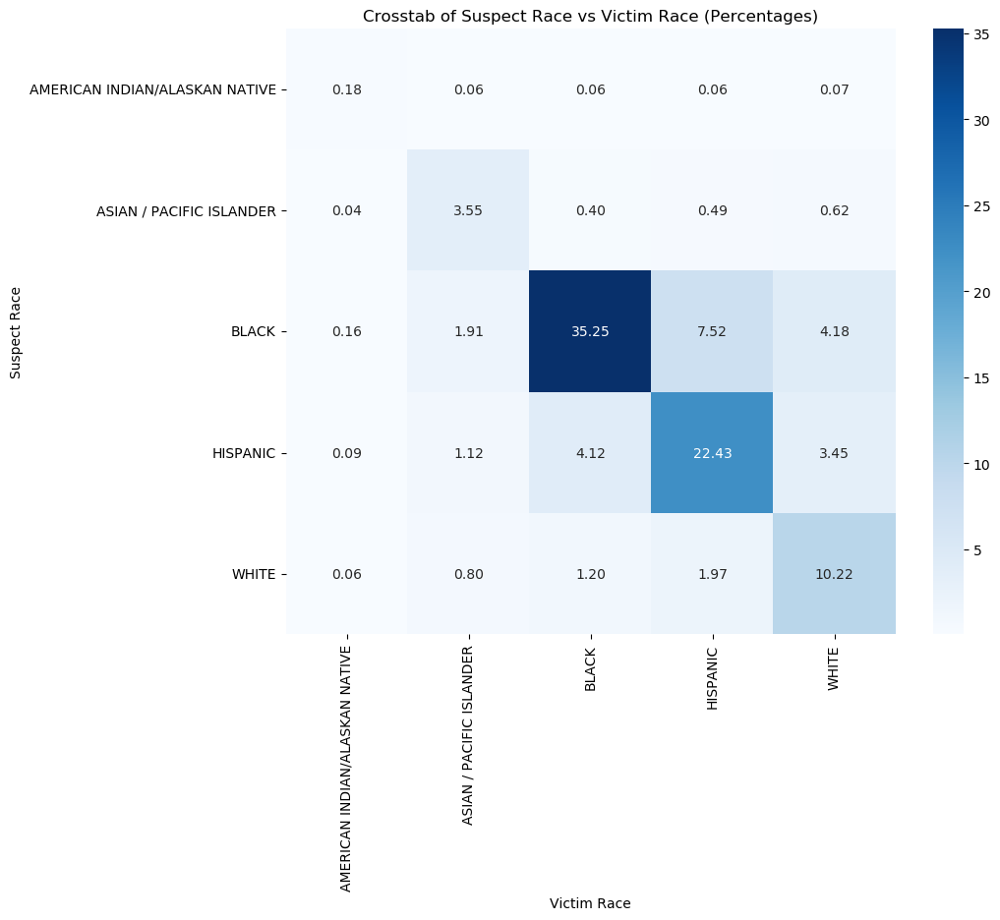
    


### Here we see that most crime is interracial. 


```python
data = crime_data_cleaned.copy()

# Group by 'SUSP_RACE' and 'LAW_CAT_CD' to get the counts
counts = data.groupby(['SUSP_RACE', 'LAW_CAT_CD']).size().unstack(fill_value=0)

# Calculate the percentages within each racial group
percentages = counts.div(counts.sum(axis=1), axis=0) * 100

# Convert the data into a DataFrame
percentages = pd.DataFrame(percentages)

# Melt the DataFrame for seaborn
percentages_melted = percentages.reset_index().melt(id_vars='SUSP_RACE', var_name='Crime Type', value_name='Percentage')

# Create the bar plot
plt.figure(figsize=(12, 8))
ax = sns.barplot(x='SUSP_RACE', y='Percentage', hue='Crime Type', data=percentages_melted, palette='viridis')

# Annotate each bar with the percentage
for p in ax.patches:
    percentage = f'{p.get_height():.1f}%'
    ax.annotate(percentage, 
                (p.get_x() + p.get_width() / 2., p.get_height()), 
                ha='center', va='bottom', 
                xytext=(0, 10), 
                textcoords='offset points')

# Rotate the x-axis labels
plt.xticks(rotation=45)

# Add titles and labels
plt.title('Racial Group by Crime Type Percentage')
plt.xlabel('Racial Group')
plt.ylabel('Percentage')
plt.legend(title='Crime Type', bbox_to_anchor=(1.05, 1), loc='upper left')
plt.tight_layout()  # Adjust layout to make room for the rotated labels
plt.show()
```


    
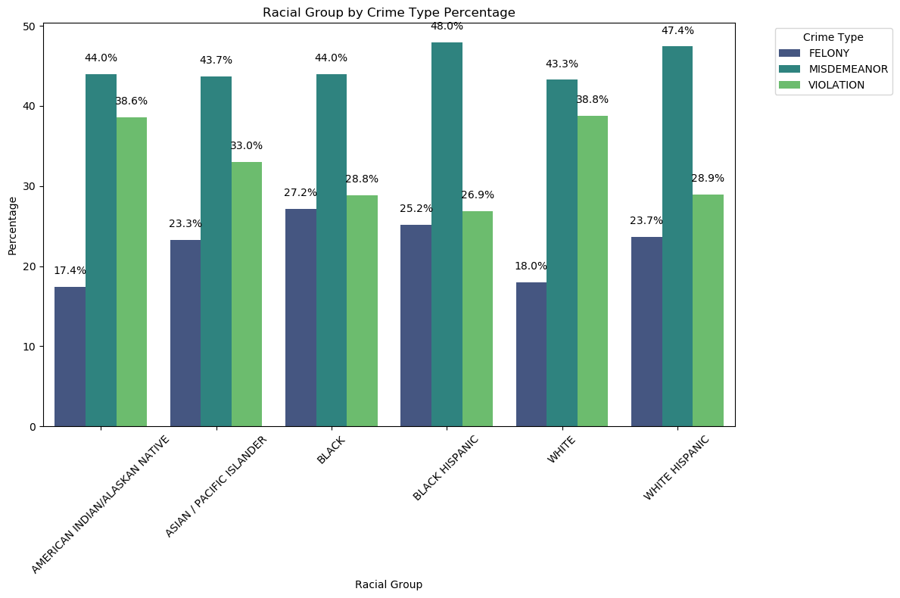
    


```python
data_copy = data.copy()

# Convert the date column to datetime
data_copy['CMPLNT_FR_DT'] = pd.to_datetime(data_copy['CMPLNT_FR_DT'], errors='coerce')

# Extract day of the week from the date
data_copy['DayOfWeek'] = data_copy['CMPLNT_FR_DT'].dt.day_name()

# Drop rows with NaT in CMPLNT_FR_DT
data_copy = data_copy.dropna(subset=['CMPLNT_FR_DT'])

# Aggregate the data by day of the week and crime type
crime_by_day = data_copy.groupby(['DayOfWeek', 'LAW_CAT_CD']).size().unstack(fill_value=0).reset_index()

# Reorder the days of the week for better visualization
days_order = ['Monday', 'Tuesday', 'Wednesday', 'Thursday', 'Friday', 'Saturday', 'Sunday']
crime_by_day['DayOfWeek'] = pd.Categorical(crime_by_day['DayOfWeek'], categories=days_order, ordered=True)
crime_by_day = crime_by_day.sort_values('DayOfWeek')

# Standardize the values
scaler = StandardScaler()
crime_by_day_standardized = pd.DataFrame(scaler.fit_transform(crime_by_day.iloc[:, 1:]), columns=crime_by_day.columns[1:], index=crime_by_day['DayOfWeek'])

# Melt the standardized data for plotting
crime_by_day_melted = crime_by_day_standardized.reset_index().melt(id_vars='DayOfWeek', var_name='Crime Type', value_name='Standardized Number of Crimes')

# Plotting the standardized line chart
plt.figure(figsize=(14, 8))
sns.lineplot(data=crime_by_day_melted, x='DayOfWeek', y='Standardized Number of Crimes', hue='Crime Type', markers=True, dashes=False)
plt.title('Standardized Number of Crimes by Day of the Week')
plt.xlabel('Day of the Week')
plt.ylabel('Standardized Number of Crimes')
plt.xticks(rotation=45)
plt.legend(title='Crime Type')
plt.show()
```


    
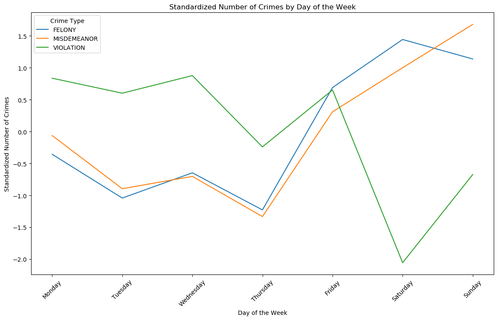
    


```python
data = crime_data_cleaned.copy()

# Combine Hispanic groups
data['SUSP_RACE'] = data['SUSP_RACE'].replace({'BLACK HISPANIC': 'HISPANIC', 'WHITE HISPANIC': 'HISPANIC'})
data['VIC_RACE'] = data['VIC_RACE'].replace({'BLACK HISPANIC': 'HISPANIC', 'WHITE HISPANIC': 'HISPANIC'})

# Convert the date column to datetime
data['CMPLNT_FR_DT'] = pd.to_datetime(data['CMPLNT_FR_DT'], errors='coerce')

# Drop rows with NaT in CMPLNT_FR_DT
data = data.dropna(subset=['CMPLNT_FR_DT'])

# Extract day of the week from the date
data['DayOfWeek'] = data['CMPLNT_FR_DT'].dt.day_name()

# Filter data for summer months (June, July, August)
summer_data = data[data['CMPLNT_FR_DT'].dt.month.isin([6, 7, 8])]

# Filter data for non-summer months
non_summer_data = data[~data['CMPLNT_FR_DT'].dt.month.isin([6, 7, 8])]

# Function to aggregate, standardize, and melt data
def process_data(data):
    # Aggregate the data by day of the week and crime type
    crime_by_day = data.groupby(['DayOfWeek', 'LAW_CAT_CD']).size().unstack(fill_value=0).reset_index()

    # Reorder the days of the week for better visualization
    days_order = ['Monday', 'Tuesday', 'Wednesday', 'Thursday', 'Friday', 'Saturday', 'Sunday']
    crime_by_day['DayOfWeek'] = pd.Categorical(crime_by_day['DayOfWeek'], categories=days_order, ordered=True)
    crime_by_day = crime_by_day.sort_values('DayOfWeek')

    # Standardize the values
    scaler = StandardScaler()
    crime_by_day_standardized = pd.DataFrame(scaler.fit_transform(crime_by_day.iloc[:, 1:]), columns=crime_by_day.columns[1:], index=crime_by_day['DayOfWeek'])

    # Melt the standardized data for plotting
    crime_by_day_melted = crime_by_day_standardized.reset_index().melt(id_vars='DayOfWeek', var_name='Crime Type', value_name='Standardized Number of Crimes')
    
    return crime_by_day_melted

# Process summer and non-summer data
summer_crime_by_day_melted = process_data(summer_data)
non_summer_crime_by_day_melted = process_data(non_summer_data)

# Plotting the standardized line chart for summer months
plt.figure(figsize=(14, 8))
sns.lineplot(data=summer_crime_by_day_melted, x='DayOfWeek', y='Standardized Number of Crimes', hue='Crime Type', markers=True, dashes=False)
plt.title('Standardized Number of Crimes by Day of the Week (Summer Months)')
plt.xlabel('Day of the Week')
plt.ylabel('Standardized Number of Crimes')
plt.xticks(rotation=45)
plt.legend(title='Crime Type')
plt.show()

# Plotting the standardized line chart for non-summer months
plt.figure(figsize=(14, 8))
sns.lineplot(data=non_summer_crime_by_day_melted, x='DayOfWeek', y='Standardized Number of Crimes', hue='Crime Type', markers=True, dashes=False)
plt.title('Standardized Number of Crimes by Day of the Week (Non-Summer Months)')
plt.xlabel('Day of the Week')
plt.ylabel('Standardized Number of Crimes')
plt.xticks(rotation=45)
plt.legend(title='Crime Type')
plt.show()
```


    
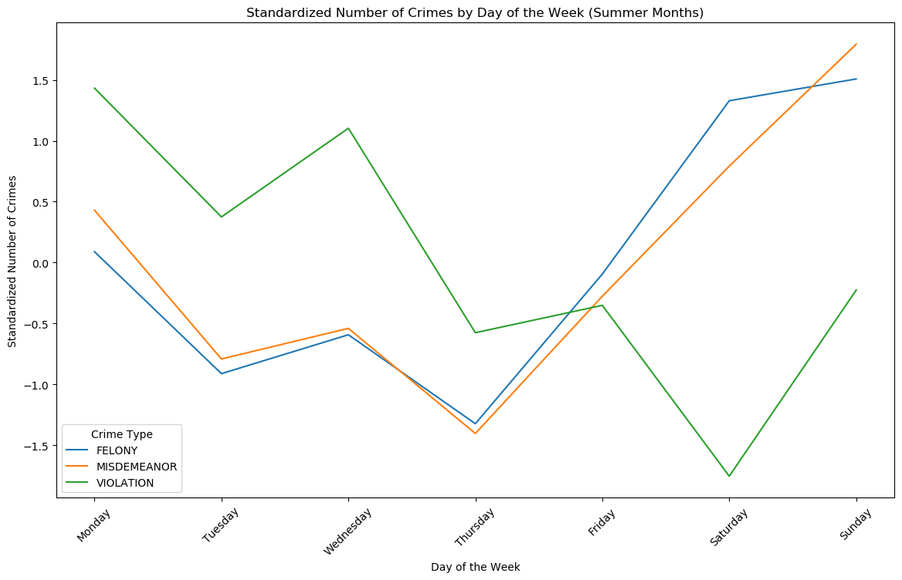
    


    
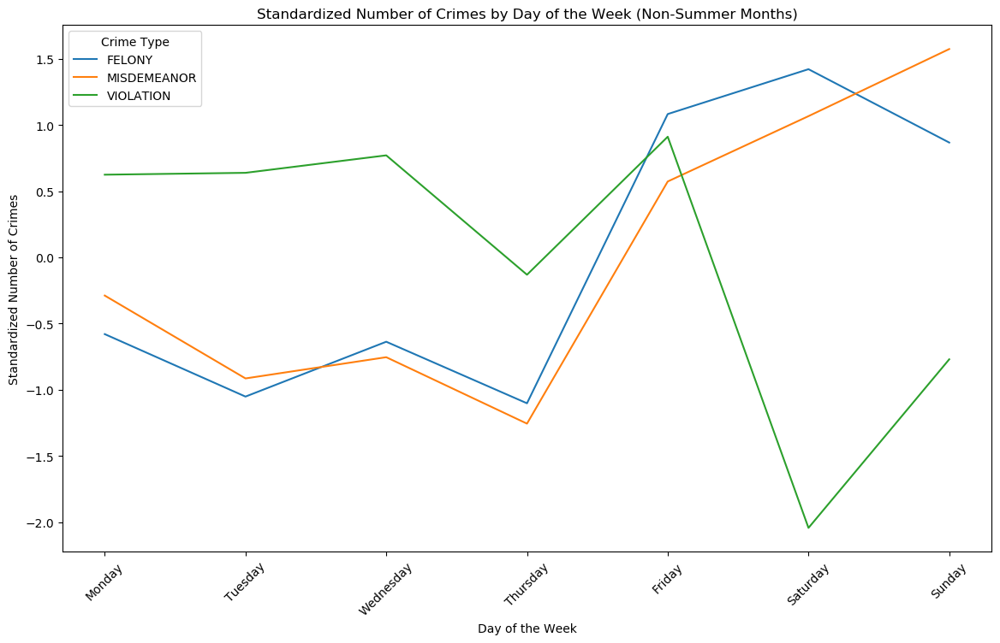
    


```python
data = crime_data_cleaned.copy()

# Combine Hispanic groups
data['SUSP_RACE'] = data['SUSP_RACE'].replace({'BLACK HISPANIC': 'HISPANIC', 'WHITE HISPANIC': 'HISPANIC'})
data['VIC_RACE'] = data['VIC_RACE'].replace({'BLACK HISPANIC': 'HISPANIC', 'WHITE HISPANIC': 'HISPANIC'})

# Convert the date column to datetime
data['CMPLNT_FR_DT'] = pd.to_datetime(data['CMPLNT_FR_DT'], errors='coerce')

# Drop rows with NaT in CMPLNT_FR_DT
data = data.dropna(subset=['CMPLNT_FR_DT'])

# Extract day of the week from the date
data['DayOfWeek'] = data['CMPLNT_FR_DT'].dt.day_name()

# Filter data for summer months (June, July, August)
summer_data = data[data['CMPLNT_FR_DT'].dt.month.isin([6, 7, 8])]

# Filter data for non-summer months
non_summer_data = data[~data['CMPLNT_FR_DT'].dt.month.isin([6, 7, 8])]

# Function to aggregate, standardize, and melt data by age group
def process_data_by_age_group(data):
    results = {}
    for age_group in data['SUSP_AGE_GROUP'].unique():
        age_group_data = data[data['SUSP_AGE_GROUP'] == age_group]
        
        # Aggregate the data by day of the week and crime type
        crime_by_day = age_group_data.groupby(['DayOfWeek', 'LAW_CAT_CD']).size().unstack(fill_value=0).reset_index()

        # Reorder the days of the week for better visualization
        days_order = ['Monday', 'Tuesday', 'Wednesday', 'Thursday', 'Friday', 'Saturday', 'Sunday']
        crime_by_day['DayOfWeek'] = pd.Categorical(crime_by_day['DayOfWeek'], categories=days_order, ordered=True)
        crime_by_day = crime_by_day.sort_values('DayOfWeek')

        # Standardize the values
        scaler = StandardScaler()
        crime_by_day_standardized = pd.DataFrame(scaler.fit_transform(crime_by_day.iloc[:, 1:]), columns=crime_by_day.columns[1:], index=crime_by_day['DayOfWeek'])

        # Melt the standardized data for plotting
        crime_by_day_melted = crime_by_day_standardized.reset_index().melt(id_vars='DayOfWeek', var_name='Crime Type', value_name='Standardized Number of Crimes')
        
        results[age_group] = crime_by_day_melted
    return results

# Process summer and non-summer data by age group
summer_crime_by_age_group = process_data_by_age_group(summer_data)
non_summer_crime_by_age_group = process_data_by_age_group(non_summer_data)

# Plotting the standardized line chart for summer months by age group
for age_group, data in summer_crime_by_age_group.items():
    plt.figure(figsize=(14, 8))
    sns.lineplot(data=data, x='DayOfWeek', y='Standardized Number of Crimes', hue='Crime Type', markers=True, dashes=False)
    plt.title(f'Standardized Number of Crimes by Day of the Week (Summer Months) - Age Group: {age_group}')
    plt.xlabel('Day of the Week')
    plt.ylabel('Standardized Number of Crimes')
    plt.xticks(rotation=45)
    plt.legend(title='Crime Type')
    plt.show()

# Plotting the standardized line chart for non-summer months by age group
for age_group, data in non_summer_crime_by_age_group.items():
    plt.figure(figsize=(14, 8))
    sns.lineplot(data=data, x='DayOfWeek', y='Standardized Number of Crimes', hue='Crime Type', markers=True, dashes=False)
    plt.title(f'Standardized Number of Crimes by Day of the Week (Non-Summer Months) - Age Group: {age_group}')
    plt.xlabel('Day of the Week')
    plt.ylabel('Standardized Number of Crimes')
    plt.xticks(rotation=45)
    plt.legend(title='Crime Type')
    plt.show()
```


    
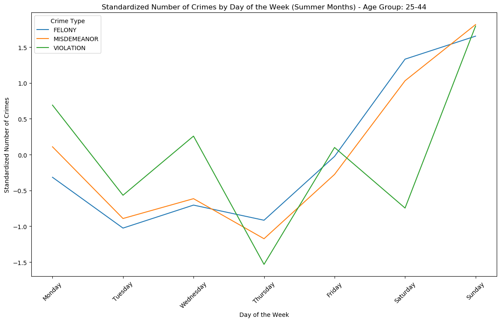
    


    
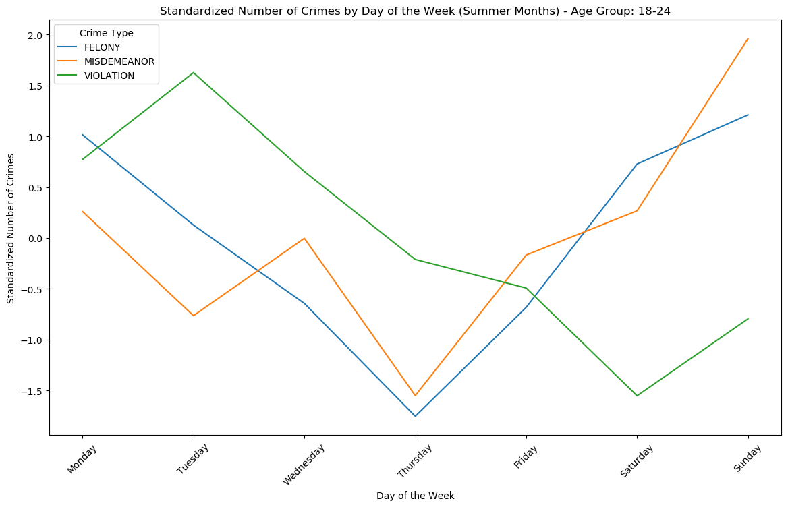
    


    
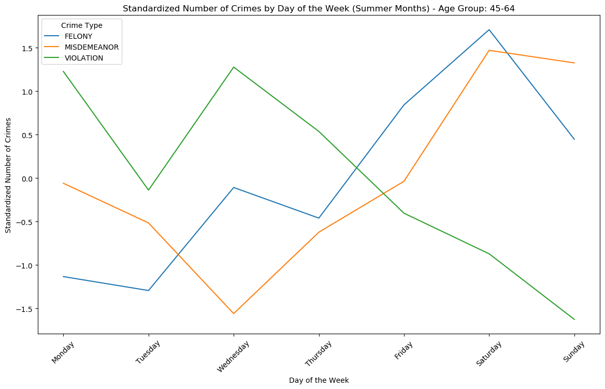
    


    
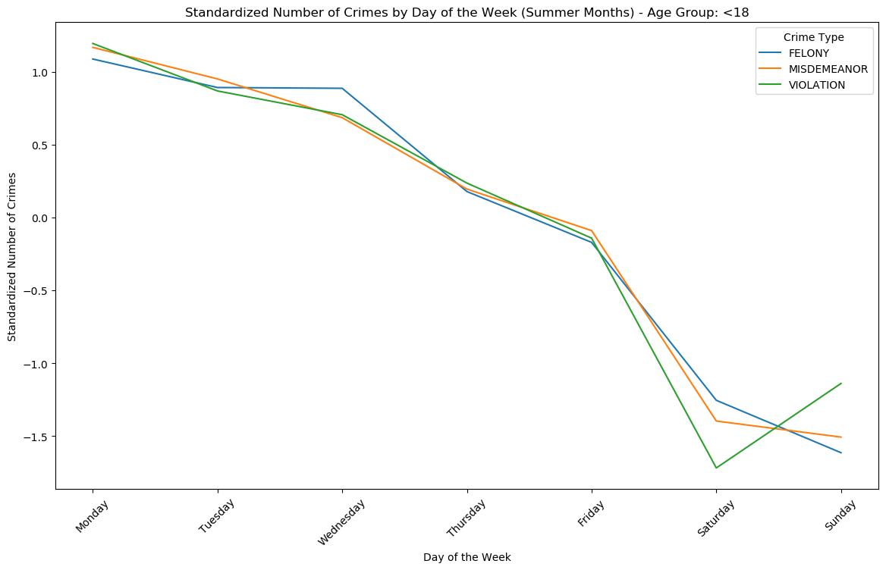
    


    

    


    

    


    
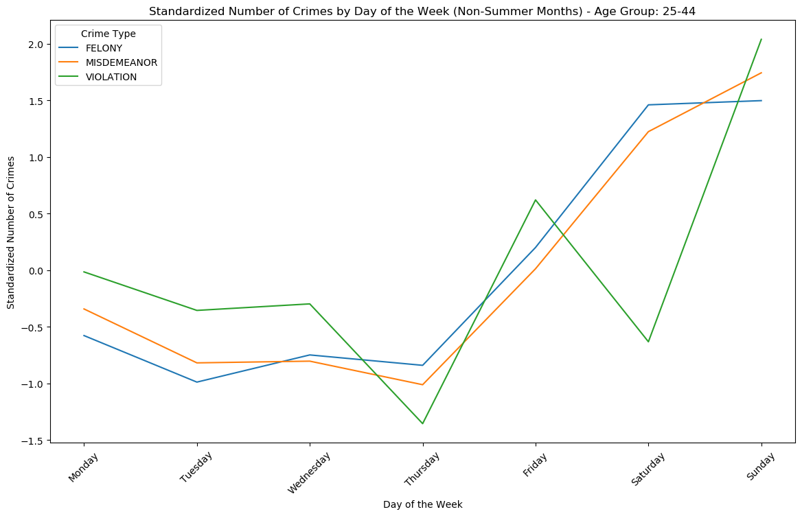
    


    
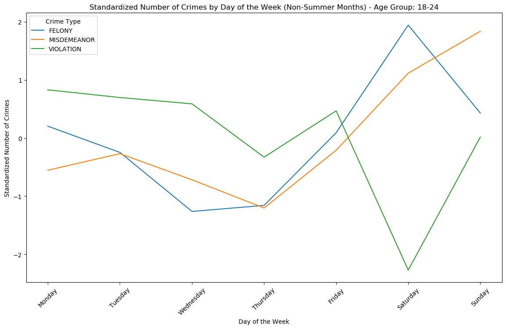
    


    
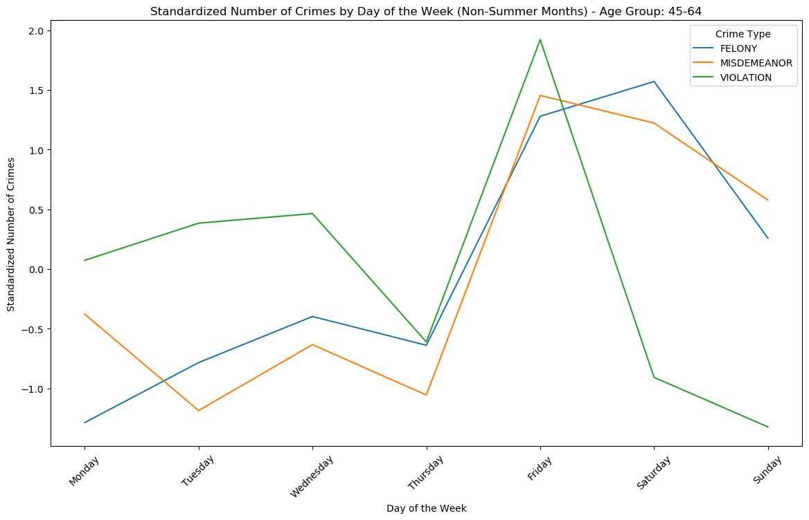
    


    
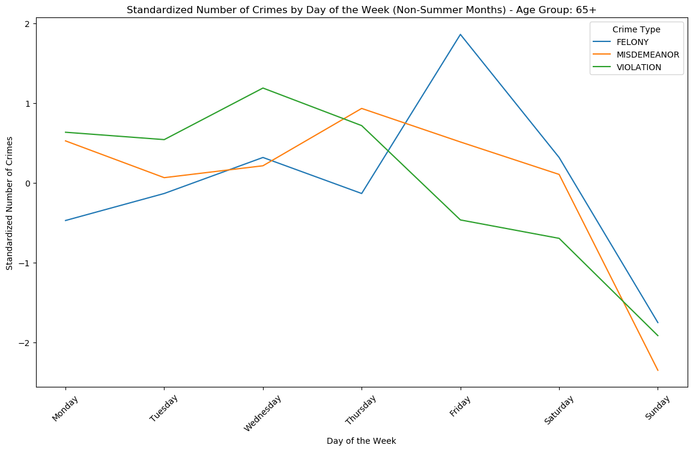
    


```python
data = crime_data_cleaned.copy()

# Combine Hispanic groups
data['SUSP_RACE'] = data['SUSP_RACE'].replace({'BLACK HISPANIC': 'HISPANIC', 'WHITE HISPANIC': 'HISPANIC'})
data['VIC_RACE'] = data['VIC_RACE'].replace({'BLACK HISPANIC': 'HISPANIC', 'WHITE HISPANIC': 'HISPANIC'})

# Convert the date column to datetime
data['CMPLNT_FR_DT'] = pd.to_datetime(data['CMPLNT_FR_DT'], errors='coerce')

# Drop rows with NaT in CMPLNT_FR_DT
data = data.dropna(subset=['CMPLNT_FR_DT'])

# Filter data for summer months (June, July, August)
summer_data = data[data['CMPLNT_FR_DT'].dt.month.isin([6, 7, 8])]

# Filter data for non-summer months
non_summer_data = data[~data['CMPLNT_FR_DT'].dt.month.isin([6, 7, 8])]

# Create crosstab for summer months
crosstab_summer = pd.crosstab(summer_data['SUSP_RACE'], summer_data['VIC_RACE'])
crosstab_summer_percentage = crosstab_summer / crosstab_summer.sum().sum() * 100

# Create crosstab for non-summer months
crosstab_non_summer = pd.crosstab(non_summer_data['SUSP_RACE'], non_summer_data['VIC_RACE'])
crosstab_non_summer_percentage = crosstab_non_summer / crosstab_non_summer.sum().sum() * 100

# Plot heatmap for summer months
plt.figure(figsize=(10, 8))
sns.heatmap(crosstab_summer_percentage, annot=True, cmap='Blues', fmt='.2f')
plt.title('Crosstab of Suspect Race vs Victim Race (Summer Months) - Percentages')
plt.xlabel('Victim Race')
plt.ylabel('Suspect Race')
plt.show()

# Plot heatmap for non-summer months
plt.figure(figsize=(10, 8))
sns.heatmap(crosstab_non_summer_percentage, annot=True, cmap='Blues', fmt='.2f')
plt.title('Crosstab of Suspect Race vs Victim Race (Non-Summer Months) - Percentages')
plt.xlabel('Victim Race')
plt.ylabel('Suspect Race')
plt.show()

```


    
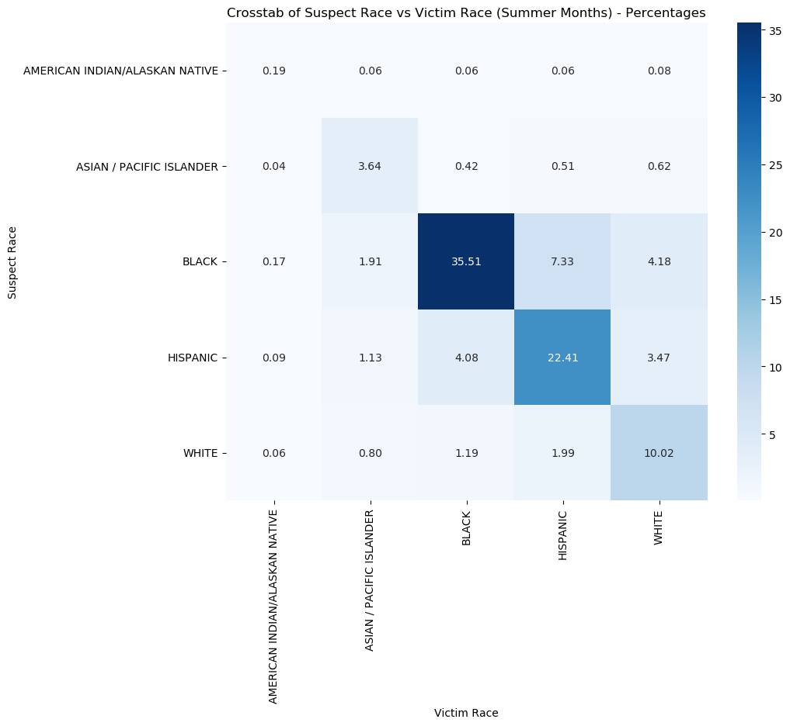
    


    

    


```python
data
```


<div>
<style scoped>
    .dataframe tbody tr th:only-of-type {
        vertical-align: middle;
    }

    .dataframe tbody tr th {
        vertical-align: top;
    }

    .dataframe thead th {
        text-align: right;
    }
</style>
<table border="1" class="dataframe">
  <thead>
    <tr style="text-align: right;">
      <th></th>
      <th>CMPLNT_FR_DT</th>
      <th>LAW_CAT_CD</th>
      <th>SUSP_AGE_GROUP</th>
      <th>SUSP_RACE</th>
      <th>SUSP_SEX</th>
      <th>Latitude</th>
      <th>Longitude</th>
      <th>VIC_AGE_GROUP</th>
      <th>VIC_RACE</th>
      <th>VIC_SEX</th>
    </tr>
  </thead>
  <tbody>
    <tr>
      <th>4</th>
      <td>2008-03-10</td>
      <td>FELONY</td>
      <td>&lt;18</td>
      <td>BLACK</td>
      <td>M</td>
      <td>40.650142</td>
      <td>-73.944674</td>
      <td>25-44</td>
      <td>BLACK</td>
      <td>M</td>
    </tr>
    <tr>
      <th>6</th>
      <td>2008-12-21</td>
      <td>MISDEMEANOR</td>
      <td>25-44</td>
      <td>BLACK</td>
      <td>M</td>
      <td>40.669126</td>
      <td>-73.973071</td>
      <td>25-44</td>
      <td>WHITE</td>
      <td>M</td>
    </tr>
    <tr>
      <th>9</th>
      <td>2008-04-19</td>
      <td>VIOLATION</td>
      <td>18-24</td>
      <td>HISPANIC</td>
      <td>M</td>
      <td>40.689954</td>
      <td>-73.916924</td>
      <td>25-44</td>
      <td>HISPANIC</td>
      <td>F</td>
    </tr>
    <tr>
      <th>20</th>
      <td>2008-07-14</td>
      <td>FELONY</td>
      <td>25-44</td>
      <td>BLACK</td>
      <td>F</td>
      <td>40.628285</td>
      <td>-73.944245</td>
      <td>45-64</td>
      <td>WHITE</td>
      <td>M</td>
    </tr>
    <tr>
      <th>26</th>
      <td>2008-11-11</td>
      <td>MISDEMEANOR</td>
      <td>25-44</td>
      <td>HISPANIC</td>
      <td>M</td>
      <td>40.655604</td>
      <td>-73.926420</td>
      <td>45-64</td>
      <td>BLACK</td>
      <td>F</td>
    </tr>
    <tr>
      <th>...</th>
      <td>...</td>
      <td>...</td>
      <td>...</td>
      <td>...</td>
      <td>...</td>
      <td>...</td>
      <td>...</td>
      <td>...</td>
      <td>...</td>
      <td>...</td>
    </tr>
    <tr>
      <th>8914821</th>
      <td>2008-08-06</td>
      <td>VIOLATION</td>
      <td>65+</td>
      <td>BLACK</td>
      <td>F</td>
      <td>40.834776</td>
      <td>-73.916017</td>
      <td>45-64</td>
      <td>BLACK</td>
      <td>F</td>
    </tr>
    <tr>
      <th>8914824</th>
      <td>2008-10-27</td>
      <td>MISDEMEANOR</td>
      <td>25-44</td>
      <td>BLACK</td>
      <td>M</td>
      <td>40.831575</td>
      <td>-73.927705</td>
      <td>25-44</td>
      <td>BLACK</td>
      <td>F</td>
    </tr>
    <tr>
      <th>8914831</th>
      <td>2008-05-25</td>
      <td>MISDEMEANOR</td>
      <td>&lt;18</td>
      <td>BLACK</td>
      <td>M</td>
      <td>40.841935</td>
      <td>-73.914246</td>
      <td>45-64</td>
      <td>BLACK</td>
      <td>M</td>
    </tr>
    <tr>
      <th>8914834</th>
      <td>2008-04-16</td>
      <td>FELONY</td>
      <td>25-44</td>
      <td>BLACK</td>
      <td>M</td>
      <td>40.826765</td>
      <td>-73.950203</td>
      <td>45-64</td>
      <td>WHITE</td>
      <td>F</td>
    </tr>
    <tr>
      <th>8914836</th>
      <td>2008-06-25</td>
      <td>MISDEMEANOR</td>
      <td>25-44</td>
      <td>BLACK</td>
      <td>M</td>
      <td>40.578255</td>
      <td>-73.972324</td>
      <td>25-44</td>
      <td>BLACK</td>
      <td>F</td>
    </tr>
  </tbody>
</table>
<p>2071476 rows × 10 columns</p>
</div>


supports the proximity to people theory.  people are around more people on the weekends b/c they are not working


```python
data_copy = data.copy()

# Convert the date column to datetime
data_copy['CMPLNT_FR_DT'] = pd.to_datetime(data_copy['CMPLNT_FR_DT'], errors='coerce')

# Extract month from the date
data_copy['Month'] = data_copy['CMPLNT_FR_DT'].dt.month_name()

# Drop rows with NaT in CMPLNT_FR_DT
data_copy = data_copy.dropna(subset=['CMPLNT_FR_DT'])

# Aggregate the data by month and crime type
crime_by_month = data_copy.groupby(['Month', 'LAW_CAT_CD']).size().unstack(fill_value=0).reset_index()

# Reorder the months for better visualization
months_order = ['January', 'February', 'March', 'April', 'May', 'June', 'July', 'August', 'September', 'October', 'November', 'December']
crime_by_month['Month'] = pd.Categorical(crime_by_month['Month'], categories=months_order, ordered=True)
crime_by_month = crime_by_month.sort_values('Month')

# Standardize the values
scaler = StandardScaler()
crime_by_month_standardized = pd.DataFrame(scaler.fit_transform(crime_by_month.iloc[:, 1:]), columns=crime_by_month.columns[1:], index=crime_by_month['Month'])

# Melt the standardized data for plotting
crime_by_month_melted = crime_by_month_standardized.reset_index().melt(id_vars='Month', var_name='Crime Type', value_name='Standardized Number of Crimes')

# Plotting the standardized line chart
plt.figure(figsize=(14, 8))
sns.lineplot(data=crime_by_month_melted, x='Month', y='Standardized Number of Crimes', hue='Crime Type', markers=True, dashes=False)
plt.title('Standardized Number of Crimes by Month')
plt.xlabel('Month')
plt.ylabel('Standardized Number of Crimes')
plt.xticks(rotation=45)
plt.legend(title='Crime Type')
plt.show()
```


    

    


Makes sense, more crime happens in the summer because people are out enjoying the weather

## Let's look at a breakdown of this chart for each age group


```python
data_copy = data.copy()

# Convert the date column to datetime
data_copy['CMPLNT_FR_DT'] = pd.to_datetime(data_copy['CMPLNT_FR_DT'], errors='coerce')

# Extract month from the date
data_copy['Month'] = data_copy['CMPLNT_FR_DT'].dt.month_name()

# Drop rows with NaT in CMPLNT_FR_DT
data_copy = data_copy.dropna(subset=['CMPLNT_FR_DT'])

# List of age groups
age_groups = data_copy['SUSP_AGE_GROUP'].unique()

# Reorder the months for better visualization
months_order = ['January', 'February', 'March', 'April', 'May', 'June', 'July', 'August', 'September', 'October', 'November', 'December']

# Loop through each age group to create separate plots
for age_group in age_groups:
    # Filter data for the current age group
    age_group_data = data_copy[data_copy['SUSP_AGE_GROUP'] == age_group]
    
    # Aggregate the data by month and crime type
    crime_by_month = age_group_data.groupby(['Month', 'LAW_CAT_CD']).size().unstack(fill_value=0).reset_index()
    
    # Reorder the months
    crime_by_month['Month'] = pd.Categorical(crime_by_month['Month'], categories=months_order, ordered=True)
    crime_by_month = crime_by_month.sort_values('Month')
    
    # Standardize the values
    scaler = StandardScaler()
    crime_by_month_standardized = pd.DataFrame(scaler.fit_transform(crime_by_month.iloc[:, 1:]), columns=crime_by_month.columns[1:], index=crime_by_month['Month'])
    
    # Melt the standardized data for plotting
    crime_by_month_melted = crime_by_month_standardized.reset_index().melt(id_vars='Month', var_name='Crime Type', value_name='Standardized Number of Crimes')
    
    # Plotting the standardized line chart
    plt.figure(figsize=(14, 8))
    sns.lineplot(data=crime_by_month_melted, x='Month', y='Standardized Number of Crimes', hue='Crime Type', markers=True, dashes=False)
    plt.title(f'Standardized Number of Crimes by Month for Age Group: {age_group}')
    plt.xlabel('Month')
    plt.ylabel('Standardized Number of Crimes')
    plt.xticks(rotation=45)
    plt.legend(title='Crime Type')
    plt.show()
```


    
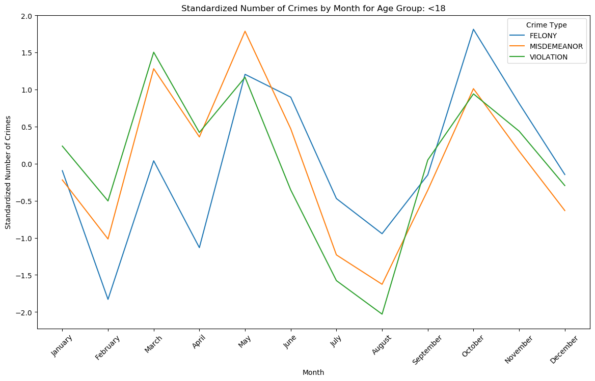
    


    
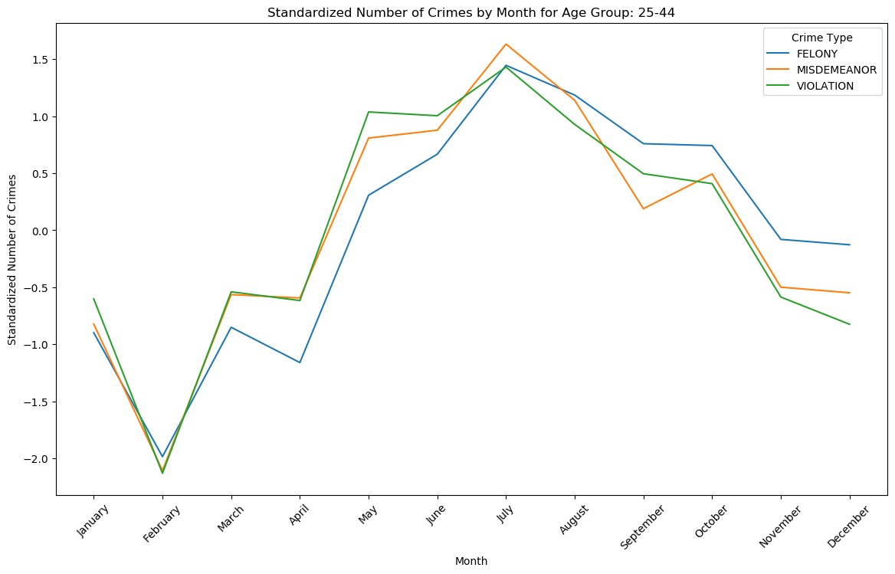
    


    
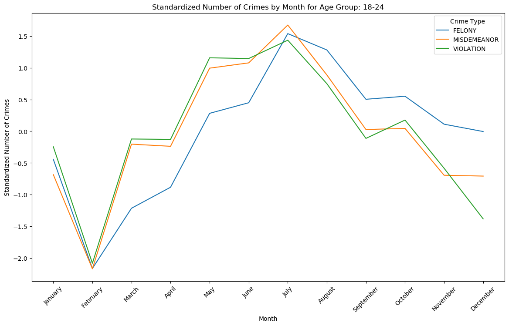
    


    
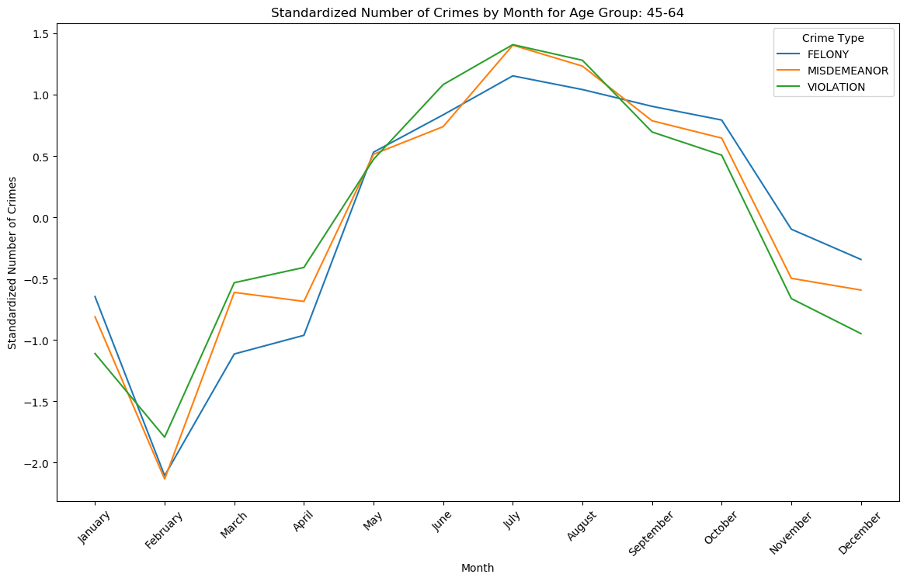
    


    
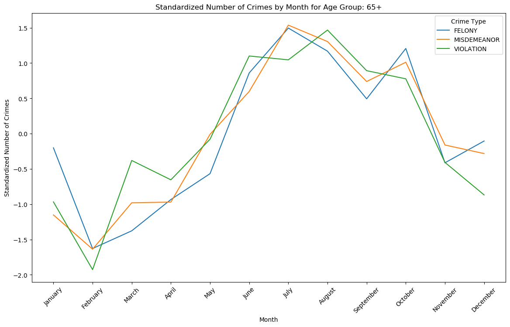
    


This is an interesting result.  Crime increases during summer months for all age groups, except minors less than 18 years old. 

Explanation:  we saw that most crimes happen between people of the same race and the same age group. For all age groups, the number of interactions with people of the same demographic increases because people are spending more time outside enjoying the good weather.  however, for minors less than 18, they are out of school and likely have fewer intractions with other minors. 

This suggests that heat is not the causal factor. Rather, the real causal factor is proximity to high number of potential victims within the criminal's core demographic. 


###  This makes sense, because more people are outside during the summer months.  Or it could be that the heat itself is a causal factor. 


```python
data_copy = data.copy()

# Convert the date column to datetime
data_copy['CMPLNT_FR_DT'] = pd.to_datetime(data_copy['CMPLNT_FR_DT'], errors='coerce')

# Drop rows with NaT in CMPLNT_FR_DT
data_copy = data_copy.dropna(subset=['CMPLNT_FR_DT'])

def age_group_to_numeric(age_group):
    if age_group == '<18':
        return 9  # Midpoint for <18
    elif age_group == '18-24':
        return 21  # Midpoint for 18-24
    elif age_group == '25-44':
        return 34  # Midpoint for 25-44
    elif age_group == '45-64':
        return 54  # Midpoint for 45-64
    elif age_group == '65+':
        return 70  # Approximate midpoint for 65+
    else:
        return None  # Handle other cases

# Apply the conversion to the VIC_AGE_GROUP column
data_copy['SUSP_AGE_GROUP_NUMERIC'] = data_copy['SUSP_AGE_GROUP'].apply(age_group_to_numeric)

# Box plot of victim age group by law category
plt.figure(figsize=(12, 8))
sns.boxplot(x='LAW_CAT_CD', y='SUSP_AGE_GROUP_NUMERIC', data=data_copy, palette='viridis')
plt.title('Suspect Age Group by Law Category')
plt.xlabel('Law Category')
plt.ylabel('Suspect Age Group (Numeric)')
plt.show()
```


    
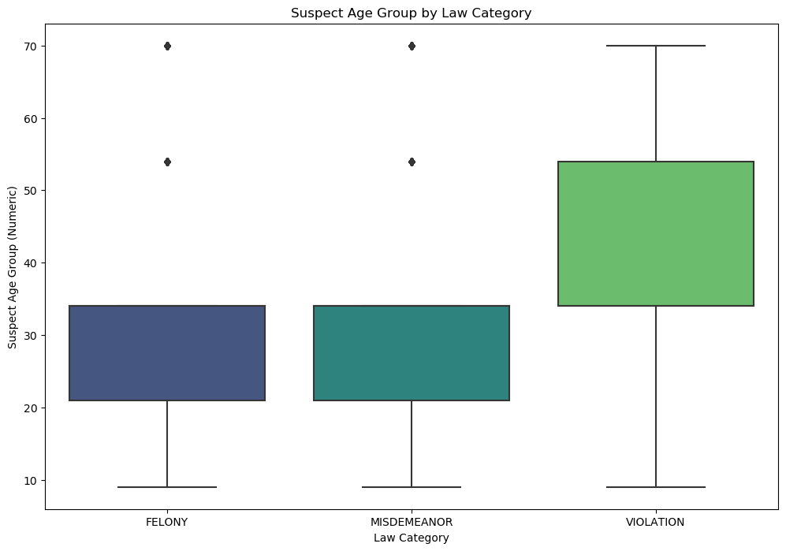
    


# Model to predict suspect profile based on victim profile


```python
import pandas as pd
from sklearn.model_selection import train_test_split
from sklearn.preprocessing import LabelEncoder


# Create a copy of the data to avoid modifying the original dataset
data_copy = data.copy()

# Drop rows with missing values
data_copy = data_copy.dropna()

# Encode categorical variables using separate LabelEncoders
le_susp_age_group = LabelEncoder()
le_susp_race = LabelEncoder()
le_susp_sex = LabelEncoder()
le_vic_age_group = LabelEncoder()
le_vic_race = LabelEncoder()
le_vic_sex = LabelEncoder()
le_law_cat_cd = LabelEncoder()

data_copy['SUSP_AGE_GROUP'] = le_susp_age_group.fit_transform(data_copy['SUSP_AGE_GROUP'])
data_copy['SUSP_RACE'] = le_susp_race.fit_transform(data_copy['SUSP_RACE'])
data_copy['SUSP_SEX'] = le_susp_sex.fit_transform(data_copy['SUSP_SEX'])
data_copy['VIC_AGE_GROUP'] = le_vic_age_group.fit_transform(data_copy['VIC_AGE_GROUP'])
data_copy['VIC_RACE'] = le_vic_race.fit_transform(data_copy['VIC_RACE'])
data_copy['VIC_SEX'] = le_vic_sex.fit_transform(data_copy['VIC_SEX'])
data_copy['LAW_CAT_CD'] = le_law_cat_cd.fit_transform(data_copy['LAW_CAT_CD'])

# Select features and target variables
features = ['VIC_AGE_GROUP', 'VIC_RACE', 'VIC_SEX', 'LAW_CAT_CD']
X = data_copy[features]
y = data_copy[['SUSP_RACE', 'SUSP_AGE_GROUP', 'SUSP_SEX']]

# Split the data into training and test sets
X_train, X_test, y_train, y_test = train_test_split(X, y, test_size=0.2, random_state=42)


from sklearn.multioutput import MultiOutputClassifier
from sklearn.ensemble import RandomForestClassifier

# Initialize the base model
base_model = RandomForestClassifier(n_estimators=100, random_state=42)

# Initialize the multi-output model
multi_output_model = MultiOutputClassifier(base_model, n_jobs=1)

# Train the model
multi_output_model.fit(X_train, y_train)


from sklearn.metrics import accuracy_score, classification_report

# Make predictions on the test set
y_pred = multi_output_model.predict(X_test)

# Evaluate the model for each target variable
accuracy_race = accuracy_score(y_test['SUSP_RACE'], y_pred[:, 0])
accuracy_age_group = accuracy_score(y_test['SUSP_AGE_GROUP'], y_pred[:, 1])
accuracy_sex = accuracy_score(y_test['SUSP_SEX'], y_pred[:, 2])

print(f'Accuracy for SUSP_RACE: {accuracy_race:.2f}')
print(f'Accuracy for SUSP_AGE_GROUP: {accuracy_age_group:.2f}')
print(f'Accuracy for SUSP_SEX: {accuracy_sex:.2f}')

report_race = classification_report(y_test['SUSP_RACE'], y_pred[:, 0], target_names=le_susp_race.classes_)
report_age_group = classification_report(y_test['SUSP_AGE_GROUP'], y_pred[:, 1], target_names=le_susp_age_group.classes_)
report_sex = classification_report(y_test['SUSP_SEX'], y_pred[:, 2], target_names=le_susp_sex.classes_)

print('Classification Report for SUSP_RACE:')
print(report_race)

print('Classification Report for SUSP_AGE_GROUP:')
print(report_age_group)

print('Classification Report for SUSP_SEX:')
print(report_sex)


```

    Accuracy for SUSP_RACE: 0.72
    Accuracy for SUSP_AGE_GROUP: 0.55
    Accuracy for SUSP_SEX: 0.74
    

    c:\users\alex\appdata\local\programs\python\python37\lib\site-packages\sklearn\metrics\_classification.py:1318: UndefinedMetricWarning: Precision and F-score are ill-defined and being set to 0.0 in labels with no predicted samples. Use `zero_division` parameter to control this behavior.
      _warn_prf(average, modifier, msg_start, len(result))
    c:\users\alex\appdata\local\programs\python\python37\lib\site-packages\sklearn\metrics\_classification.py:1318: UndefinedMetricWarning: Precision and F-score are ill-defined and being set to 0.0 in labels with no predicted samples. Use `zero_division` parameter to control this behavior.
      _warn_prf(average, modifier, msg_start, len(result))
    c:\users\alex\appdata\local\programs\python\python37\lib\site-packages\sklearn\metrics\_classification.py:1318: UndefinedMetricWarning: Precision and F-score are ill-defined and being set to 0.0 in labels with no predicted samples. Use `zero_division` parameter to control this behavior.
      _warn_prf(average, modifier, msg_start, len(result))
    

    Classification Report for SUSP_RACE:
                                    precision    recall  f1-score   support
    
    AMERICAN INDIAN/ALASKAN NATIVE       0.45      0.26      0.33      1786
          ASIAN / PACIFIC ISLANDER       0.52      0.64      0.57     21162
                             BLACK       0.83      0.75      0.79    203150
                          HISPANIC       0.69      0.72      0.71    129420
                             WHITE       0.57      0.68      0.62     58778
    
                          accuracy                           0.72    414296
                         macro avg       0.61      0.61      0.60    414296
                      weighted avg       0.73      0.72      0.72    414296
    
    Classification Report for SUSP_AGE_GROUP:
                  precision    recall  f1-score   support
    
           18-24       0.47      0.25      0.32     80492
           25-44       0.58      0.87      0.69    220300
           45-64       0.45      0.08      0.13     75864
             65+       0.00      0.00      0.00      7809
             <18       0.44      0.42      0.43     29831
    
        accuracy                           0.55    414296
       macro avg       0.39      0.32      0.31    414296
    weighted avg       0.51      0.55      0.49    414296
    
    Classification Report for SUSP_SEX:
                  precision    recall  f1-score   support
    
               F       0.53      0.02      0.04    106512
               M       0.75      0.99      0.85    307784
    
        accuracy                           0.74    414296
       macro avg       0.64      0.51      0.45    414296
    weighted avg       0.69      0.74      0.64    414296
    
    


```python

# Example victim data
new_victim_data = {
    'VIC_AGE_GROUP': ['25-44'],
    'VIC_RACE': ['BLACK'],
    'VIC_SEX': ['M'],
    'LAW_CAT_CD': ['FELONY']
}

# Convert to DataFrame
new_victim_df = pd.DataFrame(new_victim_data)

# Encode the new data using the same LabelEncoders
new_victim_df['VIC_AGE_GROUP'] = le_vic_age_group.transform(new_victim_df['VIC_AGE_GROUP'])
new_victim_df['VIC_RACE'] = le_vic_race.transform(new_victim_df['VIC_RACE'])
new_victim_df['VIC_SEX'] = le_vic_sex.transform(new_victim_df['VIC_SEX'])
new_victim_df['LAW_CAT_CD'] = le_law_cat_cd.transform(new_victim_df['LAW_CAT_CD'])

# Make predictions
predicted_suspect_profile = multi_output_model.predict(new_victim_df)

predicted_suspect_race = le_susp_race.inverse_transform(predicted_suspect_profile[:, 0])
predicted_suspect_age_group = le_susp_age_group.inverse_transform(predicted_suspect_profile[:, 1])
predicted_suspect_sex = le_susp_sex.inverse_transform(predicted_suspect_profile[:, 2])

print('Predicted Suspect Race:', predicted_suspect_race)
print('Predicted Suspect Age Group:', predicted_suspect_age_group)
print('Predicted Suspect Sex:', predicted_suspect_sex)
```

    Predicted Suspect Race: ['BLACK']
    Predicted Suspect Age Group: ['25-44']
    Predicted Suspect Sex: ['M']
    

# Let's look at the relationship between crime rates and housing prices 


```python
crime_data = crime_data_cleaned.copy()
```

## First we add zip code data so we can merge our crime data with our housing data


```python
# Load the ZIP Code shapefile once
zip_code_shapefile = 'geo_export_5d779e3d-72be-4a75-b7b0-443826472d7f.shp'
zip_codes = gpd.read_file(zip_code_shapefile)

# Ensure the coordinate reference system (CRS) is WGS84 (EPSG:4326)
zip_codes = zip_codes.to_crs(epsg=4326)

# Define the function to get ZIP Code from latitude and longitude using the pre-loaded GeoDataFrame
def get_zip_code(longitude, latitude, zip_codes):
    
    try: 
        # Create a GeoDataFrame for the input point
        point = gpd.GeoDataFrame(geometry=[Point(longitude, latitude)], crs='EPSG:4326')

        # Perform spatial join to find the corresponding ZIP Code
        joined = gpd.sjoin(point, zip_codes, how='left', predicate='within')

        # Extract the ZIP Code from the resulting GeoDataFrame
        if not joined.empty:
            return joined.iloc[0]['modzcta']  # Use 'modzcta' as the ZIP Code column
        else:
            return None
    except:
        return None
```


```python
## This took 8 hours of compute time! 

# crime_data['zip_code'] = crime_data.apply(lambda row: get_zip_code(row['Longitude'], row['Latitude'], zip_codes), axis=1)
# crime_data.to_csv('big_data_w_zipcodes.csv')

df = pd.read_csv('big_data_w_zipcodes.csv')

```


```python
df['zip_code'].unique()
df_clean = df.dropna(subset=['zip_code'])

df_clean = df_clean[df_clean['zip_code'] != 99999]

```


```python
zillow_data = pd.read_csv('zillow_data.csv')
```


```python
zillow_data
```


<div>
<style scoped>
    .dataframe tbody tr th:only-of-type {
        vertical-align: middle;
    }

    .dataframe tbody tr th {
        vertical-align: top;
    }

    .dataframe thead th {
        text-align: right;
    }
</style>
<table border="1" class="dataframe">
  <thead>
    <tr style="text-align: right;">
      <th></th>
      <th>RegionID</th>
      <th>SizeRank</th>
      <th>RegionName</th>
      <th>RegionType</th>
      <th>StateName</th>
      <th>State</th>
      <th>City</th>
      <th>Metro</th>
      <th>CountyName</th>
      <th>2000-01-31</th>
      <th>...</th>
      <th>2023-07-31</th>
      <th>2023-08-31</th>
      <th>2023-09-30</th>
      <th>2023-10-31</th>
      <th>2023-11-30</th>
      <th>2023-12-31</th>
      <th>2024-01-31</th>
      <th>2024-02-29</th>
      <th>2024-03-31</th>
      <th>2024-04-30</th>
    </tr>
  </thead>
  <tbody>
    <tr>
      <th>0</th>
      <td>91982</td>
      <td>1</td>
      <td>77494</td>
      <td>zip</td>
      <td>TX</td>
      <td>TX</td>
      <td>Katy</td>
      <td>Houston-The Woodlands-Sugar Land, TX</td>
      <td>Fort Bend County</td>
      <td>213463.221766</td>
      <td>...</td>
      <td>488235.174762</td>
      <td>490749.946441</td>
      <td>492598.348830</td>
      <td>493857.713761</td>
      <td>494559.104796</td>
      <td>495182.966394</td>
      <td>496580.196689</td>
      <td>498775.863988</td>
      <td>501631.311127</td>
      <td>504191.521560</td>
    </tr>
    <tr>
      <th>1</th>
      <td>61148</td>
      <td>2</td>
      <td>8701</td>
      <td>zip</td>
      <td>NJ</td>
      <td>NJ</td>
      <td>Lakewood</td>
      <td>New York-Newark-Jersey City, NY-NJ-PA</td>
      <td>Ocean County</td>
      <td>137293.774710</td>
      <td>...</td>
      <td>552105.838958</td>
      <td>557998.314944</td>
      <td>564321.215281</td>
      <td>571660.009863</td>
      <td>578460.106425</td>
      <td>583227.579651</td>
      <td>584811.159583</td>
      <td>587368.424745</td>
      <td>592465.126119</td>
      <td>600765.893612</td>
    </tr>
    <tr>
      <th>2</th>
      <td>91940</td>
      <td>3</td>
      <td>77449</td>
      <td>zip</td>
      <td>TX</td>
      <td>TX</td>
      <td>Katy</td>
      <td>Houston-The Woodlands-Sugar Land, TX</td>
      <td>Harris County</td>
      <td>104657.662381</td>
      <td>...</td>
      <td>280286.283611</td>
      <td>281194.368840</td>
      <td>281734.942252</td>
      <td>281724.603121</td>
      <td>281486.774213</td>
      <td>281192.083503</td>
      <td>281550.767554</td>
      <td>282258.587207</td>
      <td>283366.392394</td>
      <td>284335.695860</td>
    </tr>
    <tr>
      <th>3</th>
      <td>62080</td>
      <td>4</td>
      <td>11368</td>
      <td>zip</td>
      <td>NY</td>
      <td>NY</td>
      <td>New York</td>
      <td>New York-Newark-Jersey City, NY-NJ-PA</td>
      <td>Queens County</td>
      <td>151159.744038</td>
      <td>...</td>
      <td>470293.119764</td>
      <td>470287.047021</td>
      <td>469717.985426</td>
      <td>467648.873528</td>
      <td>464224.467531</td>
      <td>459848.455550</td>
      <td>456960.515649</td>
      <td>455322.918370</td>
      <td>458447.265050</td>
      <td>463052.465021</td>
    </tr>
    <tr>
      <th>4</th>
      <td>91733</td>
      <td>5</td>
      <td>77084</td>
      <td>zip</td>
      <td>TX</td>
      <td>TX</td>
      <td>Houston</td>
      <td>Houston-The Woodlands-Sugar Land, TX</td>
      <td>Harris County</td>
      <td>103553.438861</td>
      <td>...</td>
      <td>274946.698136</td>
      <td>275833.130611</td>
      <td>276267.718851</td>
      <td>276257.923524</td>
      <td>275831.123272</td>
      <td>275402.735803</td>
      <td>275449.324127</td>
      <td>275980.979306</td>
      <td>276993.281910</td>
      <td>277995.947760</td>
    </tr>
    <tr>
      <th>...</th>
      <td>...</td>
      <td>...</td>
      <td>...</td>
      <td>...</td>
      <td>...</td>
      <td>...</td>
      <td>...</td>
      <td>...</td>
      <td>...</td>
      <td>...</td>
      <td>...</td>
      <td>...</td>
      <td>...</td>
      <td>...</td>
      <td>...</td>
      <td>...</td>
      <td>...</td>
      <td>...</td>
      <td>...</td>
      <td>...</td>
      <td>...</td>
    </tr>
    <tr>
      <th>26343</th>
      <td>80861</td>
      <td>39992</td>
      <td>52163</td>
      <td>zip</td>
      <td>IA</td>
      <td>IA</td>
      <td>Protivin</td>
      <td>NaN</td>
      <td>Howard County</td>
      <td>NaN</td>
      <td>...</td>
      <td>109269.126880</td>
      <td>110419.123557</td>
      <td>110820.423406</td>
      <td>111354.936397</td>
      <td>111108.677621</td>
      <td>111243.215255</td>
      <td>110810.979578</td>
      <td>110342.940450</td>
      <td>110499.197898</td>
      <td>111574.934445</td>
    </tr>
    <tr>
      <th>26344</th>
      <td>78282</td>
      <td>39992</td>
      <td>46799</td>
      <td>zip</td>
      <td>IN</td>
      <td>IN</td>
      <td>Zanesville</td>
      <td>Bluffton, IN</td>
      <td>Wells County</td>
      <td>NaN</td>
      <td>...</td>
      <td>181473.523220</td>
      <td>182203.146285</td>
      <td>182312.007548</td>
      <td>182514.233146</td>
      <td>182425.668374</td>
      <td>182274.194491</td>
      <td>182620.859652</td>
      <td>184053.231562</td>
      <td>186531.904955</td>
      <td>188907.845488</td>
    </tr>
    <tr>
      <th>26345</th>
      <td>67377</td>
      <td>39992</td>
      <td>22731</td>
      <td>zip</td>
      <td>VA</td>
      <td>VA</td>
      <td>Aroda</td>
      <td>Washington-Arlington-Alexandria, DC-VA-MD-WV</td>
      <td>Madison County</td>
      <td>NaN</td>
      <td>...</td>
      <td>351587.049497</td>
      <td>354456.096884</td>
      <td>356464.642392</td>
      <td>358106.343308</td>
      <td>358995.115238</td>
      <td>359371.473201</td>
      <td>358742.952830</td>
      <td>358954.594523</td>
      <td>360887.900558</td>
      <td>364760.095348</td>
    </tr>
    <tr>
      <th>26346</th>
      <td>69074</td>
      <td>39992</td>
      <td>26576</td>
      <td>zip</td>
      <td>WV</td>
      <td>WV</td>
      <td>Farmington</td>
      <td>Fairmont, WV</td>
      <td>Marion County</td>
      <td>NaN</td>
      <td>...</td>
      <td>106861.843807</td>
      <td>107896.829803</td>
      <td>109308.280625</td>
      <td>110226.905841</td>
      <td>110669.089088</td>
      <td>110755.737552</td>
      <td>110901.660129</td>
      <td>110787.195207</td>
      <td>111166.856127</td>
      <td>111639.208310</td>
    </tr>
    <tr>
      <th>26347</th>
      <td>80190</td>
      <td>39992</td>
      <td>50160</td>
      <td>zip</td>
      <td>IA</td>
      <td>IA</td>
      <td>Martensdale</td>
      <td>Des Moines-West Des Moines, IA</td>
      <td>Warren County</td>
      <td>NaN</td>
      <td>...</td>
      <td>192566.289891</td>
      <td>193519.741781</td>
      <td>194168.767241</td>
      <td>194786.276690</td>
      <td>195330.944095</td>
      <td>196271.147913</td>
      <td>197149.510562</td>
      <td>197990.458089</td>
      <td>199040.412876</td>
      <td>200208.125928</td>
    </tr>
  </tbody>
</table>
<p>26348 rows × 301 columns</p>
</div>


```python
pd.set_option('display.max_columns', None)
zillow_data[zillow_data['RegionName']==10001]
# pd.reset_option('display.max_columns')
```


<div>
<style scoped>
    .dataframe tbody tr th:only-of-type {
        vertical-align: middle;
    }

    .dataframe tbody tr th {
        vertical-align: top;
    }

    .dataframe thead th {
        text-align: right;
    }
</style>
<table border="1" class="dataframe">
  <thead>
    <tr style="text-align: right;">
      <th></th>
      <th>RegionID</th>
      <th>SizeRank</th>
      <th>RegionName</th>
      <th>RegionType</th>
      <th>StateName</th>
      <th>State</th>
      <th>City</th>
      <th>Metro</th>
      <th>CountyName</th>
      <th>2000-01-31</th>
      <th>2000-02-29</th>
      <th>2000-03-31</th>
      <th>2000-04-30</th>
      <th>2000-05-31</th>
      <th>2000-06-30</th>
      <th>2000-07-31</th>
      <th>2000-08-31</th>
      <th>2000-09-30</th>
      <th>2000-10-31</th>
      <th>2000-11-30</th>
      <th>2000-12-31</th>
      <th>2001-01-31</th>
      <th>2001-02-28</th>
      <th>2001-03-31</th>
      <th>2001-04-30</th>
      <th>2001-05-31</th>
      <th>2001-06-30</th>
      <th>2001-07-31</th>
      <th>2001-08-31</th>
      <th>2001-09-30</th>
      <th>2001-10-31</th>
      <th>2001-11-30</th>
      <th>2001-12-31</th>
      <th>2002-01-31</th>
      <th>2002-02-28</th>
      <th>2002-03-31</th>
      <th>2002-04-30</th>
      <th>2002-05-31</th>
      <th>2002-06-30</th>
      <th>2002-07-31</th>
      <th>2002-08-31</th>
      <th>2002-09-30</th>
      <th>2002-10-31</th>
      <th>2002-11-30</th>
      <th>2002-12-31</th>
      <th>2003-01-31</th>
      <th>2003-02-28</th>
      <th>2003-03-31</th>
      <th>2003-04-30</th>
      <th>2003-05-31</th>
      <th>2003-06-30</th>
      <th>2003-07-31</th>
      <th>2003-08-31</th>
      <th>2003-09-30</th>
      <th>2003-10-31</th>
      <th>2003-11-30</th>
      <th>2003-12-31</th>
      <th>2004-01-31</th>
      <th>2004-02-29</th>
      <th>2004-03-31</th>
      <th>2004-04-30</th>
      <th>2004-05-31</th>
      <th>2004-06-30</th>
      <th>2004-07-31</th>
      <th>2004-08-31</th>
      <th>2004-09-30</th>
      <th>2004-10-31</th>
      <th>2004-11-30</th>
      <th>2004-12-31</th>
      <th>2005-01-31</th>
      <th>2005-02-28</th>
      <th>2005-03-31</th>
      <th>2005-04-30</th>
      <th>2005-05-31</th>
      <th>2005-06-30</th>
      <th>2005-07-31</th>
      <th>2005-08-31</th>
      <th>2005-09-30</th>
      <th>2005-10-31</th>
      <th>2005-11-30</th>
      <th>2005-12-31</th>
      <th>2006-01-31</th>
      <th>2006-02-28</th>
      <th>2006-03-31</th>
      <th>2006-04-30</th>
      <th>2006-05-31</th>
      <th>2006-06-30</th>
      <th>2006-07-31</th>
      <th>2006-08-31</th>
      <th>2006-09-30</th>
      <th>2006-10-31</th>
      <th>2006-11-30</th>
      <th>2006-12-31</th>
      <th>2007-01-31</th>
      <th>2007-02-28</th>
      <th>2007-03-31</th>
      <th>2007-04-30</th>
      <th>2007-05-31</th>
      <th>2007-06-30</th>
      <th>2007-07-31</th>
      <th>2007-08-31</th>
      <th>2007-09-30</th>
      <th>2007-10-31</th>
      <th>2007-11-30</th>
      <th>2007-12-31</th>
      <th>2008-01-31</th>
      <th>2008-02-29</th>
      <th>2008-03-31</th>
      <th>2008-04-30</th>
      <th>2008-05-31</th>
      <th>2008-06-30</th>
      <th>2008-07-31</th>
      <th>2008-08-31</th>
      <th>2008-09-30</th>
      <th>2008-10-31</th>
      <th>2008-11-30</th>
      <th>2008-12-31</th>
      <th>2009-01-31</th>
      <th>2009-02-28</th>
      <th>2009-03-31</th>
      <th>2009-04-30</th>
      <th>2009-05-31</th>
      <th>2009-06-30</th>
      <th>2009-07-31</th>
      <th>2009-08-31</th>
      <th>2009-09-30</th>
      <th>2009-10-31</th>
      <th>2009-11-30</th>
      <th>2009-12-31</th>
      <th>2010-01-31</th>
      <th>2010-02-28</th>
      <th>2010-03-31</th>
      <th>2010-04-30</th>
      <th>2010-05-31</th>
      <th>2010-06-30</th>
      <th>2010-07-31</th>
      <th>2010-08-31</th>
      <th>2010-09-30</th>
      <th>2010-10-31</th>
      <th>2010-11-30</th>
      <th>2010-12-31</th>
      <th>2011-01-31</th>
      <th>2011-02-28</th>
      <th>2011-03-31</th>
      <th>2011-04-30</th>
      <th>2011-05-31</th>
      <th>2011-06-30</th>
      <th>2011-07-31</th>
      <th>2011-08-31</th>
      <th>2011-09-30</th>
      <th>2011-10-31</th>
      <th>2011-11-30</th>
      <th>2011-12-31</th>
      <th>2012-01-31</th>
      <th>2012-02-29</th>
      <th>2012-03-31</th>
      <th>2012-04-30</th>
      <th>2012-05-31</th>
      <th>2012-06-30</th>
      <th>2012-07-31</th>
      <th>2012-08-31</th>
      <th>2012-09-30</th>
      <th>2012-10-31</th>
      <th>2012-11-30</th>
      <th>2012-12-31</th>
      <th>2013-01-31</th>
      <th>2013-02-28</th>
      <th>2013-03-31</th>
      <th>2013-04-30</th>
      <th>2013-05-31</th>
      <th>2013-06-30</th>
      <th>2013-07-31</th>
      <th>2013-08-31</th>
      <th>2013-09-30</th>
      <th>2013-10-31</th>
      <th>2013-11-30</th>
      <th>2013-12-31</th>
      <th>2014-01-31</th>
      <th>2014-02-28</th>
      <th>2014-03-31</th>
      <th>2014-04-30</th>
      <th>2014-05-31</th>
      <th>2014-06-30</th>
      <th>2014-07-31</th>
      <th>2014-08-31</th>
      <th>2014-09-30</th>
      <th>2014-10-31</th>
      <th>2014-11-30</th>
      <th>2014-12-31</th>
      <th>2015-01-31</th>
      <th>2015-02-28</th>
      <th>2015-03-31</th>
      <th>2015-04-30</th>
      <th>2015-05-31</th>
      <th>2015-06-30</th>
      <th>2015-07-31</th>
      <th>2015-08-31</th>
      <th>2015-09-30</th>
      <th>2015-10-31</th>
      <th>2015-11-30</th>
      <th>2015-12-31</th>
      <th>2016-01-31</th>
      <th>2016-02-29</th>
      <th>2016-03-31</th>
      <th>2016-04-30</th>
      <th>2016-05-31</th>
      <th>2016-06-30</th>
      <th>2016-07-31</th>
      <th>2016-08-31</th>
      <th>2016-09-30</th>
      <th>2016-10-31</th>
      <th>2016-11-30</th>
      <th>2016-12-31</th>
      <th>2017-01-31</th>
      <th>2017-02-28</th>
      <th>2017-03-31</th>
      <th>2017-04-30</th>
      <th>2017-05-31</th>
      <th>2017-06-30</th>
      <th>2017-07-31</th>
      <th>2017-08-31</th>
      <th>2017-09-30</th>
      <th>2017-10-31</th>
      <th>2017-11-30</th>
      <th>2017-12-31</th>
      <th>2018-01-31</th>
      <th>2018-02-28</th>
      <th>2018-03-31</th>
      <th>2018-04-30</th>
      <th>2018-05-31</th>
      <th>2018-06-30</th>
      <th>2018-07-31</th>
      <th>2018-08-31</th>
      <th>2018-09-30</th>
      <th>2018-10-31</th>
      <th>2018-11-30</th>
      <th>2018-12-31</th>
      <th>2019-01-31</th>
      <th>2019-02-28</th>
      <th>2019-03-31</th>
      <th>2019-04-30</th>
      <th>2019-05-31</th>
      <th>2019-06-30</th>
      <th>2019-07-31</th>
      <th>2019-08-31</th>
      <th>2019-09-30</th>
      <th>2019-10-31</th>
      <th>2019-11-30</th>
      <th>2019-12-31</th>
      <th>2020-01-31</th>
      <th>2020-02-29</th>
      <th>2020-03-31</th>
      <th>2020-04-30</th>
      <th>2020-05-31</th>
      <th>2020-06-30</th>
      <th>2020-07-31</th>
      <th>2020-08-31</th>
      <th>2020-09-30</th>
      <th>2020-10-31</th>
      <th>2020-11-30</th>
      <th>2020-12-31</th>
      <th>2021-01-31</th>
      <th>2021-02-28</th>
      <th>2021-03-31</th>
      <th>2021-04-30</th>
      <th>2021-05-31</th>
      <th>2021-06-30</th>
      <th>2021-07-31</th>
      <th>2021-08-31</th>
      <th>2021-09-30</th>
      <th>2021-10-31</th>
      <th>2021-11-30</th>
      <th>2021-12-31</th>
      <th>2022-01-31</th>
      <th>2022-02-28</th>
      <th>2022-03-31</th>
      <th>2022-04-30</th>
      <th>2022-05-31</th>
      <th>2022-06-30</th>
      <th>2022-07-31</th>
      <th>2022-08-31</th>
      <th>2022-09-30</th>
      <th>2022-10-31</th>
      <th>2022-11-30</th>
      <th>2022-12-31</th>
      <th>2023-01-31</th>
      <th>2023-02-28</th>
      <th>2023-03-31</th>
      <th>2023-04-30</th>
      <th>2023-05-31</th>
      <th>2023-06-30</th>
      <th>2023-07-31</th>
      <th>2023-08-31</th>
      <th>2023-09-30</th>
      <th>2023-10-31</th>
      <th>2023-11-30</th>
      <th>2023-12-31</th>
      <th>2024-01-31</th>
      <th>2024-02-29</th>
      <th>2024-03-31</th>
      <th>2024-04-30</th>
    </tr>
  </thead>
  <tbody>
    <tr>
      <th>4395</th>
      <td>61615</td>
      <td>4444</td>
      <td>10001</td>
      <td>zip</td>
      <td>NY</td>
      <td>NY</td>
      <td>New York</td>
      <td>New York-Newark-Jersey City, NY-NJ-PA</td>
      <td>New York County</td>
      <td>763407.887006</td>
      <td>769889.739211</td>
      <td>776302.905099</td>
      <td>787823.846403</td>
      <td>801524.142995</td>
      <td>814515.884437</td>
      <td>827818.21759</td>
      <td>825499.850491</td>
      <td>819499.233004</td>
      <td>807880.760916</td>
      <td>810991.335993</td>
      <td>823654.328285</td>
      <td>847588.273344</td>
      <td>871714.837535</td>
      <td>890210.769123</td>
      <td>902057.670171</td>
      <td>913468.419951</td>
      <td>924493.209181</td>
      <td>934653.885062</td>
      <td>943412.865879</td>
      <td>954154.138313</td>
      <td>965309.669117</td>
      <td>976238.829871</td>
      <td>984164.149661</td>
      <td>996504.485155</td>
      <td>1.011185e+06</td>
      <td>1.027279e+06</td>
      <td>1.040830e+06</td>
      <td>1.054482e+06</td>
      <td>1.068294e+06</td>
      <td>1.080368e+06</td>
      <td>1.089343e+06</td>
      <td>1.097274e+06</td>
      <td>1.102881e+06</td>
      <td>1.106572e+06</td>
      <td>1.109852e+06</td>
      <td>1.115949e+06</td>
      <td>1.125506e+06</td>
      <td>1.135837e+06</td>
      <td>1.146974e+06</td>
      <td>1.163086e+06</td>
      <td>1.185891e+06</td>
      <td>1.211336e+06</td>
      <td>1.229366e+06</td>
      <td>1.236254e+06</td>
      <td>1.227281e+06</td>
      <td>1.215630e+06</td>
      <td>1.207858e+06</td>
      <td>1.207566e+06</td>
      <td>1.209749e+06</td>
      <td>1.216914e+06</td>
      <td>1.233462e+06</td>
      <td>1.252121e+06</td>
      <td>1.264866e+06</td>
      <td>1.273215e+06</td>
      <td>1.288237e+06</td>
      <td>1.313883e+06</td>
      <td>1.341072e+06</td>
      <td>1.360132e+06</td>
      <td>1.373811e+06</td>
      <td>1.404318e+06</td>
      <td>1.444130e+06</td>
      <td>1.491438e+06</td>
      <td>1.521870e+06</td>
      <td>1.549585e+06</td>
      <td>1.574623e+06</td>
      <td>1.600617e+06</td>
      <td>1.621329e+06</td>
      <td>1.639977e+06</td>
      <td>1.672176e+06</td>
      <td>1.714018e+06</td>
      <td>1.756643e+06</td>
      <td>1.800262e+06</td>
      <td>1.832286e+06</td>
      <td>1.848558e+06</td>
      <td>1.844301e+06</td>
      <td>1.844681e+06</td>
      <td>1.849799e+06</td>
      <td>1.848295e+06</td>
      <td>1.816923e+06</td>
      <td>1.781869e+06</td>
      <td>1.748614e+06</td>
      <td>1.751969e+06</td>
      <td>1.778572e+06</td>
      <td>1.799718e+06</td>
      <td>1.807888e+06</td>
      <td>1.798159e+06</td>
      <td>1.800564e+06</td>
      <td>1.804612e+06</td>
      <td>1.791939e+06</td>
      <td>1.777768e+06</td>
      <td>1.762857e+06</td>
      <td>1.801354e+06</td>
      <td>1.855134e+06</td>
      <td>1.910863e+06</td>
      <td>1.928678e+06</td>
      <td>1.933300e+06</td>
      <td>1.931285e+06</td>
      <td>1.924376e+06</td>
      <td>1.924385e+06</td>
      <td>1.913586e+06</td>
      <td>1.900473e+06</td>
      <td>1.874019e+06</td>
      <td>1.866574e+06</td>
      <td>1.870598e+06</td>
      <td>1.870029e+06</td>
      <td>1.859105e+06</td>
      <td>1.823068e+06</td>
      <td>1.779352e+06</td>
      <td>1.733505e+06</td>
      <td>1.712020e+06</td>
      <td>1.685983e+06</td>
      <td>1.680273e+06</td>
      <td>1.670963e+06</td>
      <td>1.675847e+06</td>
      <td>1.660556e+06</td>
      <td>1.635452e+06</td>
      <td>1.602037e+06</td>
      <td>1.572748e+06</td>
      <td>1.543119e+06</td>
      <td>1.524449e+06</td>
      <td>1.508825e+06</td>
      <td>1.500990e+06</td>
      <td>1.503401e+06</td>
      <td>1.510817e+06</td>
      <td>1.523884e+06</td>
      <td>1.545374e+06</td>
      <td>1.568302e+06</td>
      <td>1.590041e+06</td>
      <td>1.602406e+06</td>
      <td>1.593745e+06</td>
      <td>1.579243e+06</td>
      <td>1.567627e+06</td>
      <td>1.573359e+06</td>
      <td>1.584542e+06</td>
      <td>1.592963e+06</td>
      <td>1.598929e+06</td>
      <td>1.606499e+06</td>
      <td>1.612134e+06</td>
      <td>1.627446e+06</td>
      <td>1.645178e+06</td>
      <td>1.659200e+06</td>
      <td>1.663529e+06</td>
      <td>1.663142e+06</td>
      <td>1.661305e+06</td>
      <td>1.659224e+06</td>
      <td>1.658694e+06</td>
      <td>1.666156e+06</td>
      <td>1.681166e+06</td>
      <td>1.705108e+06</td>
      <td>1.731510e+06</td>
      <td>1.765127e+06</td>
      <td>1.789609e+06</td>
      <td>1.819138e+06</td>
      <td>1.841495e+06</td>
      <td>1.853721e+06</td>
      <td>1.856839e+06</td>
      <td>1.854286e+06</td>
      <td>1.864174e+06</td>
      <td>1.872706e+06</td>
      <td>1.878225e+06</td>
      <td>1.888811e+06</td>
      <td>1.908837e+06</td>
      <td>1.945519e+06</td>
      <td>1.991168e+06</td>
      <td>2.067104e+06</td>
      <td>2.139093e+06</td>
      <td>2.196279e+06</td>
      <td>2.224532e+06</td>
      <td>2.245851e+06</td>
      <td>2.267591e+06</td>
      <td>2.279778e+06</td>
      <td>2.287893e+06</td>
      <td>2.293830e+06</td>
      <td>2.301511e+06</td>
      <td>2.317582e+06</td>
      <td>2.332339e+06</td>
      <td>2.368707e+06</td>
      <td>2.411219e+06</td>
      <td>2.449981e+06</td>
      <td>2.466372e+06</td>
      <td>2.467878e+06</td>
      <td>2.475508e+06</td>
      <td>2.487326e+06</td>
      <td>2.506752e+06</td>
      <td>2.536295e+06</td>
      <td>2.572936e+06</td>
      <td>2.611956e+06</td>
      <td>2.641659e+06</td>
      <td>2.675336e+06</td>
      <td>2.704689e+06</td>
      <td>2.725376e+06</td>
      <td>2.724166e+06</td>
      <td>2.721352e+06</td>
      <td>2.729003e+06</td>
      <td>2.734859e+06</td>
      <td>2.734417e+06</td>
      <td>2.731964e+06</td>
      <td>2.732258e+06</td>
      <td>2.736281e+06</td>
      <td>2.725793e+06</td>
      <td>2.721103e+06</td>
      <td>2.722451e+06</td>
      <td>2.740661e+06</td>
      <td>2.749751e+06</td>
      <td>2.769398e+06</td>
      <td>2.768247e+06</td>
      <td>2.776729e+06</td>
      <td>2.761028e+06</td>
      <td>2.787671e+06</td>
      <td>2.809042e+06</td>
      <td>2.849780e+06</td>
      <td>2.841891e+06</td>
      <td>2.844209e+06</td>
      <td>2.823021e+06</td>
      <td>2.836746e+06</td>
      <td>2.832302e+06</td>
      <td>2.850549e+06</td>
      <td>2.865434e+06</td>
      <td>2.902431e+06</td>
      <td>2.922842e+06</td>
      <td>2.908845e+06</td>
      <td>2.880896e+06</td>
      <td>2.852581e+06</td>
      <td>2.870150e+06</td>
      <td>2.882413e+06</td>
      <td>2.894448e+06</td>
      <td>2.886279e+06</td>
      <td>2.878502e+06</td>
      <td>2.883780e+06</td>
      <td>2.880614e+06</td>
      <td>2.880857e+06</td>
      <td>2.877183e+06</td>
      <td>2.878411e+06</td>
      <td>2.872000e+06</td>
      <td>2.835562e+06</td>
      <td>2.766314e+06</td>
      <td>2.659384e+06</td>
      <td>2.561148e+06</td>
      <td>2.465569e+06</td>
      <td>2.392835e+06</td>
      <td>2.302570e+06</td>
      <td>2.218814e+06</td>
      <td>2.151012e+06</td>
      <td>2.116508e+06</td>
      <td>2.089314e+06</td>
      <td>2.070521e+06</td>
      <td>2.053183e+06</td>
      <td>2.057187e+06</td>
      <td>2.061514e+06</td>
      <td>2.057650e+06</td>
      <td>2.039984e+06</td>
      <td>2.020217e+06</td>
      <td>1.994590e+06</td>
      <td>1.994730e+06</td>
      <td>1.971750e+06</td>
      <td>1.950834e+06</td>
      <td>1.896635e+06</td>
      <td>1.856161e+06</td>
      <td>1.819750e+06</td>
      <td>1.798778e+06</td>
      <td>1.788807e+06</td>
      <td>1.798725e+06</td>
      <td>1.812223e+06</td>
      <td>1.835409e+06</td>
      <td>1.855448e+06</td>
      <td>1.887512e+06</td>
      <td>1.910249e+06</td>
      <td>1.930148e+06</td>
      <td>1.944459e+06</td>
      <td>1.946402e+06</td>
      <td>1.932448e+06</td>
      <td>1.892052e+06</td>
      <td>1.862107e+06</td>
      <td>1.839891e+06</td>
      <td>1.826405e+06</td>
      <td>1.809401e+06</td>
      <td>1.782423e+06</td>
      <td>1.763195e+06</td>
      <td>1.745146e+06</td>
      <td>1.737597e+06</td>
      <td>1.733334e+06</td>
      <td>1.725812e+06</td>
      <td>1.717032e+06</td>
      <td>1.707506e+06</td>
      <td>1.698545e+06</td>
      <td>1.688874e+06</td>
      <td>1.677290e+06</td>
      <td>1.671082e+06</td>
      <td>1.664020e+06</td>
      <td>1.662763e+06</td>
      <td>1.663115e+06</td>
    </tr>
  </tbody>
</table>
</div>


```python
df_clean['zip_code'].unique()

#df_clean['zip_code'] = df_clean['zip_code'].astype(int, errors='ignore')

df_clean['zip_code'] = df_clean['zip_code'].astype(str)
df_clean['zip_code'] = df_clean['zip_code'].apply(lambda x: x[:-2])
```


```python
df_clean
```


<div>
<style scoped>
    .dataframe tbody tr th:only-of-type {
        vertical-align: middle;
    }

    .dataframe tbody tr th {
        vertical-align: top;
    }

    .dataframe thead th {
        text-align: right;
    }
</style>
<table border="1" class="dataframe">
  <thead>
    <tr style="text-align: right;">
      <th></th>
      <th>Unnamed: 0</th>
      <th>CMPLNT_FR_DT</th>
      <th>LAW_CAT_CD</th>
      <th>SUSP_AGE_GROUP</th>
      <th>SUSP_RACE</th>
      <th>SUSP_SEX</th>
      <th>Latitude</th>
      <th>Longitude</th>
      <th>VIC_AGE_GROUP</th>
      <th>VIC_RACE</th>
      <th>VIC_SEX</th>
      <th>zip_code</th>
    </tr>
  </thead>
  <tbody>
    <tr>
      <th>0</th>
      <td>0</td>
      <td>03/10/2008</td>
      <td>FELONY</td>
      <td>&lt;18</td>
      <td>BLACK</td>
      <td>M</td>
      <td>40.650142</td>
      <td>-73.944674</td>
      <td>25-44</td>
      <td>BLACK</td>
      <td>M</td>
      <td>11203</td>
    </tr>
    <tr>
      <th>2</th>
      <td>2</td>
      <td>04/19/2008</td>
      <td>VIOLATION</td>
      <td>18-24</td>
      <td>WHITE HISPANIC</td>
      <td>M</td>
      <td>40.689954</td>
      <td>-73.916924</td>
      <td>25-44</td>
      <td>WHITE HISPANIC</td>
      <td>F</td>
      <td>11221</td>
    </tr>
    <tr>
      <th>3</th>
      <td>3</td>
      <td>07/14/2008</td>
      <td>FELONY</td>
      <td>25-44</td>
      <td>BLACK</td>
      <td>F</td>
      <td>40.628285</td>
      <td>-73.944245</td>
      <td>45-64</td>
      <td>WHITE</td>
      <td>M</td>
      <td>11210</td>
    </tr>
    <tr>
      <th>4</th>
      <td>4</td>
      <td>11/11/2008</td>
      <td>MISDEMEANOR</td>
      <td>25-44</td>
      <td>BLACK HISPANIC</td>
      <td>M</td>
      <td>40.655604</td>
      <td>-73.926420</td>
      <td>45-64</td>
      <td>BLACK</td>
      <td>F</td>
      <td>11203</td>
    </tr>
    <tr>
      <th>5</th>
      <td>5</td>
      <td>02/15/2008</td>
      <td>MISDEMEANOR</td>
      <td>18-24</td>
      <td>BLACK</td>
      <td>M</td>
      <td>40.810262</td>
      <td>-73.941560</td>
      <td>45-64</td>
      <td>BLACK</td>
      <td>M</td>
      <td>10037</td>
    </tr>
    <tr>
      <th>...</th>
      <td>...</td>
      <td>...</td>
      <td>...</td>
      <td>...</td>
      <td>...</td>
      <td>...</td>
      <td>...</td>
      <td>...</td>
      <td>...</td>
      <td>...</td>
      <td>...</td>
      <td>...</td>
    </tr>
    <tr>
      <th>2071511</th>
      <td>2071511</td>
      <td>08/06/2008</td>
      <td>VIOLATION</td>
      <td>65+</td>
      <td>BLACK</td>
      <td>F</td>
      <td>40.834776</td>
      <td>-73.916017</td>
      <td>45-64</td>
      <td>BLACK</td>
      <td>F</td>
      <td>10456</td>
    </tr>
    <tr>
      <th>2071512</th>
      <td>2071512</td>
      <td>10/27/2008</td>
      <td>MISDEMEANOR</td>
      <td>25-44</td>
      <td>BLACK</td>
      <td>M</td>
      <td>40.831575</td>
      <td>-73.927705</td>
      <td>25-44</td>
      <td>BLACK</td>
      <td>F</td>
      <td>10452</td>
    </tr>
    <tr>
      <th>2071513</th>
      <td>2071513</td>
      <td>05/25/2008</td>
      <td>MISDEMEANOR</td>
      <td>&lt;18</td>
      <td>BLACK</td>
      <td>M</td>
      <td>40.841935</td>
      <td>-73.914246</td>
      <td>45-64</td>
      <td>BLACK</td>
      <td>M</td>
      <td>10452</td>
    </tr>
    <tr>
      <th>2071514</th>
      <td>2071514</td>
      <td>04/16/2008</td>
      <td>FELONY</td>
      <td>25-44</td>
      <td>BLACK</td>
      <td>M</td>
      <td>40.826765</td>
      <td>-73.950203</td>
      <td>45-64</td>
      <td>WHITE</td>
      <td>F</td>
      <td>10031</td>
    </tr>
    <tr>
      <th>2071515</th>
      <td>2071515</td>
      <td>06/25/2008</td>
      <td>MISDEMEANOR</td>
      <td>25-44</td>
      <td>BLACK</td>
      <td>M</td>
      <td>40.578255</td>
      <td>-73.972324</td>
      <td>25-44</td>
      <td>BLACK</td>
      <td>F</td>
      <td>11224</td>
    </tr>
  </tbody>
</table>
<p>2065793 rows × 12 columns</p>
</div>


## Now we combine the zillow housing data with the NYC Crime data by zip code 


```python
crime_data = df_clean.copy()
zillow_data = zillow_data.copy()

crime_data['CMPLNT_FR_DT'] = pd.to_datetime(crime_data['CMPLNT_FR_DT'], format='%m/%d/%Y', errors='coerce')

# Drop rows where CMPLNT_FR_DT could not be converted
crime_data = crime_data.dropna(subset=['CMPLNT_FR_DT']).copy()

# Extract year and month
crime_data.loc[:, 'Year'] = crime_data['CMPLNT_FR_DT'].dt.year
crime_data.loc[:, 'Month'] = crime_data['CMPLNT_FR_DT'].dt.month

zillow_long = pd.melt(zillow_data, 
                      id_vars=['RegionID', 'RegionName', 'State', 'City', 'Metro', 'CountyName'], 
                      var_name='Date', 
                      value_name='HousingPrice')

# Convert Date to datetime, coercing errors
zillow_long['Date'] = pd.to_datetime(zillow_long['Date'], errors='coerce')

# Drop rows where Date could not be converted
zillow_long = zillow_long.dropna(subset=['Date']).copy()

# Extract year and month from the Date column
zillow_long.loc[:, 'Year'] = zillow_long['Date'].dt.year
zillow_long.loc[:, 'Month'] = zillow_long['Date'].dt.month

# Rename RegionName to zip_code for merging
zillow_long = zillow_long.rename(columns={'RegionName': 'zip_code'})

# Convert zip_code to string for merging
zillow_long['zip_code'] = zillow_long['zip_code'].astype(str)
crime_data['zip_code'] = crime_data['zip_code'].astype(str)

# Step 3: Merge the dataframes on zip_code, Year, and Month
merged_data = pd.merge(crime_data, zillow_long, on=['zip_code', 'Year', 'Month'], how='left')

```


```python
census_data = pd.read_csv('Aggregate census data.csv')

census_data = census_data.dropna()

census_data
```


<div>
<style scoped>
    .dataframe tbody tr th:only-of-type {
        vertical-align: middle;
    }

    .dataframe tbody tr th {
        vertical-align: top;
    }

    .dataframe thead th {
        text-align: right;
    }
</style>
<table border="1" class="dataframe">
  <thead>
    <tr style="text-align: right;">
      <th></th>
      <th>GEO_ID</th>
      <th>NAME</th>
      <th>zipCode</th>
      <th>2011</th>
      <th>2011 margin of error</th>
      <th>2012</th>
      <th>2012 margin of error</th>
      <th>2013</th>
      <th>2013 margin of error</th>
      <th>2014</th>
      <th>2014 margin of error</th>
      <th>2015</th>
      <th>2015 margin of error</th>
      <th>2016</th>
      <th>2016 margin of error</th>
      <th>2017</th>
      <th>2017 margin of error</th>
      <th>2018</th>
      <th>2018 margin of error</th>
      <th>2019</th>
      <th>2019 margin of error</th>
      <th>2020</th>
      <th>2020 margin of error</th>
      <th>2021</th>
      <th>2021 margin of error</th>
      <th>2022</th>
      <th>2022 margin of error</th>
    </tr>
  </thead>
  <tbody>
    <tr>
      <th>0</th>
      <td>8600000US06390</td>
      <td>ZCTA5 06390</td>
      <td>6390.0</td>
      <td>280.0</td>
      <td>121.0</td>
      <td>307.0</td>
      <td>121.0</td>
      <td>291.0</td>
      <td>113.0</td>
      <td>296.0</td>
      <td>120.0</td>
      <td>339.0</td>
      <td>146.0</td>
      <td>303.0</td>
      <td>151.0</td>
      <td>230.0</td>
      <td>139.0</td>
      <td>183.0</td>
      <td>117.0</td>
      <td>125.0</td>
      <td>106.0</td>
      <td>61.0</td>
      <td>36.0</td>
      <td>58</td>
      <td>36</td>
      <td>53</td>
      <td>39</td>
    </tr>
    <tr>
      <th>1</th>
      <td>8600000US10001</td>
      <td>ZCTA5 10001</td>
      <td>10001.0</td>
      <td>21097.0</td>
      <td>1160.0</td>
      <td>20579.0</td>
      <td>1027.0</td>
      <td>21966.0</td>
      <td>1552.0</td>
      <td>22767.0</td>
      <td>2058.0</td>
      <td>23537.0</td>
      <td>2422.0</td>
      <td>23332.0</td>
      <td>1740.0</td>
      <td>23947.0</td>
      <td>1738.0</td>
      <td>22924.0</td>
      <td>1190.0</td>
      <td>24117.0</td>
      <td>1274.0</td>
      <td>25026.0</td>
      <td>1759.0</td>
      <td>26966</td>
      <td>1911</td>
      <td>27004</td>
      <td>1827</td>
    </tr>
    <tr>
      <th>2</th>
      <td>8600000US10002</td>
      <td>ZCTA5 10002</td>
      <td>10002.0</td>
      <td>81335.0</td>
      <td>2469.0</td>
      <td>80323.0</td>
      <td>2259.0</td>
      <td>82191.0</td>
      <td>2595.0</td>
      <td>79894.0</td>
      <td>2177.0</td>
      <td>80736.0</td>
      <td>2479.0</td>
      <td>78096.0</td>
      <td>2456.0</td>
      <td>77925.0</td>
      <td>2031.0</td>
      <td>74993.0</td>
      <td>1909.0</td>
      <td>74479.0</td>
      <td>1959.0</td>
      <td>74363.0</td>
      <td>3183.0</td>
      <td>76807</td>
      <td>3172</td>
      <td>76518</td>
      <td>2894</td>
    </tr>
    <tr>
      <th>3</th>
      <td>8600000US10003</td>
      <td>ZCTA5 10003</td>
      <td>10003.0</td>
      <td>55190.0</td>
      <td>1766.0</td>
      <td>56614.0</td>
      <td>2161.0</td>
      <td>57310.0</td>
      <td>1844.0</td>
      <td>57068.0</td>
      <td>1563.0</td>
      <td>57112.0</td>
      <td>1592.0</td>
      <td>56767.0</td>
      <td>1934.0</td>
      <td>55035.0</td>
      <td>1789.0</td>
      <td>54682.0</td>
      <td>1754.0</td>
      <td>53977.0</td>
      <td>1593.0</td>
      <td>54671.0</td>
      <td>2568.0</td>
      <td>54447</td>
      <td>2660</td>
      <td>53877</td>
      <td>2579</td>
    </tr>
    <tr>
      <th>4</th>
      <td>8600000US10004</td>
      <td>ZCTA5 10004</td>
      <td>10004.0</td>
      <td>2604.0</td>
      <td>362.0</td>
      <td>2780.0</td>
      <td>511.0</td>
      <td>2807.0</td>
      <td>450.0</td>
      <td>3024.0</td>
      <td>486.0</td>
      <td>3221.0</td>
      <td>556.0</td>
      <td>3044.0</td>
      <td>509.0</td>
      <td>2990.0</td>
      <td>532.0</td>
      <td>3028.0</td>
      <td>442.0</td>
      <td>3335.0</td>
      <td>581.0</td>
      <td>3310.0</td>
      <td>658.0</td>
      <td>4795</td>
      <td>966</td>
      <td>4579</td>
      <td>926</td>
    </tr>
    <tr>
      <th>...</th>
      <td>...</td>
      <td>...</td>
      <td>...</td>
      <td>...</td>
      <td>...</td>
      <td>...</td>
      <td>...</td>
      <td>...</td>
      <td>...</td>
      <td>...</td>
      <td>...</td>
      <td>...</td>
      <td>...</td>
      <td>...</td>
      <td>...</td>
      <td>...</td>
      <td>...</td>
      <td>...</td>
      <td>...</td>
      <td>...</td>
      <td>...</td>
      <td>...</td>
      <td>...</td>
      <td>...</td>
      <td>...</td>
      <td>...</td>
      <td>...</td>
    </tr>
    <tr>
      <th>1789</th>
      <td>8600000US14898</td>
      <td>ZCTA5 14898</td>
      <td>14898.0</td>
      <td>2287.0</td>
      <td>419.0</td>
      <td>2120.0</td>
      <td>328.0</td>
      <td>2083.0</td>
      <td>389.0</td>
      <td>2021.0</td>
      <td>375.0</td>
      <td>1918.0</td>
      <td>330.0</td>
      <td>1826.0</td>
      <td>238.0</td>
      <td>2019.0</td>
      <td>245.0</td>
      <td>1950.0</td>
      <td>206.0</td>
      <td>2018.0</td>
      <td>187.0</td>
      <td>1772.0</td>
      <td>279.0</td>
      <td>810</td>
      <td>129</td>
      <td>871</td>
      <td>150</td>
    </tr>
    <tr>
      <th>1790</th>
      <td>8600000US14901</td>
      <td>ZCTA5 14901</td>
      <td>14901.0</td>
      <td>16750.0</td>
      <td>1188.0</td>
      <td>16658.0</td>
      <td>886.0</td>
      <td>17495.0</td>
      <td>825.0</td>
      <td>17019.0</td>
      <td>670.0</td>
      <td>16855.0</td>
      <td>700.0</td>
      <td>16334.0</td>
      <td>567.0</td>
      <td>16038.0</td>
      <td>594.0</td>
      <td>15965.0</td>
      <td>638.0</td>
      <td>15855.0</td>
      <td>580.0</td>
      <td>15581.0</td>
      <td>881.0</td>
      <td>0</td>
      <td>13</td>
      <td>0</td>
      <td>13</td>
    </tr>
    <tr>
      <th>1791</th>
      <td>8600000US14903</td>
      <td>ZCTA5 14903</td>
      <td>14903.0</td>
      <td>7030.0</td>
      <td>398.0</td>
      <td>6927.0</td>
      <td>380.0</td>
      <td>6943.0</td>
      <td>423.0</td>
      <td>6805.0</td>
      <td>397.0</td>
      <td>6985.0</td>
      <td>490.0</td>
      <td>7143.0</td>
      <td>490.0</td>
      <td>7310.0</td>
      <td>481.0</td>
      <td>7584.0</td>
      <td>521.0</td>
      <td>7600.0</td>
      <td>434.0</td>
      <td>7186.0</td>
      <td>610.0</td>
      <td>1357</td>
      <td>217</td>
      <td>1395</td>
      <td>238</td>
    </tr>
    <tr>
      <th>1792</th>
      <td>8600000US14904</td>
      <td>ZCTA5 14904</td>
      <td>14904.0</td>
      <td>15992.0</td>
      <td>913.0</td>
      <td>15806.0</td>
      <td>722.0</td>
      <td>15519.0</td>
      <td>695.0</td>
      <td>15411.0</td>
      <td>771.0</td>
      <td>15224.0</td>
      <td>688.0</td>
      <td>15782.0</td>
      <td>612.0</td>
      <td>15861.0</td>
      <td>690.0</td>
      <td>15480.0</td>
      <td>600.0</td>
      <td>15176.0</td>
      <td>752.0</td>
      <td>15109.0</td>
      <td>859.0</td>
      <td>1099</td>
      <td>276</td>
      <td>1141</td>
      <td>285</td>
    </tr>
    <tr>
      <th>1793</th>
      <td>8600000US14905</td>
      <td>ZCTA5 14905</td>
      <td>14905.0</td>
      <td>9742.0</td>
      <td>819.0</td>
      <td>9897.0</td>
      <td>778.0</td>
      <td>9255.0</td>
      <td>532.0</td>
      <td>9414.0</td>
      <td>473.0</td>
      <td>9311.0</td>
      <td>512.0</td>
      <td>9150.0</td>
      <td>478.0</td>
      <td>8796.0</td>
      <td>541.0</td>
      <td>8593.0</td>
      <td>551.0</td>
      <td>8407.0</td>
      <td>487.0</td>
      <td>8330.0</td>
      <td>696.0</td>
      <td>1192</td>
      <td>218</td>
      <td>1121</td>
      <td>207</td>
    </tr>
  </tbody>
</table>
<p>1794 rows × 27 columns</p>
</div>


```python
crime_data = merged_data.copy()
# Preprocess Census Data
# Ensure zipCode column is correctly named and convert to string type for merging
census_data['zipCode'] = census_data['zipCode'].astype(str).str.split('.').str[0]
#print("Census Data Columns:", census_data.columns)

# Aggregate Crime Data by year and zip code
crime_data['Year'] = pd.to_datetime(crime_data['CMPLNT_FR_DT']).dt.year
crime_counts = crime_data.groupby(['Year', 'zip_code']).size().reset_index(name='CrimeCount')

# Ensure the zip_code column in crime_counts is of type string for consistent merging
crime_counts['zip_code'] = crime_counts['zip_code'].astype(str)
#print("Crime Counts Columns:", crime_counts.columns)

# Merge the aggregated crime data with the census population data
crime_counts = crime_counts.rename(columns={'zip_code': 'zipCode'})
merged_data = crime_counts.copy()

# Add population data for each year without suffix conflicts
population_data = pd.melt(census_data, id_vars=['zipCode'], var_name='Year', value_name='Population')
population_data = population_data[population_data['Year'].str.isnumeric()]
population_data['Year'] = population_data['Year'].astype(int)

# Debugging: Print unique values of zipCode and Year in population_data
#print("Unique zipCodes in Population Data:", population_data['zipCode'].unique())
#print("Unique Years in Population Data:", population_data['Year'].unique())

# Debugging: Print unique values of zipCode and Year in crime_counts
#print("Unique zipCodes in Crime Data:", crime_counts['zipCode'].unique())
#print("Unique Years in Crime Data:", crime_counts['Year'].unique())

merged_data = pd.merge(merged_data, population_data, on=['zipCode', 'Year'], how='left')

# Filter for valid years (2011-2022)
valid_years = list(range(2011, 2023))
merged_data = merged_data[merged_data['Year'].isin(valid_years)]

# Check if 'Population' column exists in the merged data
#print("Merged Data Columns:", merged_data.columns)

# Filter out rows with zero or NaN population
merged_data = merged_data[merged_data['Population'].notna() & (merged_data['Population'] > 0)]

# Calculate the crime rate per 100,000 people
if 'Population' in merged_data.columns:
    merged_data['CrimeRate'] = (merged_data['CrimeCount'] / merged_data['Population']) * 100000
    # Display the merged data with crime rates
    #print(merged_data.head())

    # Save the merged data with crime rates to a CSV file
    # merged_data.to_csv('/mnt/data/merged_crime_rate_data.csv', index=False)
else:
    print("Error: 'Population' column not found in merged data.")
```


```python
merged_data
```


<div>
<style scoped>
    .dataframe tbody tr th:only-of-type {
        vertical-align: middle;
    }

    .dataframe tbody tr th {
        vertical-align: top;
    }

    .dataframe thead th {
        text-align: right;
    }
</style>
<table border="1" class="dataframe">
  <thead>
    <tr style="text-align: right;">
      <th></th>
      <th>Year</th>
      <th>zipCode</th>
      <th>CrimeCount</th>
      <th>Population</th>
      <th>CrimeRate</th>
    </tr>
  </thead>
  <tbody>
    <tr>
      <th>2033</th>
      <td>2011</td>
      <td>10001</td>
      <td>509</td>
      <td>21097.0</td>
      <td>2412.665308</td>
    </tr>
    <tr>
      <th>2034</th>
      <td>2011</td>
      <td>10002</td>
      <td>887</td>
      <td>81335.0</td>
      <td>1090.551423</td>
    </tr>
    <tr>
      <th>2035</th>
      <td>2011</td>
      <td>10003</td>
      <td>520</td>
      <td>55190.0</td>
      <td>942.199674</td>
    </tr>
    <tr>
      <th>2036</th>
      <td>2011</td>
      <td>10004</td>
      <td>55</td>
      <td>2604.0</td>
      <td>2112.135177</td>
    </tr>
    <tr>
      <th>2037</th>
      <td>2011</td>
      <td>10005</td>
      <td>65</td>
      <td>4935.0</td>
      <td>1317.122594</td>
    </tr>
    <tr>
      <th>...</th>
      <td>...</td>
      <td>...</td>
      <td>...</td>
      <td>...</td>
      <td>...</td>
    </tr>
    <tr>
      <th>4152</th>
      <td>2022</td>
      <td>11691</td>
      <td>1282</td>
      <td>10520</td>
      <td>12186.311787</td>
    </tr>
    <tr>
      <th>4153</th>
      <td>2022</td>
      <td>11692</td>
      <td>514</td>
      <td>14531</td>
      <td>3537.265157</td>
    </tr>
    <tr>
      <th>4154</th>
      <td>2022</td>
      <td>11693</td>
      <td>300</td>
      <td>70365</td>
      <td>426.348327</td>
    </tr>
    <tr>
      <th>4155</th>
      <td>2022</td>
      <td>11694</td>
      <td>267</td>
      <td>24584</td>
      <td>1086.072242</td>
    </tr>
    <tr>
      <th>4156</th>
      <td>2022</td>
      <td>11697</td>
      <td>8</td>
      <td>13558</td>
      <td>59.005753</td>
    </tr>
  </tbody>
</table>
<p>2118 rows × 5 columns</p>
</div>


```python
merged_data['Year'] = merged_data['Year'].astype(int)
merged_data['zipCode'] = merged_data['zipCode'].astype(str)

# Ensure CrimeRate column is calculated and cast to float
merged_data['CrimeRate'] = (merged_data['CrimeCount'] / merged_data['Population']) * 100000
merged_data['CrimeRate'] = merged_data['CrimeRate'].astype(float)

# Prepare a DataFrame to store the results
results = pd.DataFrame(columns=['zipCode', 'Beta'])

# Get the unique zip codes
zip_codes = merged_data['zipCode'].unique()

# Perform OLS regression for each zip code
for zip_code in zip_codes:
    zip_data = merged_data[merged_data['zipCode'] == zip_code].copy()
    
    if len(zip_data) < 2:
        continue  # Skip zip codes with less than 2 data points to avoid regression errors
    
    # Drop NaN values
    zip_data = zip_data.dropna(subset=['Year', 'CrimeRate'])
    
    # Prepare the independent and dependent variables
    X = sm.add_constant(zip_data['Year'])  # Add a constant term for the intercept
    y = zip_data['CrimeRate']
    
    # Ensure X and y are numpy arrays with appropriate dtypes
    X = np.asarray(X, dtype=float)
    y = np.asarray(y, dtype=float)
    
    # Perform OLS regression
    model = sm.OLS(y, X).fit()
    
    
    # Extract the beta coefficient for the 'Year' variable
    beta = model.params[1]  # 'Year' should be at index 1 if the constant is at index 0
    
    # Append the result to the results DataFrame
    results = results.append({'zipCode': zip_code, 'Beta': beta}, ignore_index=True)

# Merge the results DataFrame with the original merged_data
merged_data = pd.merge(merged_data, results, on='zipCode', how='left')

# Display the merged data with the Beta coefficients
merged_data
```


<div>
<style scoped>
    .dataframe tbody tr th:only-of-type {
        vertical-align: middle;
    }

    .dataframe tbody tr th {
        vertical-align: top;
    }

    .dataframe thead th {
        text-align: right;
    }
</style>
<table border="1" class="dataframe">
  <thead>
    <tr style="text-align: right;">
      <th></th>
      <th>Year</th>
      <th>zipCode</th>
      <th>CrimeCount</th>
      <th>Population</th>
      <th>CrimeRate</th>
      <th>Beta</th>
    </tr>
  </thead>
  <tbody>
    <tr>
      <th>0</th>
      <td>2011</td>
      <td>10001</td>
      <td>509</td>
      <td>21097.0</td>
      <td>2412.665308</td>
      <td>176.536217</td>
    </tr>
    <tr>
      <th>1</th>
      <td>2011</td>
      <td>10002</td>
      <td>887</td>
      <td>81335.0</td>
      <td>1090.551423</td>
      <td>87.616352</td>
    </tr>
    <tr>
      <th>2</th>
      <td>2011</td>
      <td>10003</td>
      <td>520</td>
      <td>55190.0</td>
      <td>942.199674</td>
      <td>57.544412</td>
    </tr>
    <tr>
      <th>3</th>
      <td>2011</td>
      <td>10004</td>
      <td>55</td>
      <td>2604.0</td>
      <td>2112.135177</td>
      <td>-4.221215</td>
    </tr>
    <tr>
      <th>4</th>
      <td>2011</td>
      <td>10005</td>
      <td>65</td>
      <td>4935.0</td>
      <td>1317.122594</td>
      <td>-6.012379</td>
    </tr>
    <tr>
      <th>...</th>
      <td>...</td>
      <td>...</td>
      <td>...</td>
      <td>...</td>
      <td>...</td>
      <td>...</td>
    </tr>
    <tr>
      <th>2113</th>
      <td>2022</td>
      <td>11691</td>
      <td>1282</td>
      <td>10520</td>
      <td>12186.311787</td>
      <td>805.497945</td>
    </tr>
    <tr>
      <th>2114</th>
      <td>2022</td>
      <td>11692</td>
      <td>514</td>
      <td>14531</td>
      <td>3537.265157</td>
      <td>140.950822</td>
    </tr>
    <tr>
      <th>2115</th>
      <td>2022</td>
      <td>11693</td>
      <td>300</td>
      <td>70365</td>
      <td>426.348327</td>
      <td>-85.874470</td>
    </tr>
    <tr>
      <th>2116</th>
      <td>2022</td>
      <td>11694</td>
      <td>267</td>
      <td>24584</td>
      <td>1086.072242</td>
      <td>29.717461</td>
    </tr>
    <tr>
      <th>2117</th>
      <td>2022</td>
      <td>11697</td>
      <td>8</td>
      <td>13558</td>
      <td>59.005753</td>
      <td>-11.887864</td>
    </tr>
  </tbody>
</table>
<p>2118 rows × 6 columns</p>
</div>


show the rate at which crime rates are increasing (or decreasing) per 100000 people per year


```python
zip_codes = merged_data['zipCode'].unique()

# Plot crime rate by year for each zip code
for zip_code in zip_codes[:5]:
    plt.figure(figsize=(10, 5))
    zip_data = merged_data[merged_data['zipCode'] == zip_code]
    plt.plot(zip_data['Year'], zip_data['CrimeRate'], marker='o')
    
     # Fit a linear trendline
    z = np.polyfit(zip_data['Year'], zip_data['CrimeRate'], 1)
    p = np.poly1d(z)
    
    # Plot the trendline
    plt.plot(zip_data['Year'], p(zip_data['Year']), "r--", label=f'Trendline (slope = {z[0]:.2f})')
    plt.text(zip_data['Year'].min(), zip_data['CrimeRate'].max(), f'crime_rate_trend = {z[0]:.2f}', color='red', fontsize=12)
    
    
    plt.title(f'Crime Rate by Year for Zip Code {zip_code}')
    plt.xlabel('Year')
    plt.ylabel('Crime Rate per 100,000 People')
    plt.grid(True)
    plt.show()
```


    

    


    
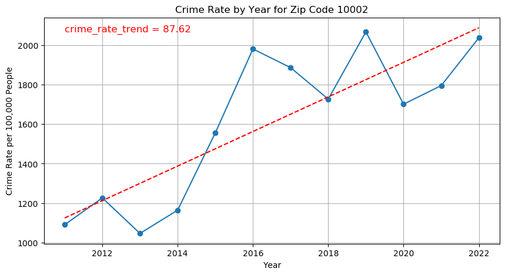
    


    

    


    
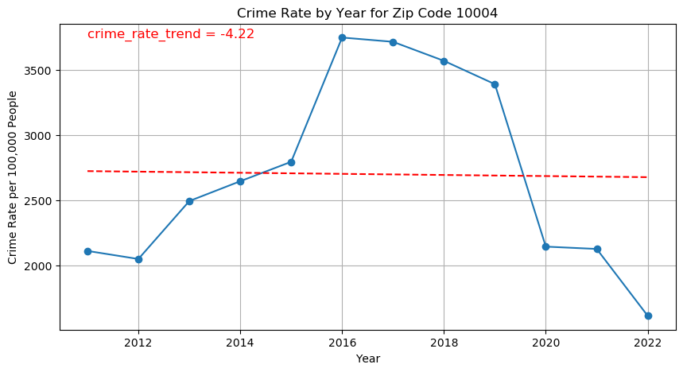
    


    

    


```python

crime_rate_data = merged_data.copy()
# Ensure zip_code columns are of the same type for merging
crime_rate_data['zipCode'] = crime_rate_data['zipCode'].astype(str)
crime_data['zip_code'] = crime_data['zip_code'].astype(str)

# Merge datasets to get HousingPrice
merged_data = pd.merge(crime_rate_data, crime_data[['Year', 'zip_code', 'HousingPrice']], 
                       left_on=['Year', 'zipCode'], right_on=['Year', 'zip_code'], how='left')

# Drop rows with NaN values in HousingPrice
merged_data = merged_data.dropna(subset=['HousingPrice'])

# Preprocess Census Data
census_data['zipCode'] = census_data['zipCode'].astype(str).str.split('.').str[0]

# Aggregate Crime Data by year and zip code
crime_data['Year'] = pd.to_datetime(crime_data['CMPLNT_FR_DT']).dt.year
crime_counts = crime_data.groupby(['Year', 'zip_code']).size().reset_index(name='CrimeCount')

# Ensure the zip_code column in crime_counts is of type string for consistent merging
crime_counts['zip_code'] = crime_counts['zip_code'].astype(str)

# Merge the aggregated crime data with the census population data
crime_counts = crime_counts.rename(columns={'zip_code': 'zipCode'})
population_data = pd.melt(census_data, id_vars=['zipCode'], var_name='Year', value_name='Population')
population_data = population_data[population_data['Year'].str.isnumeric()]
population_data['Year'] = population_data['Year'].astype(int)

# Merge crime counts with population data
crime_population_merged = pd.merge(crime_counts, population_data, on=['zipCode', 'Year'], how='left')

# Filter for valid years (2011-2022)
valid_years = list(range(2011, 2023))
crime_population_merged = crime_population_merged[crime_population_merged['Year'].isin(valid_years)]

# Filter out rows with zero or NaN population
crime_population_merged = crime_population_merged[crime_population_merged['Population'].notna() & (crime_population_merged['Population'] > 0)]

# Calculate the crime rate per 100,000 people
if 'Population' in crime_population_merged.columns:
    crime_population_merged['CrimeRate'] = (crime_population_merged['CrimeCount'] / crime_population_merged['Population']) * 100000
else:
    print("Error: 'Population' column not found in merged data.")

# Now merge this data with the initial merged_data to include HousingPrice
final_merged_data = pd.merge(crime_population_merged, merged_data[['Year', 'zipCode', 'Beta', 'HousingPrice']], 
                             on=['Year', 'zipCode'], how='left')

# Calculate the average housing price per zip code for 2011 and 2022
avg_housing_2011 = final_merged_data[final_merged_data['Year'] == 2011].groupby('zipCode')['HousingPrice'].mean().reset_index()
avg_housing_2022 = final_merged_data[final_merged_data['Year'] == 2022].groupby('zipCode')['HousingPrice'].mean().reset_index()

# Rename columns to avoid conflicts
avg_housing_2011 = avg_housing_2011.rename(columns={'HousingPrice': 'AvgHousingPrice2011'})
avg_housing_2022 = avg_housing_2022.rename(columns={'HousingPrice': 'AvgHousingPrice2022'})

# Merge the averages with the main dataframe
final_merged_data = pd.merge(final_merged_data, avg_housing_2011, on='zipCode', how='left')
final_merged_data = pd.merge(final_merged_data, avg_housing_2022, on='zipCode', how='left')

# Calculate the change in housing price
final_merged_data['chng_housing_price'] = final_merged_data['AvgHousingPrice2022'] - final_merged_data['AvgHousingPrice2011']
final_merged_data['chng_housing_price_pct'] = (final_merged_data['AvgHousingPrice2022'] - final_merged_data['AvgHousingPrice2011'])/final_merged_data['AvgHousingPrice2011']
# Display the final merged data with the new column
final_merged_data
```


<div>
<style scoped>
    .dataframe tbody tr th:only-of-type {
        vertical-align: middle;
    }

    .dataframe tbody tr th {
        vertical-align: top;
    }

    .dataframe thead th {
        text-align: right;
    }
</style>
<table border="1" class="dataframe">
  <thead>
    <tr style="text-align: right;">
      <th></th>
      <th>Year</th>
      <th>zipCode</th>
      <th>CrimeCount</th>
      <th>Population</th>
      <th>CrimeRate</th>
      <th>Beta</th>
      <th>HousingPrice</th>
      <th>AvgHousingPrice2011</th>
      <th>AvgHousingPrice2022</th>
      <th>chng_housing_price</th>
      <th>chng_housing_price_pct</th>
    </tr>
  </thead>
  <tbody>
    <tr>
      <th>0</th>
      <td>2011</td>
      <td>10001</td>
      <td>509</td>
      <td>21097.0</td>
      <td>2412.665308</td>
      <td>176.536217</td>
      <td>1612133.893494</td>
      <td>1.614173e+06</td>
      <td>1.891585e+06</td>
      <td>277411.531212</td>
      <td>0.171860</td>
    </tr>
    <tr>
      <th>1</th>
      <td>2011</td>
      <td>10001</td>
      <td>509</td>
      <td>21097.0</td>
      <td>2412.665308</td>
      <td>176.536217</td>
      <td>1627445.944321</td>
      <td>1.614173e+06</td>
      <td>1.891585e+06</td>
      <td>277411.531212</td>
      <td>0.171860</td>
    </tr>
    <tr>
      <th>2</th>
      <td>2011</td>
      <td>10001</td>
      <td>509</td>
      <td>21097.0</td>
      <td>2412.665308</td>
      <td>176.536217</td>
      <td>1612133.893494</td>
      <td>1.614173e+06</td>
      <td>1.891585e+06</td>
      <td>277411.531212</td>
      <td>0.171860</td>
    </tr>
    <tr>
      <th>3</th>
      <td>2011</td>
      <td>10001</td>
      <td>509</td>
      <td>21097.0</td>
      <td>2412.665308</td>
      <td>176.536217</td>
      <td>1567627.09884</td>
      <td>1.614173e+06</td>
      <td>1.891585e+06</td>
      <td>277411.531212</td>
      <td>0.171860</td>
    </tr>
    <tr>
      <th>4</th>
      <td>2011</td>
      <td>10001</td>
      <td>509</td>
      <td>21097.0</td>
      <td>2412.665308</td>
      <td>176.536217</td>
      <td>1606498.615164</td>
      <td>1.614173e+06</td>
      <td>1.891585e+06</td>
      <td>277411.531212</td>
      <td>0.171860</td>
    </tr>
    <tr>
      <th>...</th>
      <td>...</td>
      <td>...</td>
      <td>...</td>
      <td>...</td>
      <td>...</td>
      <td>...</td>
      <td>...</td>
      <td>...</td>
      <td>...</td>
      <td>...</td>
      <td>...</td>
    </tr>
    <tr>
      <th>1406047</th>
      <td>2022</td>
      <td>11694</td>
      <td>267</td>
      <td>24584</td>
      <td>1086.072242</td>
      <td>29.717461</td>
      <td>878751.028993</td>
      <td>5.729438e+05</td>
      <td>8.845665e+05</td>
      <td>311622.688883</td>
      <td>0.543897</td>
    </tr>
    <tr>
      <th>1406048</th>
      <td>2022</td>
      <td>11694</td>
      <td>267</td>
      <td>24584</td>
      <td>1086.072242</td>
      <td>29.717461</td>
      <td>878773.461607</td>
      <td>5.729438e+05</td>
      <td>8.845665e+05</td>
      <td>311622.688883</td>
      <td>0.543897</td>
    </tr>
    <tr>
      <th>1406049</th>
      <td>2022</td>
      <td>11694</td>
      <td>267</td>
      <td>24584</td>
      <td>1086.072242</td>
      <td>29.717461</td>
      <td>883008.653716</td>
      <td>5.729438e+05</td>
      <td>8.845665e+05</td>
      <td>311622.688883</td>
      <td>0.543897</td>
    </tr>
    <tr>
      <th>1406050</th>
      <td>2022</td>
      <td>11694</td>
      <td>267</td>
      <td>24584</td>
      <td>1086.072242</td>
      <td>29.717461</td>
      <td>878773.461607</td>
      <td>5.729438e+05</td>
      <td>8.845665e+05</td>
      <td>311622.688883</td>
      <td>0.543897</td>
    </tr>
    <tr>
      <th>1406051</th>
      <td>2022</td>
      <td>11697</td>
      <td>8</td>
      <td>13558</td>
      <td>59.005753</td>
      <td>NaN</td>
      <td>NaN</td>
      <td>NaN</td>
      <td>NaN</td>
      <td>NaN</td>
      <td>NaN</td>
    </tr>
  </tbody>
</table>
<p>1406052 rows × 11 columns</p>
</div>


```python
df = final_merged_data[final_merged_data['Beta']<50]

plt.figure(figsize=(10, 6))
sns.regplot(x='Beta', y='chng_housing_price_pct', data=df.sample(n=10000), line_kws={"color": "red"})
plt.title('Increasing crime rate trends negatively affect housing prices')
plt.xlabel('Linear trend in crime rate per 100,000 people')
plt.ylabel('Percent change in housing price')
plt.show()
```


    
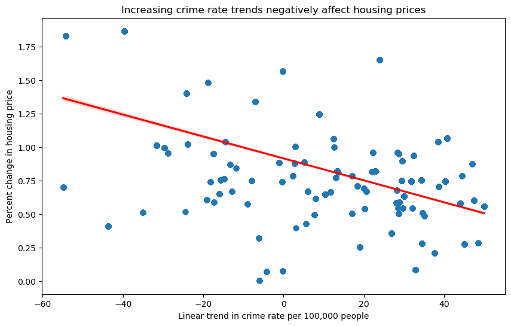
    


```python
df = df.dropna(subset=['Beta', 'chng_housing_price_pct'])

# Define the independent (X) and dependent (y) variables
X = df[['Beta']]
y = df['chng_housing_price_pct']

# Add a constant to the independent variables matrix
X = sm.add_constant(X)

# Perform OLS regression
model = sm.OLS(y, X).fit()

# Print the regression results
print(model.summary())


```

                                  OLS Regression Results                              
    ==================================================================================
    Dep. Variable:     chng_housing_price_pct   R-squared:                       0.311
    Model:                                OLS   Adj. R-squared:                  0.311
    Method:                     Least Squares   F-statistic:                 2.811e+05
    Date:                    Tue, 04 Jun 2024   Prob (F-statistic):               0.00
    Time:                            21:04:39   Log-Likelihood:            -2.0037e+05
    No. Observations:                  622595   AIC:                         4.007e+05
    Df Residuals:                      622593   BIC:                         4.008e+05
    Df Model:                               1                                         
    Covariance Type:                nonrobust                                         
    ==============================================================================
                     coef    std err          t      P>|t|      [0.025      0.975]
    ------------------------------------------------------------------------------
    const          0.9153      0.000   2003.055      0.000       0.914       0.916
    Beta          -0.0081   1.53e-05   -530.159      0.000      -0.008      -0.008
    ==============================================================================
    Omnibus:                     6499.228   Durbin-Watson:                   0.003
    Prob(Omnibus):                  0.000   Jarque-Bera (JB):             7626.804
    Skew:                           0.195   Prob(JB):                         0.00
    Kurtosis:                       3.377   Cond. No.                         32.2
    ==============================================================================
    
    Notes:
    [1] Standard Errors assume that the covariance matrix of the errors is correctly specified.
    


```python
print(final_merged_data['HousingPrice'].mean())
print(final_merged_data['HousingPrice'].mean()*0.0081)
```

    655808.0416420082
    5312.045137300266
    

The variable crime_rate_trend represents the slope of the trend in the crime rate per 100,000 people over time in a given zip code.

Thus for each unit increase in the linear crime rate trend in a given zip code, properties in that zip code lose 0.81% of their value on average. 

if the linear crime rate trend in a zip code increases by 1 per 100,000 people, then each home in that zip code loses 0.81% of it's value. since the average home in New York is 655,808 each home would lose 5,312. 

Since the average house is 655,808, this means that the average property owner loses 5,312 for each unit increase in the linear crime rate in their neighborhood. 

####  Let's cluster our data based on Housing price, Crime rate, and Crime rate trends.  K-Means clustering


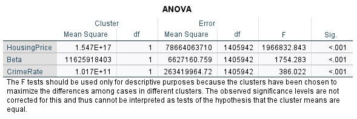


Cluster 2 is highly desirable with high home prices, low crime rates, and low crime trends. Cluster 1 is typified by lower home prices high crime rates and increasing crime rate trends. 

#### now we can vizualize our clusters 


